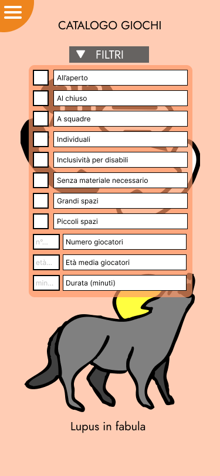
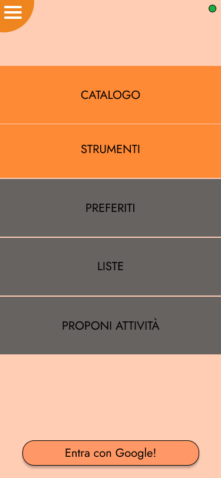
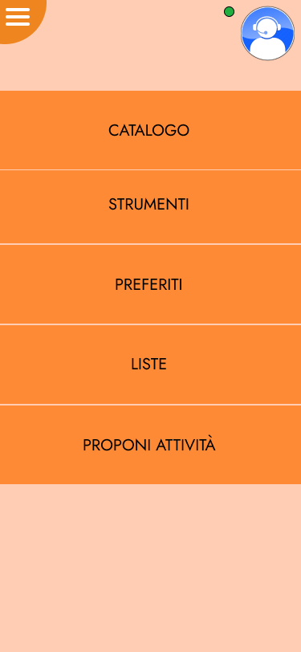
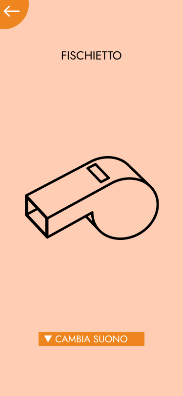
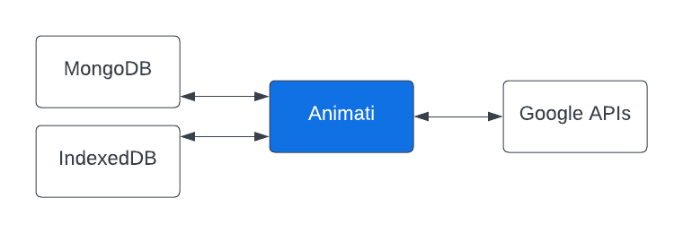

---
pdf_options:
    format: a4
    margin: 30mm 20mm
    printBackground: true
    headerTemplate: |-
        
        <section>
            D1 - Animati - Analisi dei Requisiti v1.2
        </section>
    footerTemplate: |-
        <section>
            

                Pagina 
                di 
            

        </section>
---
 Dipartimento di Ingegneria e Scienza dell’Informazione

---

### Progetto:
<h1 align="center">Animati</h1>

### Titolo del documento:
<h1 align="center">Analisi dei Requisiti</h1>

### Gruppo:
<h1 align="center">T51</h1>

# Sommario
Scopo del documento3
1. Obiettivi del progetto4
2. Requisiti funzionali6
3. Requisiti non funzionali10
4. Requisiti del front-end del progetto17
5. Requisiti del back-end del progetto29

# Scopo del documento
Il presente documento riporta l’analisi dei requisiti di sistema del progetto Animati in linguaggio naturale.

Gli obiettivi di questo documento sono quelli di:

- presentare gli [obiettivi del progetto](#obiettivi-del-progetto);
- definire i [requisiti funzionali](#requisiti-funzionali-del-progetto) e [non funzionali](#requisiti-non-funzionali-del-progetto);
- presentare i [requisiti del front-end](#requisiti-del-front-end-del-progetto);
- presentare i [requisiti del back-end](#requisiti-del-back-end-del-progetto).

# 1. Obiettivi del progetto
L’obiettivo del progetto consiste nella realizzazione di una Progressive Web App che permetta ad educatori ed animatori di visualizzare in modo categorizzato e filtrato una serie di attività ludico-ricreative e fornisca ulteriori strumenti che ne facilitino l’organizzazione e la gestione.

Nello specifico questa applicazione deve:

> #### O1.
> permettere di consultare il catalogo di giochi, con relative regole e modalità di organizzazione per ogni attività, e filtrare gli stessi in base alle esigenze dell’utente

> #### O2.
> fornire all'utente strumenti di supporto all'organizzazione e gestione di giochi:
> ### DADI
>> #### O2.1.
>> Permette di selezionare casualmente un numero in un intervallo, una parola/colore/immagine da una lista finita
> ### TIMER
>> #### O2.2.
>> Permette di creare un conto alla rovescia
> ### CRONOMETRO
>> #### O2.3.
>> Permette di misurare intervalli di tempo
> ### FISCHIETTO
>> #### O2.4.
>> Permette di riprodurre un suono
> ### SEGNA-PUNTI
>> #### O2.5.
>> Mette a disposizione molteplici contatori
> ### CREAZIONE SQUADRE
>> #### O2.6.
>> Permette la creazione rapida e semplificata di squadre in base a parametri personalizzabili, i quali possono essere specificati manualmente o compilati automaticamente in funzione dei vincoli dati da un gioco specifico selezionato dal catalogo

> #### O3.
> dare la possibilità agli utenti di autenticarsi all’interno dell’applicazione, al fine di lasciare una valutazione alle attività in catalogo, segnalare eventuali errori, proporre nuovi giochi e salvare le attività in liste personali

> #### O4.
> disporre di un’area riservata agli amministratori che permetta di visionare le segnalazioni, modificare le attività in catalogo, approvare le proposte, aggiungere nuovi amministratori

> #### O5.
> rendere disponibili in assenza di connessione internet le funzionalità che non richiedono autenticazione o interazione con servizi esterni

## Obiettivi secondari
> #### O6.
> fornire agli utenti un link ad un servizio esterno per la segnalazione di bug dell’applicativo

> #### O7.
> presentare un link ad un servizio esterno per effettuare donazioni a beneficio degli sviluppatori

> #### O8.
> mostrare un breve tutorial guidato che illustri le principali funzionalità dell’applicazione

# 2. Requisiti funzionali del progetto
Nel presente capitolo vengono riportati i requisiti funzionali (RF) del sistema, assumendo che le tipologie di utente che hanno accesso all’app siano:

- [Anonimo](#anonimo)
- [Autenticato](#autenticato)
- [Amministratore](#amministratore)

---

Per ogni tipologia di utente, il sistema deve permettere di:

## Anonimo
### In presenza di connessione al server
> #### RF1.
> Aggiornare la copia locale del catalogo delle attività con quella presente sul server
> [¶O1](#o1)

> #### RF2.
> Consultare il catalogo di attività
> [¶O3](#o3)

> #### RF3.
> Filtrare il catalogo di attività
> [¶O1](#o1)

> #### RF4.
> Utilizzare i tool
> [¶O2](#o2)

> #### RF5.
> Effettuare l’accesso tramite le credenziali di autenticazione Google
> [¶O3](#o3)

### In assenza di connessione al server
> [RF2.](#rf2)
> [RF3.](#rf3)
> [RF4.](#rf4)

> #### RF6.
> Consultare la copia locale del catalogo di attività
> [¶O1](#o1)

## Autenticato
### In presenza di connessione al server
> [RF1.](#rf1)
> [RF2.](#rf2)
> [RF3.](#rf3)
> [RF4.](#rf4)

> #### RF7.
> Creare nuove liste di attività
> [¶O3](#o3)

> #### RF8.
> Rimuovere una propria lista di attività
> [¶O3](#o3)

> #### RF9.
> Aggiungere un'attività in una lista di attività
> [¶O3](#o3)

> #### RF10.
> Rimuovere un'attività da una lista di attività
> [¶O3](#o3)

> #### RF11.
> Consultare le proprie liste di attività
> [¶O3](#o3)

> #### RF12.
> Valutare ogni attività con un punteggio numerico
> [¶O3](#o3)

> #### RF13.
> Inviare una segnalazione associata ad un'attività
> [¶O3](#o3)

> #### RF14.
> Proporre una nuova attività
> [¶O3](#o3)

> #### RF15.
> Modificare una propria attività proposta
> [¶O3](#o3)

> #### RF16.
> Effettuare il logout
> [¶O3](#o3)

### In assenza di connessione al server
> [RF2.](#rf2)
> [RF3.](#rf3)
> [RF4.](#rf4)
> [RF6.](#rf6)

> #### RF17.
> Consultare le proprie liste di attività già sincronizzate localmente
> [¶O3](#o3)

## Amministratore
### In presenza di connessione al server
> [RF1.](#rf1)
> [RF2.](#rf2)
> [RF3.](#rf3)
> [RF4.](#rf4)
> [RF7.](#rf7)
> [RF8.](#rf8)
> [RF9.](#rf9)
> [RF10.](#rf10)
> [RF11.](#rf11)
> [RF12.](#rf12)
> [RF16.](#rf16)
> [RF17.](#rf17)

> #### RF18.
> Inserire nuove attività nel catalogo di attività
> [¶O4](#o4)

> #### RF19.
> Modificare attività presenti nel catalogo di attività
> [¶O4](#o4)

> #### RF20.
> Visualizzare la lista di utenti
> [¶O4](#o4)

> #### RF21.
> Modificare il ruolo di un utenti
> [¶O4](#o4)

> #### RF22.
> Visualizzare l'elenco delle segnalazioni alle attività
> [¶O4](#o4)

### In assenza di connessione al server
per gli [Amministratori](#amministratore) i requisiti funzionali del sistema sono i medesimi di un qualsiasi altro [Autenticato](#autenticato)

---

All'interno dei seguenti strumenti, il sistema deve permettere di:

### DADI
> #### RF23.
> Creare liste di parole, colori e immagini
> [¶O2.1](#o21)

> #### RF24.
> Proporre ripetutamente un elemento casuale della lista
> [¶O2.1](#o21)

> #### RF25.
> Permettere la scelta fra riselezionare un elemento o escluderlo nelle successive proposte
> [¶O2.1](#o21)

### TIMER
> #### RF26.
> Scegliere un valore di partenza, far partire, mettere in pausa o fermare il timer
> [¶O2.2](#o22)

### CRONOMETRO
> #### RF27.
> Far partire, mettere in pausa o fermare il cronometro
> [¶O2.3](#o23)

> #### RF28.
> Salvare tempi parziali
> [¶O2.3](#o23)

### FISCHIETTO
> #### RF29.
> Selezionare un suono per il fischietto
> [¶O2.4](#o24)

> #### RF30.
> Selezionare un file presente sul dispositivo da usare come suono
> [¶O2.4](#o24)

> #### RF31.
> Riprodurre il suono per il fischietto selezionato
> [¶O2.4](#o24)

### SEGNA-PUNTI
> #### RF32.
> Scegliere il numero di contatori
> [¶O2.5](#o25)

> #### RF33.
> Incrementare o decrementare ogni contatore separatamente
> [¶O2.5](#o25)

### CREAZIONE SQUADRE
> #### RF34.
> Scegliere il numero di squadre
> [¶O2.6](#o26)

> #### RF35.
> Scegliere il numero di componenti per squadra
> [¶O2.6](#o26)

> #### RF36.
> Immettere il nome delle squadre
> [¶O2.6](#o26)

> #### RF37.
> Scegliere il numero di partecipanti
> [¶O2.6](#o26)

> #### RF38.
> Scegliere la metodologia di divisione (round-robin, casuale, per squadra)
> [¶O2.6](#o26)

> #### RF39.
> Iniziare la divisione, estraendo le squadre sequenzialmente
> [¶O2.6](#o26)

# 3. Requisiti non funzionali del progetto
Nel presente capitolo vengono riportati i requisiti non funzionali (RNF) del sistema.

---

## Efficienza e prestazioni
I seguenti requisiti assumono che l'utente disponga di una connessione a Internet con una velocità di trasmissione di almeno 20Mbps, per velocità inferiori non sono offerte garanzie di prestazione per quanto riguarda le funzionalità online dell'app.

> #### RNF1.
> Il sistema risponde a richieste di consultazione e filtraggio del catalogo ([RF2.](#rf2) ed [RF3.](#rf3)) e consultazione delle proprie liste ([RF11.](#rf11)) da parte dell'utente in meno di 1 secondo.

> #### RNF2.
> Il sistema risponde a richieste di modifica dati da parte dell'utente (da [RF8.](#rf8) a [RF20.](#rf21) escluso [RF11.](#rf11)) in meno di 1 secondo grazie a meccanismi di aggiornamento sequenziale.

> #### RNF3.
> Qualora il dispositivo utilizzato dall'utente lo permetta (si veda Portabilità), una copia locale del catalogo delle attività sarà creata sul dispositivo dell'utente ([RF1.](#rf1)) al primo utilizzo dell'app o qualvolta l'utente elimini tali dati, ed essa sarà successivamente aggiornata con frequenza di massimo 30 minuti od ogni volta che l'utente avvierà l'app e sarà connesso ad Internet o compirà un'operazione di modifica dei dati presenti sul catalogo o dei suoi dati personali.

> #### RNF4.
> La creazione della copia locale del catalogo impiegherà fino a 10 secondi, l'aggiornamento fino a 1 secondo, e nessuna delle due operazioni impedirà o interromperà la navigazione all'interno dell'app da parte dell'utente.

> #### RNF5.
> Per ogni operazione concernente le funzionalità dei tools ([RF4.](#rf4)) il sistema avrà un tempo di risposta inferiore a 1 secondo.

> #### RNF6.
> Il tempo di risposta da parte del sistema nell'operazione di login ([RF5.](#rf5)) (oltre al tempo impiegato dall'utente per inserire i propri dati quando si trova sull'interfaccia di Google) sarà inferiore a 10 secondi.

> #### RNF7.
> Qualora il dispositivo utilizzato dall'utente lo permetta, le funzionalità di consultazione e filtraggio del catalogo ([RF2.](#rf2) ed [RF3.](#rf3)), utilizzo dei tools ([RF4.](#rf4)) e consultazione delle proprie liste ([RF11.](#rf11)) saranno garantite anche in assenza di connessione ad Internet e con tempi di risposta da parte del sistema inferiori a 1 secondo.

> #### RNF8.
> Il tempo di risposta da parte del sistema nell'operazione di logout ([RF16.](#rf16)) sarà inferiore a 100ms.

> #### RNF9.
> L'aplicazione richiederà un consumo da parte del dispositivo dell'utente inferiore a 20MB di dati Internet mediamente in settimana, con un'aggiunta inferiore a 20MB in occasione della creazione della copia locale del catalogo.

Nota: il tempo di visualizzazione dei risultati delle richieste al sistema da parte dell'utente dipende, oltre che dal tempo di risposta del sistema, anche dal tempo di che caricamento del browser, che non è di competenza dell'applicazione.

## Memorizzazione dati
> #### RNF10.
> I dati salvati sul dispositivo dell'utente occuperanno fino a un massimo di 20MB di spazio.

> #### RNF11.
> Dati salvati per utenti anonimi.
>> ##### RNF11.1.
>> Non saranno salvati dati lato server.
>
>> ##### RNF11.2.
>> Qualora il browser dell'utente lo permetta, dopo che questi avrà visualizzato il contenuto di un tutorial o di determinati messaggi di errore, gli verrà chiesta conferma di non volerlo più visualizzare in futuro; inoltre, qualora il browser dell'utente lo permetta, all'utente verrà chiesto il consenso di memorizzare dati sul browser in stato persistente. Tali scelte saranno memorizzate sotto forma di cookie tecnici nel browser dell'utente stesso, sotto previo consenso.
>
>> ##### RNF11.3.
>> Qualora il browser dell'utente lo permetta, una copia del catalogo sarà memorizzata nel suo browser.

> #### RNF12.
> Dati salvati per utenti autenticati.
>> [RNF11.2.](#rnf92)
>> [RNF11.3.](#rnf93)
>> ##### RNF12.1.
>> Lato server saranno raccolte le seguenti informazioni sugli utenti autenticati: mail, valutazioni lasciate alle attività, proposte di nuovi giochi, liste di attività, segnalazioni inviate, presenza o meno di privilegi di amministratore.
>
>> ##### RNF12.2.
>> Qualora il dispositivo dell'utente lo permetta, le informazioni menzionate in RNF12.1 saranno memorizzate sul dispositivo dell'utente.

## Privacy e security
> #### RNF13.
> Ogni connessione riguardante il sistema avverrà tramite protocollo HTTPS per garantire sicurezza e protezione dei dati trasmessi.

> #### RNF14.
> Visibilità dei dati.
>> ##### RNF14.1.
>> I dati di cui al punto RNF9.2 saranno visibili esclusivamente dall'utente direttamente interessato e solo su richiesta di accesso.
>
>> ##### RNF14.2.
>> I dati delle liste di attività create da un utente autenticato saranno visibili esclusivamente dall'utente stesso.
>
>> ##### RNF14.3.
>> I dati relativi alle valutazioni lasciate da un utente alle attività e alle sue proposte sono visibli all'utente stesso e, in forma anonimizzata, a tutti gli altri utenti.
>
>> ##### RNF14.4.
>> I dati relativi a mail, id identificativo e segnalazioni di un utente sono visibili dall'utente stesso e da tutti gli utenti con privilegi di amministratore.

> #### RNF15.
> Il trattamento dei dati degli utenti sarà conforme alla normativa vigente espressa dal GDPR. In particolare:
>> ##### RNF15.1.
>> Per il trattamento dei dati sarà richiesto agli utenti il consenso preventivo ed esplicito, che l'utente potrà negare in qualsiasi momento tranne che per i cookie tecnici (RNF9.1), di cui comunque sarà informato.
>
>> ##### RNF15.2.
>> Agli utenti verrà garantito il diritto all'oblio: su esplicita richiesta di un utente saranno cancellati tutti i dati che lo riguardano dal sistema, eccetto per le valutazioni lasciate ad attività, le attività proposte e le segnalazioni di attività, che saranno conservati in forma anonima.

## Portabilità
> #### RNF16.
> Le funzionalità online (sezioni "in presenza di connessione" negli RF) dell'app saranno garantite su qualsiasi browser che supporti HTML5.

> #### RNF17.
> Le funzionalità offline (sezioni "in assenza di connessione" negli RF) dell'app che non richiedono memorizzazione di dati strutturati saranno garantite su qualsiasi browser che supporti service workers, nello specifico:
> 1. Chrome da versione 40
> 2. Edge da versione 17
> 3. Firefox da versione 44
> 4. Opera da versione 27
> 5. Safari da versione 11.1
> 6. Chrome Android da versione 40
> 7. Firefox for Android da versione 44
> 8. Opera Android da versione 27
> 9. Safari on iOS da versione 11.3
> 10. Samsung Internet da versione 4.0
> 11. WebView Android da versione 40

> #### RNF18.
> Le funzionalità offline (sezioni "in assenza di connessione" negli RF) dell'app che richiedono memorizzazione di dati strutturati saranno garantite su qualsiasi browser che supporti sia service workers sia IndexedDB API, nello specifico saranno sicuramente garantite su:
> 1. Chrome da versione 83
> 2. Edge da versione 83
> 3. Firefox non garantito, ma è consigliata almeno la versione 58
> 4. Opera da versione 70
> 5. Safari non garantito, ma è consigliata almeno la versione 15
> 6. Chrome Android da versione 83
> 7. Firefox for Android non garantito, ma è consigliata almeno la versione 58
> 8. Opera Android da versione 59
> 9. Safari on iOS non garantito, ma è consigliata almeno la  versione 15
> 10. Samsung Internet da versione 13.0
> 11. WebView Android da versione 83

## Usabilità
> #### RNF19.
> Le principali funzionalità dell'app avranno delle schermate di spiegazione che ne faciliterà la comprensione all'utente.

> #### RNF20.
> Tempi di addestramento.
>> ##### RNF20.1.
>> Dopo 10 minuti di navigazione nell'app l'utente avrà compreso come utilizzare tutte le funzionalità offerte agli utenti anonimi.
>
>> ##### RNF20.2.
>> Dopo ulteriori 20 minuti di navigazione nell'app l'utente avrà compreso come utilizzare tutte le funzionalità offerte agli utenti autenticati.
>
>> ##### RNF20.3.
>> Dopo ulteriori 15 minuti di navigazione nell'app l'utente avrà compreso come utilizzare tutte le funzionalità offerte agli amministratori.

> #### RNF21.
> Dopo questo addestramento, gli utenti esperti non dovrebbero superare, in media, i 2 errori al giorno.

> #### RNF22.
> L'aspetto, il funzionamento e lo sviluppo del sistema rispetteranno i principali aspetti dello [standard di ux design](https://www.interaction-design.org/literature/article/user-interface-design-guidelines-10-rules-of-thumb), ad esempio:
>> ##### RNF22.1.
>>  L'utente è avvisato visivamente e chiaramente dello stato attuale del sistema (anonimo/autenticato/admin, account con cui è loggato, offline/online/errore) tramite un banner nel menù.
>
>> ##### RNF22.2.
>> Qualora il dispositivo dell'utente lo permetta, in caso di malfunzionamento invece di generici errori del browser verranno mostrati messaggi di errore specifici, per garantire una migliore comprensione da parte dell'utente.
>
>> ##### RNF22.3
>> L'attività di testing e validazione verrà effettuata con la presenza di 50 veri animatori ed educatori.

## Affidabilità e robustezza
> #### RNF23.
> Il sistema sarà disponibile mediamente per almeno 20 giorni al mese nel primo anno dal deployment.

> #### RNF24.
> Il tempo medio di malfunzionamento del sistema sarà di 3 giorni in presenza di segnalazioni di malfunzionamento da parte degli utenti.

> #### RNF25.
> Nel caso in cui si dovesse verificare un malfunzionamento del sistema mentre un utente è connesso ad esso via Internet, è garantito che i dati che l'utente ha memorizzato sul suo account fino a 10 secondi prima del malfunzionamento saranno preservati.

> #### RNF26.
> Nel caso in cui il server del sistema non fosse raggiungibile a causa di un malfunzionamento, è garantito, qualora il dispositivo dell'utente lo permetta, il funzionamento delle funzionalità offline (sezioni "in assenza di connessione" negli RF).

## Sicurezza
> #### RNF27.
> Qualora un utente rilevi un contenuto inappropriato in una delle attività nel catalogo avrà la possibilità di segnalarlo agli amministratori del sistema.

> #### RNF28.
> È garantito che le segnalazioni sulle attività vengano controllate dagli amministratori con una frequenza minima di 4 ore nella fascia oraria tra le 8:00 del mattino e le 00:00 (mezzanotte).

> #### RNF29.
> Il funzionamento dell'app deve garantire che per lo svolgimento delle attività di animazione sia sufficiente che solo un dispositivo (quello dell'organizzatore) sia connesso all'app e che i partecipanti all'attività usino l'app per un tempo limitato a meno di 10 secondi, in modo che non debbano passare troppo tempo davanti allo schermo e che non debbano necessariamente possedere un dispositivo proprio per poter partecipare.

## Interoperabilità
> #### RNF30.
> Il sistema interagirà con un servizio in cloud di database non relazionale offerto da MongoDB per memorizzare dati e rispondere alle richieste degli utenti online.

> #### RNF31.
> Il sistema userà l'API di Google con il protocollo OAuth 2.0 per identificare gli utenti.

> #### RNF32.
> Il sistema esporrà API per la consultazione e il filtraggio del catalogo online.

> #### RNF33.
> Il sistema esporrà API per la creazione ed esportazione di liste di attività.

> #### RNF34.
> Sotto previo consenso da parte dell'utente e qualora il dispositivo dell'utente lo permetta, il sistema interagirà con un sistema di gestione di database non relazionale fornito dalle API di IndexedDB per memorizzare dati in locale e rispondere alle richieste degli utenti offline.

## Scalabilità
> #### RNF35.
> Il sistema potrà supportare fino a 10.000 utenti autenticati registrati contemporaneamente nel sistema senza perdita di prestazioni grazie alla possibilità di gestire le richieste degli utenti, qualora i loro dispositivi lo permettano, anche offline, rimuovendo quindi lavoro dal server.

> #### RNF36.
> Il sistema potrà supportare fino a 10.000 attività presenti contemporaneamente nel catalogo senza senza perdita di prestazione negli aggiornamenti alle copie locali degli utenti sfruttando la tecnica di aggiornamento sequenziale.

> #### RNF37.
> Il sistema potrà gestire fino a 10.000 richieste per unità di tempo senza perdita di prestazioni grazie alla possibilità di gestire le richieste degli utenti, qualora i loro dispositivi lo permettano, anche offline, rimuovendo quindi lavoro dal server.

## Accessibilità
> #### RNF38.
> Il funzionamento del sistema adotterà provvedimenti per facilitarne l'uso da parte di persone con disabilità ispirati da [Web Content Accessibility Guidelines (WCAG) 2.2](https://www.w3.org/TR/WCAG22/), ad esempio:
>> ##### RNF38.1.
>> lo stile del sistema prevederà colori ad alto contrasto per facilitare la navigazione di ipovedenti;
>
>> ##### RNF38.2.
>> la web app sarà completamente navigabile da tastiera per facilitare persone con mobilità limitata e non vedenti, in particolare:
>> 1. ogni elemento interagibile tramite posizionamento del click del mouse sarà raggiungibile per chi naviga tramite tastiera (usando frecce e tab) spostando il "focus" su di esso, per facilitare la navigazione per persone con capacità motorie o visive ridotte;
>> 2. l'ordine con cui viene messo il "focus" sugli elementi all'interno di una pagina rispetterà il flow logico della stessa, per facilitare la navigazione per persone con capacità motorie o visive ridotte;
>> 3. ogni elemento quando il focus viene messo su di esso farà comparire un riquadro con breve suggerimento o spiegazione riguardo l'elemento stesso in modo che questo possa essere letto da eventuali sistemi di screen-reader o VoiceOver, per facilitare la navigazione per persone con capacità visive o di processo del linguaggio scritto ridotte.

## Lingua
> #### RNF39.
> Il sistema sarà distribuito in lingua italiana.

## Distribuzione
> #### RNF40.
> Il codice sorgente dell'applicativo sarà distribuito sotto licenza GPL3.0.

## Progressive Web App
> #### RNF41.
> Il sistema sarà distribuito come Progressive Web App, pertanto dovrà rispettare i seguenti vincoli:
>> [RNF13.](#rnf13)
>> ##### RNF41.1.
>> Qualora il dispositivo dell'utente lo permetta, parte dell'app può essere caricata ed eseguita anche mentre il dispositivo dell'utente è offline.
>
>> ##### RNF41.2.
>> L'app deve avere un Web App Manifest di riferimento con almeno quattro proprietà chiave: name, short_name, start_url, e display.
>
>> ##### RNF41.3.
>> L'app deve avere una icona grande almeno 144×144 pixel in formato png.

# 4. Requisiti del front-end del progetto
Nel presente capitolo vengono riportati i requisiti del front-end (RFE) e mockup del sistema.

L’applicazione presenterà diverse schermate:

## Catalogo
### Visualizzato da [Anonimo](#anonimo)
> #### RFE1.
> Lista di attività del catalogo, dove cliccando sul nome o sull’immagine l’utente viene reindirizzato alla schermata della relativa attività

> #### RFE2.
> Pulsante di collegamento alla schermata del menù

> #### RFE3.
> Pulsante che apre un menu a tendina contenente i filtri se questo è chiuso, e lo chiude altrimenti. Il pulsante è di colore arancione se il menu a tendina è chiuso, grigio altrimenti

> #### RFE4.
> Spazio di inserimento per il numero di giocatori vicino al filtro "Numero Giocatori"

> #### RFE5.
> Spazio di inserimento per la durata del gioco vicino al filtro "Durata (minuti)"

> #### RFE6.
> Spazio di inserimento per l’età media dei giocatori vicino al filtro "Età media giocatori"

> #### RFE7.
> Casella contrassegnabile con un clic per selezionare tutti i filtri eccetto "Numero Giocatori", "Età media giocatori" e "Durata (minuti)"

### Visualizzato da [Autenticato](#autenticato)
> [RFE2.](#rfe2)
> [RFE2.](#rfe3)
> [RFE2.](#rfe4)
> [RFE2.](#rfe5)
> [RFE2.](#rfe6)
> [RFE7.](#rfe7)

> #### RFE1.
> Lista di attività del catalogo comprensiva delle attività proposte dagli utenti, dove cliccando sul nome o sull’immagine l’utente viene reindirizzato alla schermata della relativa attività

> #### RFE9.
> Cinque stelle situate sotto il titolo, grazie alle quali l'utente può aggiungere una valutazione che va da 1 a 5 stelle alla determinata attività

> #### RFE10.
> Pulsante situato accanto al titolo, che aggiunge una segnalazione alla determinata attività

### Visualizzato da [Amministratore](#amministratore)
> [RFE2.](#rfe2)
> [RFE3.](#rfe3)
> [RFE4.](#rfe4)
> [RFE5.](#rfe5)
> [RFE6.](#rfe6)
> [RFE7.](#rfe7)
> [RFE8.](#rfe8)
> [RFE9.](#rfe9)

> #### RFE11.
> Pulsante per la [modifica dell’attività](#modifica-attivita)

> #### RFE12.
> Numero di segnalazioni per attività

## Menu
### Visualizzato da [Anonimo](#anonimo)
> #### RFE13.
> Pulsante di collegamento alla schermata precedentemente utilizzata

> #### RFE14.
> Pallino che assume il colore grigio se l’utente non è connesso al server, verde altrimenti

> #### RFE15.
> Pulsante di collegamento alla schermata del catalogo

> #### RFE16.
> Pulsante di collegamento alla schermata degli strumenti

> #### RFE17.
> Pulsante di collegamento alla schermata dei preferiti, non utilizzabile senza autenticazione

> #### RFE18.
> Pulsante di collegamento alla schermata delle liste, non utilizzabile senza autenticazione

> #### RFE19.
> Pulsante di collegamento alla schermata di proposta attività, non utilizzabile senza autenticazione

> #### RFE20.
> Pulsante di collegamento alla schermata di autenticazione Google

> #### RFE21.
> Attività giornaliera presa casualmente dal catalogo

> #### RFE22.
> Attività giornaliera presa casualmente dal catalogo

> #### RFE23.
> Attività giornaliera presa casualmente dal catalogo

## Menu
### Visualizzato da [Autenticato](#autenticato)
> [RFE13.](#rfe13)
> [RFE14.](#rfe14)
> [RFE15.](#rfe15)
> [RFE16.](#rfe16)
> [RFE21.](#rfe21)
> [RFE22.](#rfe22)
> [RFE23.](#rfe23)

> #### RFE24.
> Pulsante di collegamento alla schermata dei preferiti

> #### RFE25.
> Pulsante di collegamento alla schermata delle liste

> #### RFE26.
> Pulsante di collegamento alla schermata di proposta attività

> #### RFE27.
> Foto profilo dell’account

> #### RFE88.
> Pulsante per effettuare il logout

### Visualizzato da [Amministratore](#amministratore)
> [RFE13.](#rfe13)
> [RFE14.](#rfe14)
> [RFE15.](#rfe15)
> [RFE16.](#rfe16)
> [RFE21.](#rfe21)
> [RFE22.](#rfe22)
> [RFE23.](#rfe23)
> [RFE24.](#rfe24)
> [RFE25.](#rfe25)
> [RFE26.](#rfe26)
> [RFE27.](#rfe27)
> [RFE88.](#rfe88)

> #### RFE28.
Pulsante di collegamento alle schermata di gestione utenti

## Strumenti
> [RFE2.](#rfe2)

> #### RFE29.
> Pulsante di collegamento allo strumento [DADO](#dado)

> #### RFE30.
> Pulsante di collegamento allo strumento [FISCHIETTO](#fischietto)

> #### RFE31.
> Pulsante di collegamento allo strumento [CRONOMETRO](#cronometro)

> #### RFE32.
> Pulsante di collegamento allo strumento [TIMER](#timer)

> #### RFE33.
> Pulsante di collegamento allo strumento [SEGNA-PUNTI](#segna-punti)

> #### RFE34.
> Pulsante di collegamento allo strumento di [CREAZIONE SQUADRE](#creazione-squadre)

### DADO
> #### RFE35.
> Pulsante di collegamento alla schermata precedente, ovvero la schermata strumenti

> #### RFE36.
> Spazio di inserimento per il numero di facce del dado

> #### RFE37.
> Pulsante avvia, che sceglie un numero casuale da 1 al numero di facce del dado e lo scrive su schermo

### FISCHIETTO
> [RFE35.](#rfe35)

> #### RFE38.
> Immagine di fischietto, che una volta premuta fa riprodurre il suono selezionato

> #### RFE39.
> Pulsante che apre un menu a tendina contenente altri suoni che è possibile selezionare

## CRONOMETRO
> [RFE35.](#rfe35)

> #### RFE40.
> Cronometro inizialmente azzerato, con segnati ore, minuti e secondi nella forma 00:00:00

> #### RFE41.
> Pulsante di avvio del cronometro. Una volta avviato quest’ultimo, il pulsante diventa pausa/avvio

> #### RFE42.
> Pulsante di stop e riavvio. Quando il cronometro è avviato l’utente lo usa per fermarlo. Quando il cronometro è stato fermato l’utente lo usa per riavviare il cronometro, per riportarlo a zero

### TIMER
> [RFE35.](#rfe35)
> [RFE39.](#rfe39)

> #### RFE43.
> imer inizialmente azzerato, con segnati ore, minuti e secondi nella forma 00:00:00. L’utente può impostare il tempo desiderato scorrendo sulle cifre.

> #### RFE44.
> Pulsante di avvio del timer. Una volta avviato quest’ultimo, il pulsante diventa pausa/avvio

> #### RFE45.
> Pulsante di stop. Quando il timer è avviato l’utente lo usa per fermarlo e il timer torna al tempo impostato precedentemente, in attesa di un nuovo avvio o di una modifica

> #### RFE46.
> Una volta finito il tempo del timer, viene riprodotto il suono selezionato

### Impostazioni SEGNA-PUNTI
> [RFE35.](#rfe35)

> #### RFE47.
> Tasto per aggiungere una nuova squadra, specificandone il nome in un campo testuale

> #### RFE48.
> Lista delle squadre già presenti, nella quale è possibile eliminare una squadra o modificarne il nome

> #### RFE49.
> Pulsante di avvio, che porta alla schermata [SEGNA-PUNTI](#segna-punti)

### SEGNA-PUNTI
> #### RFE50.
> Pulsante di collegamento alla schermata precedente, ovvero la schermata [Impostazioni SEGNA-PUNTI](#impostazioni-segna-punti)

> #### RFE51.
> Lista scorribile delle squadre, indicante nome e numero di punti correnti

> #### RFE52.
> Pulsante di incremento e di decremento punto accanto per ogni squadra

### Impostazioni CREAZIONE SQUADRE
> [RFE35.](#rfe35)

> #### RFE53.
> Campo di inserimento del numero di giocatori

> #### RFE54.
> Campo di inserimento del numero di persone per squadra

> #### RFE55.
> Campo di inserimento del numero di squadre

> #### RFE56.
> Campo di inserimento dei nomi delle squadre

> #### RFE57.
> Pulsante che apre menu a tendina per scegliere metodo di divisione in squadre

> #### RFE58.
> Pulsante che reindirizza alla schermata [CREAZIONE SQUADRE](#creazione-squadre)

### CREAZIONE SQUADRE
> #### RFE59.
> Pulsante di collegamento alla schermata precedente, ovvero la schermata [Impostazioni CREAZIONE SQADRE](#impostazioni-creazione-squadre)

> #### RFE60.
> Pulsante per passare alla prossima estrazione. A ogni estrazione viene visualizzato sullo schermo il nome della squadra di appartenenza

## Liste
### Visualizzato da [Autenticato](#autenticato) e [Amministratore](#amministratore)
> #### RFE61.
> Lista di liste create dall’utente

> #### RFE62.
> Cliccando sul nome di una lista, l’utente viene reindirizzato alla schermata "[Lista](#lista)" della relativa lista

> #### RFE63.
> Pulsante che aggiunge una lista, aprendo una finestra dove è presente un campo nel quale l’utente deve inserire il nome della nuova lista

## Lista
### Visualizzato da [Autenticato](#autenticato) e [Amministratore](#amministratore)
> [RFE3.](#rfe3)
> [RFE4.](#rfe4)
> [RFE5.](#rfe5)
> [RFE6.](#rfe6)
> [RFE7.](#rfe7)
> [RFE8.](#rfe8)
> [RFE9.](#rfe9)

> #### RFE64.
> Pulsante di collegamento alla schermata precedente, ovvero la schermata [Liste](lista)

> #### RFE65.
> Nome della lista indicato

> #### RFE66.
> Lista di attività appartenenti alla lista sopraindicata

> #### RFE67.
> Pulsante che permette di esportare la lista con tutte le informazioni sulle attività, in formato PDF

## Attività
### Visualizzato da [Anonimo](#anonimo)
> #### RFE68.
> Pulsante di collegamento alla schermata precedente, ovvero il [Catalogo](#catalogo) o una [Lista](#lista)

> #### RFE69.
> Nome e immagine dell’attività

> #### RFE70.
> Descrizione dell’attività, valutazione media, fascia d'età consigliata, numero di giocatori e durata

> #### RFE71.
> Etichette caratterizzanti l'attività

### Visualizzato da [Autenticato](#autenticato)
> [RFE9.](#rfe9)
> [RFE68.](#rfe68)
> [RFE69.](#rfe69)
> [RFE70.](#rfe70)
> [RFE71.](#rfe71)

> #### RFE72.
> Pulsante che aggiunge l’attività alla lista predefinita "preferiti"

> #### RFE73.
> Pulsante che aggiunge l’attività a una lista. Si apre un menu a tendina con tutte le liste e l’utente può selezionare le liste a cui aggiungere l’attività stessa

> #### RFE74.
> Per le attività create dall’utente compare un pulsante che apre la schermata [Modifica attività](#modifica-attività)

### Visualizzato da [Amministratore](#amministratore)
> [RFE64.](#rfe64)
> [RFE65.](#rfe65)
> [RFE66.](#rfe66)
> [RFE67.](#rfe67)
> [RFE67.](#rfe68)
> [RFE67.](#rfe69)

> #### RFE75.
> Pulsante che apre la schermata [Modifica attività](#modifica-attività)

## Modifica attività
### Visualizzato da [Amministratore](#amministratore)
> #### RFE76.
> Pulsante di collegamento alla schermata precedente, ovvero all’[Attività](#attività)

> #### RFE77.
> Campo di inserimento del titolo

> #### RFE78.
> Campo di inserimento della descrizione

> #### RFE79.
> Campo di inserimento della fascia di età

> #### RFE80.
> Campo di inserimento della durata

> #### RFE81.
> Campo di inserimento del numero di giocatori

> #### RFE82.
> Lista di etichette da selezionare

## Proponi attività
### Visualizzato da [Autenticato](#autenticato) e da [Amministratore](#amministratore)
> [RFE2.](#rfe2)
> [RFE76.](#rfe76)
> [RFE77.](#rfe76)
> [RFE78.](#rfe76)
> [RFE79.](#rfe76)
> [RFE80.](#rfe76)
> [RFE81.](#rfe76)
> [RFE82.](#rfe76)

> #### RFE83.
> Campo di inserimento dell’autore dell’attività

## Tutorial
### Visualizzato da [Anonimi](#anonimi)
> #### RFE84.
> Per ogni schermata compare inizialmente una finestra contenente una breve spiegazione di utilizzo

> #### RFE85.
> Per ogni finestra c’è un campo contrassegnabile che impedisce alla finestra stessa di essere nuovamente visualizzata

## Gestione utenti
### Visualizzato da [Amministratore](#amministratore)
> [RFE2.](#rfe2)

> #### RFE86.
> Lista degli utenti che hanno effettuato l’accesso all’applicazione

> #### RFE87.
> Per ogni utente è presente un pulsante che, selezionato assume il colore verde e indica la promozione dell’utente stesso ad amministratore, mentre deselezionato assume il colore grigio e indica che l’utente stesso non è un amministratore

# 5. Requisiti del back-end del progetto
Nel presente capitolo vengono riportati i requisiti del backend (RBE) del sistema, ovvero quei sistemi esterni con i quali il sistema deve interfacciarsi.

Il server deve:

> #### RBE1.
> interfacciarsi con le API di Google per autenticare l'utente
> [¶O3](#o3)
>
> Attraverso questo sistema, sarà possibile autenticare gli utenti per permettere l’accesso a numerose funzionalità dell’applicativo riservate agli utenti autenticati. Il controllo dei permessi degli utenti sarà invece gestito all’interno dell’applicativo stesso.

> #### RBE2.
> utilizzare il servizio per la gestione di basi di dati offerto da MongoDB
>
> Attraverso i servizi offerti da MongoDB, sarà possibile distribuire la propria base di dati sulla rete, permettendo agli utenti di aggiornare catalogo di attività e di sincronizzare tra più dispositivi le liste create dall’utente autenticato.

> #### RBE3.
> utilizzare il sistema per la gestione di basi di dati sul browser IndexedDB
>
> Attraverso le API esposte da IndexedDB, sarà possibile memorizzare e gestire parte della propria base di dati sul dispositivo dell'utente, permettendo agli utenti di salvare in locale e consultare anche in assenza di connessione ad Internet il catalogo e, in caso di utente autenticato, alcuni dati personali come le liste.

