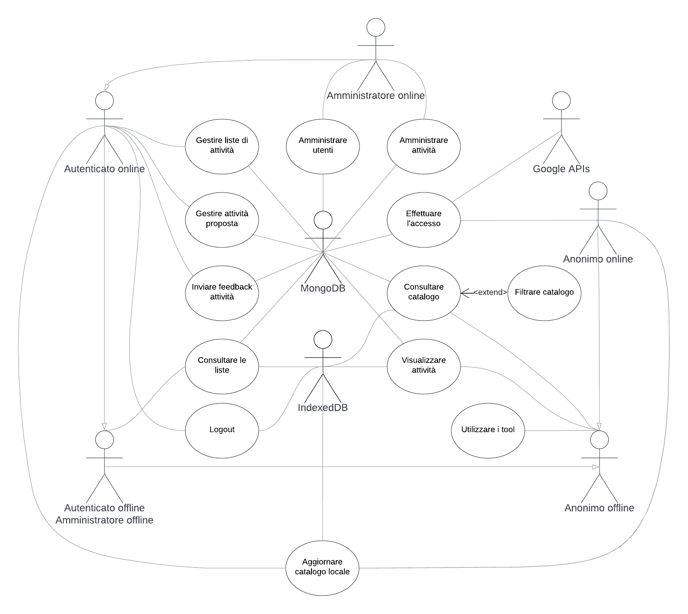

---
pdf_options:
    format: a4
    margin: 30mm 20mm
    printBackground: true
    headerTemplate: |-
        
        <section>
            D2 - Animati - Specifica dei Requisiti v0.1 [pre-release]
        </section>
    footerTemplate: |-
        <section>
            

                Pagina 
                di 
            

        </section>
---
 Dipartimento di Ingegneria e Scienza dell’Informazione

---

### Progetto:
<h1 align="center">Animati</h1>

### Titolo del documento:
<h1 align="center">Specifica dei Requisiti</h1>

### Gruppo:
<h1 align="center">T51</h1>

# Indice
Scopo del documento3
1. Casi d'uso4
1.1 Diagramma dei casi d'uso4
1.2 Descrizione dei casi d'uso class=dot>6
2. Tabella dei requisiti non funzionali25
3. Analisi del contesto36
3.1 Utenti e sistemi esterni36
3.2 Diagramma di contesto37
4. Analisi dei componenti40
4.1 Definizione dei componenti40
4.2 Diagramma dei componenti45

# Scopo del documento
Il presente documento riporta la specifica dei requisiti di sistema del progetto Animati usando diagrammi in Unified Modeling Language (UML) e tabelle strutturate. 
Tenendo conto dei requisiti individuati nella prima fase di Analisi, viene inoltre presentato il design del sistema con l’utilizzo di diagrammi di contesto e dei componenti.

# 1. Casi d'uso
Nel presente capitolo vengono riportati i requisiti funzionali (RF) del sistema utilizzando il linguaggio naturale e Use Case Diagram (UCD) scritti in UML.

## 1.1 Diagramma dei casi d'uso

La prima figura mostra i principali casi d'uso dell’applicazione Animati, raggruppati per omogeneità, e gli attori coinvolti.

La seconda figura mostra in dettaglio i principali casi d'uso dell’applicazione Animati e gli attori coinvolti. Segue una descrizione dei casi d'uso.

## 1.2 Descrizione dei casi d'uso

> #### **Titolo:**
>> Effettuare l'accesso
> #### **Riassunto:**
>> Questo use case descrive come l’utente può accedere all’applicazione tramite il suo account Google.
> #### **Descrizione:**
>> 1. L’utente clicca sul pulsante login.
>> 2. Il sistema reindirizza l’utente sulla pagina di accesso di Google.
>> 3. L’utente inserisce le sue credenziali Google.
>> 4. Google genera un codice di autorizzazione e reindirizza l’utente sull’applicazione, inoltrando il codice al sistema. [[exception 1](#exceptions)]
>> 5. Il sistema valida il codice di autorizzazione e lo utilizza per richiedere un token a Google tramite APIs. [[exception 2](#exceptions)]
>> 6. Google invia al sistema un token con le informazioni sull'account dell'utente.
>> 7. Il sistema estrae le informazioni necessarie dal token ricevuto. [[exception 3](#exceptions)]
>> 8. Se è il primo accesso dell’utente, viene creata una nuova entry su MongoDB, con un id personale e la mail.
>> 9. Se è già avvenuto almeno un accesso, vengono recuperati i dati dell’utente da MongoDB. [[extension 1](#extension-points)]
> #### **Exceptions:**
>> - [exception 1] Le credenziali non sono corrette, e non viene generato nessun codice, all'utente viene chiesto di reinserire le proprie credenziali.
>> - [exception 2] Se il codice ricevuto risulta non valido il sistema informa l'utente che si è verificato un errore e non è stato possibile effettuare il login.
>> - [exception 3] Errore nella verifica del token, il sistema informa l'utente che si è verificato un errore e non è stato possibile effettuare il login.
> #### **Extension points:**
>> - [extension 1] Allo step [7](#descrizione), se il browser dell’utente lo permette, i dati individuali dell’utente verranno memorizzati sul dispositivo dell’utente.

----
> #### **Titolo:**
>> Consultare catalogo
> #### **Riassunto:**
>> Questo use case descrive come l'utente può consultare il catalogo di attività dell’applicazione e interagire con le singole attività presenti nell’elenco.
> #### **Descrizione:**
>> 1. Il sistema chiede l'elenco di attività a un database (MongoDB o IndexedDB). [[extension 1](#extension-points-1)] [[extension 2](#extension-points-1)] [[exception 2](#exceptions-1)]
>> 2. Il database fornisce l'elenco di attività con titolo e immagine delle stesse al sistema, e il sistema lo mostra all'utente.
>> 3. Cliccando su un’attività, l’utente viene reindirizzato alla schermata con le informazioni sull’attività stessa. [[exception 1](#exceptions-1)]
> #### **Exceptions:**
>> - [exception 1] Utente viene reindirizzato ad attività eliminata, catalogo non aggiornato.
>> - [exception 2] Non c’è connessione ad internet e non c’è una copia locale del catalogo, quindi non viene mostrato nessun catalogo e compare un messaggio di errore.
> #### **Extension points:**
>> - [extension 1] Allo step [1](#descrizione-1), qualora sia stata salvata una copia del catalogo delle attività sul dispositivo dell’utente, il sistema può consultare quei dati attraverso IndexedDB senza l'uso di connessione ad Internet (“Consultare catalogo locale”).
>> - [extension 2] Allo step [1](#descrizione-1), qualora ci sia connessione ad internet il server può chiedere la lista a MongoDB (“Consultare catalogo remoto”).

----
> #### **Titolo:**
>> Visualizzare attività
> #### **Riassunto:**
>> Questo use case descrive come l’utente può visualizzare i dettagli specifici di ogni attività a partire dalla schermata del catalogo o, unicamente nel caso dell’utente autenticato, di una lista.
> #### **Descrizione:**
>> 1. L’utente clicca sull’immagine o sul nome dell’attività scelta. [[exception 1](#exceptions-2)]
>> 2. Il sistema chiede le informazioni relative all'attività a un database (MongoDB o IndexedDB). [[extension 1](#extension-points-1)] [[extension 2](#extension-points-2)] [[exception 2](#exceptions-2)]
>> 3. Il database fornisce al sistema le informazioni, e il sistema reindirizza l’utente a una schermata con i dettagli dell’attività stessa. [[extension 3](#exceptions-2)]
> #### **Exceptions:**
>> - [exception 1] L’attività scelta non è più presente nel catalogo, MongoDB non aggiornato. Viene mostrato un messaggio di errore.
>> - [exception 2] Se non c’è connessione ad Internet e non c’è una copia locale del catalogo, non viene mostrata nessuna informazione e compare un messaggio di errore.
> #### **Extension points:**
>> - [extension 1] Allo step [2](#descrizione-2), qualora sia stata salvata una copia del catalogo delle attività sul dispositivo dell’utente, il sistema può consultare quei dati attraverso IndexedDB senza l'uso di connessione ad Internet ("Visualizzare attività locali").
>> - [extension 2] Allo step [2](#descrizione-1), qualora ci sia connessione ad internet il server può chiedere le informazioni sull'attività a MongoDB (“Visualizzare attività locali”).
>> - [extension 3] Allo step [3](#descrizione-2), l’utente può accedere al tool di creazione squadre con i parametri richiesti dalla specifica attività.

----
> #### **Titolo:**
>> Utilizzare i tool
> #### **Riassunto:**
>> Questo use case descrive come l’utente può consultare la lista di tool presenti nell’applicazione a partire dal menù.
> #### **Descrizione:**
>> 1. L'utente clicca sul pulsante "Strumenti" presente nel menù e viene reindirizzato alla schermata contentente la lista di tool.
>> 2. Il sistema fornisce la lista di tool con titolo degli stessi, sui quali è possibile cliccare.
>> 3. Cliccando su un tool, l’utente viene reindirizzato alla schermata di utilizzo del tool stesso. [[extension 1](#extension-points-3)] [[extension 2](#extension-points-3)] [[extension 3](#extension-points-3)] [[extension 4](#extension-points-3)] [[extension 5](#extension-points-3)] [[extension 6](#extension-points-3)]
> #### **Exceptions:**
>> --
> #### **Extension points:**
> - [extension 1] Allo step [3](#descrizione-3), l’utente può cliccare sul tool DADI e quindi venire reindirizzato alla schermata di questo specifico tool (Utilizzare strumento DADI).
> - [extension 2] Allo step [3](#descrizione-3), l’utente può cliccare sul tool TIMER e quindi venire reindirizzato alla schermata di questo specifico tool (Utilizzare strumento TIMER).
> - [extension 3] Allo step [3](#descrizione-3), l’utente può cliccare sul tool CRONOMETRO e quindi venire reindirizzato alla schermata di questo specifico tool (Utilizzare strumento CRONOMETRO).
> - [extension 4] Allo step [3](#descrizione-3), l’utente può cliccare sul tool FISCHIETTO e quindi venire reindirizzato alla schermata di questo specifico tool (Utilizzare strumento FISCHIETTO).
> - [extension 5] Allo step [3](#descrizione-3), l’utente può cliccare sul tool SEGNA-PUNTI e quindi venire reindirizzato alla schermata di questo specifico tool (Utilizzare strumento SEGNA-PUNTI).
> - [extension 6] Allo step [3](#descrizione-3), l’utente può cliccare sul tool CREAZIONE SQUADRE e quindi venire reindirizzato alla schermata di questo specifico tool (Utilizzare strumento CREAZIONE SQUADRE).

----
> #### **Titolo:**
>> Visualizzare lista utenti
> #### **Riassunto:**
>> Questo use case descrive come l’amministratore può consultare la lista degli utenti che hanno effettuato l’accesso all’applicazione a partire dal menù.
> #### **Descrizione:**
>> 1. L'utente clicca sul pulsante "Utenti" e viene reindirizzato alla schermata con la lista degli utenti dell'applicazione.
>> 2. Il sistema chiede a MongoDB la lista degli utenti con i relativi dati. [[exception 1](#exceptions-4)]
>> 3. Il sistema fornisce la lista degli utenti con foto profilo dell’account Google, id personale, email e ruolo.
> #### **Exceptions:**
>> - [exception 1] Lista mostra utenti non più esistenti, MongoDB non aggiornato.
> #### **Extension points:**
>> --

----
> #### **Titolo:**
>> Modificare ruolo utenti
> #### **Riassunto:**
>> Questo use case descrive come l’amministratore può modificare il ruolo degli utentipresenti su MongoDB a partire dalla schermata di visualizzazione lista utenti.
> #### **Descrizione:**
>> 1. L’utente amministratore modifica il ruolo di ciascun utente nella lista selezionando il ruolo desiderato dal menù a tendina presente vicino al nome dell’utente scelto. [[exception 1](#exceptions-5)] [[exception 2](#exceptions-5)] [[exception 3](#exceptions-5)]
>> 2. Il sistema aggiorna i dati dell’utente su MongoDB.
> #### **Exceptions:**
>> - [exception 1] Un amministratore può essere declassato a utente comune unicamente dall’amministratore che lo ha promosso.
>> - [exception 2] L’utente che si sta cercando di cui si vuole cambiare il ruolo non è presente nel sistema, MongoDB non aggiornato.
>> - [exception 3] In assenza di connessione internet, viene inviato un messaggio di errore.
> #### **Extension points:**
>> --

----
> #### **Titolo:**
>> Modificare attività
> #### **Riassunto:**
>> Questo use case descrive come l’amministratore può modificare un’attività presente nel catalogo a partire dalla schermata catalogo.
> #### **Descrizione:**
>> 1. L’utente amministratore clicca sull’attività scelta.
>> 2. L’utente amministratore clicca sull’icona della matita. [[exception 1](#exceptions-6)] [[exception 2](#exceptions-6)]
>> 3. Il sistema permette all’utente di modificare tutto ciò riguardante l’attività.
>> 4. L’utente clicca sul pulsante di conferma per terminare la modifica.
>> 5. Il sistema invia a MongoDB l’attività aggiornata. [[extension 1](#extension-points-6)]
> #### **Exceptions:**
>> - [exception 1] L’attività sulla quale si clicca non è aggiornata e una modifica causerebbe delle collisioni, MongoDB non aggiornato.
>> - [exception 2] In assenza di connessione internet, viene inviato un messaggio di errore.
> #### **Extension points:**
>> - [extension 1] Qualora il dispositivo dell'utente lo permetta, avverrà un aggiornamento della copia locale dei dati dell'utente e del catalogo (["Aggiornare catalogo locale"](#titolo-26)).

----
> #### **Titolo:**
>> Aggiungere una nuova attività
> #### **Riassunto:**
>> Questo use case descrive come un utente amministratore può aggiungere una nuova attività	al catalogo di attività a partire dal menù.
> #### **Descrizione:**
>> 1. L’utente clicca sul bottone “Aggiungi attività” e viene reindirizzato alla schermata di creazione di un’attività. [[exception 1](#exceptions-7)]
>> 2. L’utente inserisce il titolo dell’attività. [[exception 6](#exceptions-7)]
>> 3. L’utente inserisce la descrizione dell’attività. [[exception 2](#exceptions-7)]
>> 4. L’utente inserisce il range di età per cui l’attività è adeguata o raccomandata, fornendo un valore intero non negativo iniziale e un valore intero non negativo finale. [[exception 3](#exceptions-7)]
>> 5. L’utente sceglie un’unità di misura per la durata media dell’attività da un menù a tendina.
>> 6. L’utente inserisce la durata media dell’attività nell’unità di misura scelta. [[exception 4](#exceptions-7)]
>> 7. L’utente inserisce il range del numero di giocatori per cui l’attività è adeguata o raccomandata, fornendo un valore intero non negativo iniziale e un valore intero non negativo finale. [[exception 3](#exceptions-7)]
>> 8. [[extension 1](#exceptions-7)]
>> 9. L’utente clicca sul pulsante per confermare [[extension 2](#extension-points-7)] [[exception 5](#exceptions-7)] [[exception 1](#descrizione-7)]
>> 10. Il sistema invia la proposta di attività a MongoDB [[extension 2](#exceptions-7)]
> #### **Exceptions:**
>> - [exception 1] In assenza di connessione ad Internet il sistema mostrerà all’utente un messaggio di errore che indicherà l’assenza di connessione
>> - [exception 2] Dopo aver inserito 2000 caratteri nel campo relativo alla descrizione, se l’utente proverà ad inserire altri caratteri questi non verranno inseriti, il campo di inserimento sarà evidenziato di rosso e riporterà una scritta che informa l’utente che il limite massimo di caratteri è stato raggiunto
>> - [exception 3] Se il valore finale è strettamente minore del valore iniziale o se uno dei due valori non è intero o se uno dei due valori è negativo o se uno dei due valori è maggiore di 99, il campo di inserimento del range sarà evidenziato in rosso e riporterà una scritta che informa l’utente dei vincoli non rispettati
>> - [exception 4] Se l’utente ha inserito un valore non intero o negativo o maggiore di 999, il campo di inserimento della durata sarà evidenziato in rosso e riporterà una scritta che informa l’utente dei vincoli non rispettati
>> - [exception 5] Se l’utente ha inserito un titolo corrispondente a quello di un’attività già presente nel catalogo o proposta da un’altro utente, o se l'utente ha lasciato il campo del titolo vuoto, il sistema mostrerà un messaggio di errore ed evidenzierà in rosso il campo di inserimento del titolo
>> - [exception 6] Dopo aver inserito 20 caratteri nel campo relativo al titolo, se l’utente proverà ad inserire altri caratteri questi non verranno inseriti, il campo di inserimento sarà evidenziato di rosso e riporterà una scritta che informa l’utente che il limite massimo di caratteri è stato raggiunto
> #### **Extension points:**
>> - [extension 1] Allo step [8](#descrizione-7), l’utente può scegliere una o più etichette con cui contrassegnare l’attività da un menù a tendina.
>> - [extension 2] Allo step [9](#descrizione-7), se il browser dell’utente è compatibile con service workers, un id corrispondente alla proposta di attività verrà memorizzato anche sul dispositivo dell’utente.

----
> #### **Titolo:**
>> Visualizzare elenco segnalazioni
> #### **Riassunto:**
>> Questo use case descrive come l’amministratore può consultare l’elenco delle	segnalazioni fatte dagli utenti sulle attività a partire dal menù.
> #### **Descrizione:**
>> 1. L’utente clicca sul pulsante “Elenco segnalazioni” e viene reindirizzato alla schermata di elenco segnalazioni. [[exception 2](#exceptions-8)]
>> 2. Il sistema chiede a MongoDB la lista di segnalazioni fatte dagli utenti autenticati.
>> 3. Il sistema fornisce la lista di attività con un numero di segnalazioni maggiore di 0, con il nome dell’attività e il rispettivo numero di segnalazioni. [[exception 1](#exceptions-8)]
>> 4. L’utente clicca sull’attività scelta e viene reindirizzato alla schermata di segnalazioni specifiche dell’attività scelta.
>> 5. Il sistema fornisce la lista di segnalazioni della singola attività, con titolo e breve descrizione.
> #### **Exceptions:**
>> - [exception 1] L'attività non esiste più, MongoDB non aggiornato.
>> - [exception 2] In assenza di connessione internet viene inviato un messaggio di errore.
> #### **Extension points:**
>> --

----
> #### **Titolo:**
>> Logout
> #### **Riassunto:**
>> Questo use case descrive come un utente autenticato può effettuare il logout dall’applicazione, cambiando quindi ruolo in utente anonimo.
> #### **Descrizione**
>> 1. L'utente clicca sul pulsante logout. [[extension 1](#extension-points-9)] [[exception 1](#exceptions-9)]
> #### **Exceptions:**
>> - [exception 1] In assenza di connessione ad Internet il sistema mostrerà all’utente un messaggio di errore che indicherà l’assenza di connessione.
> #### **Extension points:**
>> - [extension 1] Allo step [1](#descrizione-9) e erano presenti dati individuali dell’utente nello spazio riservato all’applicazione sul filesystem dell’utente, il sistema li elimina.

----
> #### **Titolo:**
>> Segnalare un'attività
> #### **Riassunto:**
>> Questo use case descrive come un utente autenticato può segnalare un’attività a partire dalla pagina di visualizzazione delle informazioni dell’attività.
> #### **Descrizione:**
>> 1. L’utente clicca sul pulsante segnala.
>> 2. Il sistema fornisce all’utente una casella di testo e un pulsante di invio.
>> 3. L’utente inserisce un breve messaggio di motivazione della segnalazione nella casella di testo. [[exception 2](#exceptions-10)]
>> 4. L’utente clicca sul pulsante d’invio. [[exception 1](#exceptions-10)]
> #### **Exceptions:**
>> - [exception 1] In assenza di connessione ad Internet il sistema mostrerà all’utente un messaggio di errore che indicherà l’assenza di connessione.
>> - [exception 2] Il messaggio può avere lunghezza massima di 500 caratteri.
> #### **Extension points:**
>> --

----
> #### **Titolo:**
>> Valutare un'attività
> #### **Riassunto:**
>> Questo use case descrive come un utente autenticato può valutare un’attività con un punteggio numerico a partire dalla pagina di visualizzazione delle informazioni dell’attività.
> #### **Descrizione:**
>> 1. L’utente clicca su una barra con 5 stelline, in corrispondenza della valutazione che intende lasciare: il numero (semintero) di stelline da sinistra al punto selezionato dall’utente indica la valutazione in numeri decimali nel range [0-5] con scarto di 0.5.
>> 2. L’utente clicca sul pulsante per confermare. [[exception 1](#exceptions-11)]
>> 3. Il sistema invia il dato numerico a MongoDB. [[extension 1](#extension-points-11)]
> #### **Exceptions:**
>> - [exception 1] In assenza di connessione ad Internet il sistema mostrerà all’utente un messaggio di errore che indicherà l’assenza di connessione.
> #### **Extension points:**
>> - [extension 1] Allo step [3](#descrizione-11), se il browser dell’utente è compatibile con service workers, il dato numerico verrà memorizzato anche sul dispositivo dell’utente.

----
> #### **Titolo:**
>> Proporre un'attività
> #### **Riassunto:**
>> Questo use case descrive come un utente autenticato online può proporre una nuova attività per il catalogo delle attività a partire dal menù.
> #### **Descrizione:**
>> 1. L’utente clicca sul bottone “Aggiungi attività” e viene reindirizzato alla schermata di creazione di un’attività. [[exception 1](#exceptions-12)]
>> 2. L’utente inserisce il titolo dell’attività. [[exception 6](#exceptions-12)]
>> 3. L’utente inserisce la descrizione dell’attività. [[exception 2](#exceptions-12)]
>> 4. L’utente inserisce il range di età per cui l’attività è adeguata o raccomandata, fornendo un valore intero non negativo iniziale e un valore intero non negativo finale. [[exception 3](#exceptions-12)]
>> 5. L’utente sceglie un’unità di misura per la durata media dell’attività da un menù a tendina.
>> 6. L’utente inserisce la durata media dell’attività nell’unità di misura scelta. [[exception 4](#exceptions-12)]
>> 7. L’utente inserisce il range del numero di partecipanti per cui l’attività è adeguata o raccomandata, fornendo un valore intero non negativo iniziale e un valore intero non negativo finale. [[exception 3](#exceptions-12)]
>> 8. [[extension 1](#extension-points-12)]
>> 9. L’utente clicca sul pulsante per confermare [[extension 2](#extension-points-12)] [[exception 5](#exceptions-12)] [[exception 1](#descrizione-12)]
>> 10. Il sistema invia la proposta di attività a MongoDB [[extension 2](#exceptions-12)]
> #### **Exceptions:**
>> - [exception 1] In assenza di connessione ad Internet il sistema mostrerà all’utente un messaggio di errore che indicherà l’assenza di connessione
>> - [exception 2] Dopo aver inserito 2000 caratteri nel campo relativo alla descrizione, se l’utente proverà ad inserire altri caratteri questi non verranno inseriti, il campo di inserimento sarà evidenziato di rosso e riporterà una scritta che informa l’utente che il limite massimo di caratteri è stato raggiunto
>> - [exception 3] Se il valore finale è strettamente minore del valore iniziale o se uno dei due valori non è intero o se uno dei due valori è negativo o se uno dei due valori è maggiore di 99, il campo di inserimento del range sarà evidenziato in rosso e riporterà una scritta che informa l’utente dei vincoli non rispettati
>> - [exception 4] Se l’utente ha inserito un valore non intero o negativo o maggiore di 999, il campo di inserimento della durata sarà evidenziato in rosso e riporterà una scritta che informa l’utente dei vincoli non rispettati
>> - [exception 5] Se l’utente ha inserito un titolo corrispondente a quello di un’attività già presente nel catalogo o proposta da un’altro utente, o se l'utente ha lasciato il campo del titolo vuoto, il sistema mostrerà un messaggio di errore ed evidenzierà in rosso il campo di inserimento del titolo
>> - [exception 6] Dopo aver inserito 20 caratteri nel campo relativo al titolo, se l’utente proverà ad inserire altri caratteri questi non verranno inseriti, il campo di inserimento sarà evidenziato di rosso e riporterà una scritta che informa l’utente che il limite massimo di caratteri è stato raggiunto
> #### **Extension points:**
>> - [extension 1] Allo step [8](#descrizione-12), l’utente può scegliere una o più etichette con cui contrassegnare l’attività da un menù a tendina.
>> - [extension 2] Allo step [9](#descrizione-12), se il browser dell’utente è compatibile con service workers, un id corrispondente alla proposta di attività verrà memorizzato anche sul dispositivo dell’utente.

----
> #### **Titolo:**
>> Modificare un'attività proposta
> #### **Riassunto:**
>> Questo use case descrive come un utente autenticato online può modificare una propria proposta di attività a partire dalla pagina di visualizzazione delle informazioni dell’attività.
> #### **Descrizione:**
>> 1. L’utente clicca sul bottone “Modifica proposta” e viene reindirizzato alla schermata di modifica di una proposta di attività. [extension 1]
>> 2. [[extension 1](#extension-points-13)]
>> 3. L’utente clicca sul pulsante per confermare. [[exception 1](#exceptions-13)] [[exception 2](#exceptions-13)]
>> 4. Il sistema invia i dati modificati a MongoDB. [[extension 2](#extension-points-13)]
> #### **Exceptions:**
>> - [exception 1] In assenza di connessione ad Internet il sistema mostrerà all’utente un messaggio di errore che indicherà l’assenza di connessione.
>> - [exception 2] Se l’utente ha inserito un titolo corrispondente a quello di un’attività già presente nel catalogo o proposta da un’altro utente, il sistema mostrerà un messaggio di errore ed evidenzierà in rosso il campo di inserimento del titolo.
> #### **Extension points:**
>> - [extension 1] Allo step 2 l’utente può modificare uno qualsiasi dei campi dell’attività, con modalità, eccezioni ed estensioni descritte negli step 2.-8. dello use case “Proporre un’attività”.
>> - [extension 2] Qualora il dispositivo dell'utente lo permetta, avverrà un aggiornamento della copia locale dei dati dell'utente e del catalogo (["Aggiornare catalogo locale"](#titolo-26)).

----
> #### **Titolo:**
>> Manipolare liste di attività
> #### **Riassunto:**
>> Questo use case descrive come un utente autenticato online può effettuare un’azione di modifica delle sue liste di attività, a partire dalla schermata "Liste".
> #### **Descrizione:**
>> 1. [[extension 1](#extension-points-14)] [[extension 2](#extension-points-14)] [[extension 3](#extension-points-14)] [[extension 4](#extension-points-14)] [[exception 1](#exceptions-14)]
>> 2. [[extension 5](#extension-points-14)]
> #### **Exceptions:**
>> - [exception 1] Tentando di inziare una qualsiasi attività di manipolazione di liste in assenza di connessione ad Internet, il sistema mostrerà all’utente un messaggio di errore che indicherà l’assenza di connessione (ulteriore chiarimento nelle descrzioni degli use case delle singole operazioni di manipolazione di liste).
> #### **Extension points:**
>> - [extension 1] Allo step [2](#descrizione-14), use case “Creare una lista di attività”.
>> - [extension 2] Allo step [2](#descrizione-14), use case “Rimuovere una lista di attività”.
>> - [extension 3] Allo step [2](#descrizione-14), l’utente clicca una lista di attività, passa alla schermata della lista, use case “Rimuovere un’attività da una lista”.
>> - [extension 4] Allo step [2](#descrizione-14), spostarsi sulla pagina di visualizzazione delle informazioni di un’attività, use case “Aggiungere un’attività ad una lista di attività”.
>> - [extension 5] Qualora il dispositivo dell'utente lo permetta, dopo una qualsiasi operazione di manipolazione di liste, avverrà un aggiornamento della copia locale dei dati dell'utente e del catalogo (["Aggiornare catalogo locale"](#titolo-26)).

----
> #### **Titolo:**
>> Creare una lista di attività
> #### **Riassunto:**
>> Questo use case descrive come un utente autenticato online può creare una nuova lista di attività a partire dalla schermata “Liste”.
> #### **Descrizione:**
>> 1. L’utente clicca sul pulsante +. [[exception 1](#exceptions-15)][[exception 4](#exceptions-15)]
>> 2. L’utente inserisce il nome che intende dare alla nuova lista. [[exception 2](#exceptions-15)]
>> 3. L’utente clicca sul pulsante per confermare. [[exception 3](#exceptions-15)] [[exception 1](#exceptions-15)]
>> 4. Il sistema invia la lista di attività a MongoDB. [[extension 1](#extension-points-15)]
> #### **Exceptions:**
>> - [exception 1] In assenza di connessione ad Internet il sistema mostrerà all’utente un messaggio di errore che indicherà l’assenza di connessione.
>> - [exception 2] Dopo aver inserito 20 caratteri nel campo relativo al nome, se l’utente proverà ad inserire altri caratteri questi non verranno inseriti, il campo di inserimento sarà evidenziato di rosso e riporterà una scritta che informa l’utente che il limite massimo di caratteri è stato raggiunto.
>> - [exception 3] Se l’utente ha inserito un nome corrispondente a quello di una lista di attività presente tra le sue liste personali, o se l'utente ha lasciato il campo del nome vuoto, il sistema mostrerà un messaggio di errore ed evidenzierà in rosso il campo di inserimento del nome.
>> - [exception 4] Se l'utente ha già creato 99 liste di attività, il pulsante più non sarà disponibile e il sistema mostrerà all'utente un messaggio di errore per informarlo.
> #### **Extension points:**
>> - [extension 1] Allo step [4](#descrizione-15), se il browser dell’utente è compatibile con service workers, la lista creata verrà memorizzata anche sul dispositivo dell’utente.

----
> #### **Titolo:**
>> Rimuovere una lista di attività
> #### **Riassunto:**
>> Questo use case descrive come un utente autenticato online può eliminare una delle proprie liste di attività a partire dalla schermata “Liste”.
> #### **Descrizione:**
>> 1. L’utente clicca e tiene premuto su una propria lista di attività. [[exception 2](#exceptions-16)]
>> 2. L’utente clicca sul pulsante cestino. [[exception 1](#exceptions-16)]
>> 3. Il sistema invia a MongoDB la richiesta di rimozione della lista. [[extension 1](#extension-points-16)]
> #### **Exceptions:**
>> - [exception 1] In assenza di connessione ad Internet il sistema mostrerà all’utente un messaggio di errore che indicherà l’assenza di connessione.
>> - [exception 2] Se l’utente proverà a rimuovere la lista dei preferiti il pulsante “Cestino” non comparirà.
> #### **Extension points:**
>> - [extension 1] Allo step [3](#descrizione-16), se il browser dell’utente è compatibile con service workers, la lista rimossa verrà rimossa anche dal dispositivo dell’utente.

----
> #### **Titolo:**
>> Aggiungere un'attività ad una lista
> #### **Riassunto:**
>> Questo use case descrive come un utente autenticato online può aggiungere un’attività ad una sua lista di attività a partire dalla pagina di visualizzazione delle informazioni di un’attività.
> #### **Descrizione:**
>> 1. L’utente clicca sul pulsante +. [[extension 1](#extension-points-17)] [[exception 1](#exceptions-17)]
>> 2. L’utente seleziona una lista di attività.
>> 3. L’utente clicca sul pulsante per confermare. [[exception 1](#exceptions-17)]
>> 4. Il sistema invia a MongoDB l’id dell’attività aggiunta. [[extension 2](#extension-points-17)]
> #### **Exceptions:**
>> - [exception 1] In assenza di connessione ad Internet il sistema mostrerà all’utente un messaggio di errore che indicherà l’assenza di connessione.
>> - [exception 2] Se la lista selezionata ha già 9.999 attività, l’attività selezionata non verrà aggiunta e il sistema mostrerà all’utente un messaggio di errore.
> #### **Extension points:**
>> - [extension 1] Allo step [1](#descrizione-17), cliccando sul pulsante stella l’attività verrà aggiunta direttamente alla lista dei preferiti. [[exception 1](#exceptions-17)] [[exception 2](#exceptions-17)]
>> - [extension 2] Allo step [4](#descrizione-17), se il browser dell’utente è compatibile con service workers, l’id dell’attività aggiunta verrà memorizzato anche sul dispositivo dell’utente.

----
> #### **Titolo:**
>> Rimuovere un’attività da una lista
> #### **Riassunto:**
>> Questo use case descrive come un utente autenticato online può rimuovere un’attività da una lista di attività personale a partire dalla schermata di visualizzazione della lista.
> #### **Descrizione:**
>> 1. L’utente clicca e tiene premuto sull’attività che intende rimuovere [[exception 2](#exceptions-18)]
>> 2. L’utente clicca sul pulsante cestino [[exception 1](#extension-points-18)]
>> 3. Il sistema invia a MongoDB la richiesta di rimozione dell’attività dalla lista [[extension 1](#extension-points-18)]
> #### **Exceptions:**
>> - [exception 1] In assenza di connessione ad Internet il sistema mostrerà all’utente un messaggio di errore che indicherà l’assenza di connessione.
>> - [exception 2] Se la lista è vuota l’utente non può rimuovere alcuna attività.
> #### **Extension points:**
>> - [extension 1] Se il browser dell’utente è compatibile con service workers, l’attività verrà rimossa dalla relativa lista anche dal dispositivo dell’utente.

----
> #### **Titolo:**
>> Utilizzare strumento FISCHIETTO
> #### **Riassunto:**
>> Questo use case descrive come l'utente può utilizzare lo strumento FISCHIETTO, a partire dal menù
> #### **Descrizione:**
>> 1. L'utente clicca sul pulsante "Strumenti" presente nel menù e viene reindirizzato alla schermata contentente la lista di tool.
>> 2. L'utente clicca sul pulsante "FISCHIETTO".
>> 3. [[extension 1](#extension-points-19)] [[extension 2](#extension-points-19)] [[extension 3](#extension-points-19)]
> #### **Exceptions:**
>> --
> #### **Extension points:**
>> - [extension 1] Allo step [3](#descrizione-19), cliccando sul pulsante "Suoni", che apre un menù a tendina, l'utente può selezionare il suono desiderato.
>> - [extension 2] Allo step [3](#descrizione-19), cliccando sul pulsante "Suoni", che apre un menù a tendina, in fondo è presente un "+", che una volta cliccato permette all'utente di caricare un nuovo suono da utilizzare.
>> - [extension 3] Allo step [3](#descrizione-19), l'utente può cliccare sull'immagine del fischietto per riprodurre il suono selezionato.

----
> #### **Titolo:**
>> Utilizzare strumento TIMER
> #### **Riassunto:**
>> Questo use case descrive come l'utente può utilizzare lo strumento TIMER, a partire dal menù.
> #### **Descrizione:**
>> 1. L'utente clicca sul pulsante "Strumenti" presente nel menù e viene reindirizzato alla schermata contenente la lista di tool.
>> 2. L'utente clicca sul pulsante "TIMER".
>> 3. Il sistema mostra di default il timer impostato al valore 00:00:00.
>> 4. [[extension 1](#extension-points-20)] [[extension 2](#extension-points-20)] [[extension 3](#extension-points-20)] [[extension 4](#extension-points-20)] [[extension 5](#extension-points-20)] [[extension 6](#extension-points-20)] [[extension 7](#extension-points-20)]
> #### **Exceptions:**
>> --
> #### **Extension points:**
>> - [extension 1] Allo step [4](#descrizione-20), l'utente può scorrere sulle cifre per modificare il valore di partenza del timer.
>> - [extension 2] Allo step [4](#descrizione-20), l'utente può far partire il timer cliccando sul pulsante "Avvia". In quel momento al posto del pulsante "Avvia", compariranno due pulsanti, "Pausa" e "Annulla".
>> - [extension 3] Allo step [4](#descrizione-20), l'utente può mettere in pausa il timer cliccando sul pulsante "Pausa". Il valore verrà momentaneamente fermato e comparirà il pulsante "Riprendi".
>> - [extension 4] Allo step [4](#descrizione-20), l'utente può fermare il timer cliccando sul pulsante "Annulla". Il valore verrà resettato a quello impostato precedentemente e comparirà nuovamente il pulsante "Avvia", che andrà a sostituire "Pausa"/"Riprendi" e "Annulla".
>> - [extension 5] Allo step [4](#descrizione-20), cliccando sul pulsante "Suoni", che apre un menù a tendina, l'utente può selezionare il suono desiderato.
>> - [extension 6] Allo step [4](#descrizione-20), cliccando sul pulsante "Suoni", che apre un menù a tendina, in fondo è presente un "+", che una volta cliccato permette all'utente di caricare un nuovo suono da utilizzare.
>> - [extension 7] Allo step [4](#descrizione-20), allo scadere del timer verrà riprodotto il suono selezionato.

----
> #### **Titolo:**
>> Utilizzare strumento CRONOMETRO
> #### **Riassunto:**
>> Questo use case descrive come l'utente può utilizzare lo strumento CRONOMETRO, a partire dal menù.
> #### **Descrizione:**
>> 1. L'utente clicca sul pulsante "Strumenti" presente nel menù e viene reindirizzato alla schermata contenente la lista di tool.
>> 2. L'utente clicca sul pulsante "CRONOMETRO".
>> 3. Il sistema mostra come valore di partenza 00:00.00
>> 4. Il sistema mostra due pulsanti, "Avvia" e "Parziale" con quest'ultimo inizialmente non disponibile, in quanto il cronometro non è ancora stato avviato.
>> 4. [[extension 1](#extension-points-21)] [[extension 2](#extension-points-21)] [[extension 3](#extension-points-21)] [[extension 4](#extension-points-21)]
> #### **Exceptions:**
>> --
> #### **Extension points:**
>> - [extension 1] Allo step [4](#descrizione-21), l'utente può far partire il cronometro cliccando sul pulsante "Avvia", rappresentato da un triangolino. In quel momento al posto del pulsante "Avvia", comparirà il pulsante "Ferma" e il pulsante "Parziale" diventerà disponibile.
>> - [extension 2] Allo step [4](#descrizione-21), l'utente può mettere in pausa il cronometro cliccando sul pulsante "Ferma". Il valore verrà momentaneamente fermato e compariranno il pulsante "Riprendi" al posto di "Ferma" e "Ripristina" al posto di "Parziale".
>> - [extension 3] Allo step [4](#descrizione-21), l'utente può fermare il cronometro cliccando sul pulsante "Ripristina". Il valore verrà riportato a 00:00:00 e compariranno nuovamente i pulsanti "Avvia" e "Parziale".
>> - [extension 4] Allo step [4](#descrizione-21), l'utente può cliccare sul pulsante "Parziale" per salvare il tempo mostrato in quel momento dal sistema e scriverlo a carattere ridotto sotto quello principale.

----
> #### **Titolo:**
>> Utilizzare strumento DADI
> #### **Riassunto:**
>> Questo use case descrive come l'utente può utilizzare lo strumento DADI, a partire dal menù.
> #### **Descrizione:**
>> 1. L'utente clicca sul pulsante "Strumenti" presente nel menù e viene reindirizzato alla schermata contenente la lista di tool.
>> 2. L'utente clicca sul pulsante "DADI".
>> 3. L'utente sceglie il tipo di elementi che vuole estrarre con i dadi, cliccando un'opzione tra: "Numeri", "Parole", "Colori", "Immagini".
>> 4. L'utente sceglie il numero di elementi totali presenti nel campione da cui estrarre. [[exception 1](#exceptions-22)]
>> 5. L'utente riempie il campione degli elementi che possono essere estratti, con diverse modalità a seconda del tipo di elementi che ha selezionato. [[extension 1](#extension-points-22)][[extension 2](#extension-points-22)][[extension 3](#extension-points-22)][[extension 4](#extension-points-22)]
>> 6. L'utente sceglie un'opzione tra "Estrazione con reimmissione" ed "Estrazione senza reimmissione".
>> 7. L'utente clicca sul pulsante "Estrai". [[exception 2](#exceptions-22)]
>> 8. Il sistema mostra all'utente l'elemento estratto e il numero di estrazioni effettuate fino a quel momento (dal momento di creazione della lista corrente)
> #### **Exceptions:**
>> - [exception 1] Se l’utente ha inserito un valore non intero o negativo o maggiore di 9.999, il campo di inserimento del valore sarà evidenziato in rosso e riporterà una scritta che informa l’utente dei vincoli non rispettati.
>> - [exception 2] Se l'utente ha selezionato "Estrazione senza reimmissione" e ha già estratto un numero di elementi pari a quelli presenti nel campione, il sistema mostrerà all'utente un messaggio di errore per informarlo che gli elementi da estrarre sono esauriti.
>> - [exception 3] Dopo aver inserito 20 caratteri nel campo relativo alla parola, se l’utente proverà ad inserire altri caratteri questi non verranno inseriti, il campo di inserimento sarà evidenziato di rosso e riporterà una scritta che informa l’utente che il limite massimo di caratteri è stato raggiunto.
>> - [exception 4] L'utente non potrà cliccare il pulsante per confermare se ha lasciato il campo di inserimento vuoto.
>> - [exception 5] Se l’utente prova ad inserire un'immagine la cui dimensione sommata alla dimensione totale delle immagini caricate nel campione corrente ecceda i 100MB o lo spazio disponibile al browser sul dispositivo dell'utente, questa non verrà inserita, il campo di inserimento sarà evidenziato di rosso e riporterà una scritta che informa l’utente che il limite massimo di dati di immagini è stato raggiunto, l'utente potrà scegliere di eliminare alcune immagini già inserite per ridurre il carico totale di dati.
> #### **Extension points:**
>> - [extension 1] Se la tipologia di elementi selezionata è "Numeri", l'utente dovrà scegliere l'estremo inferiore del range da cui vuole estrarre e il passo tra due elementi consecutivi. [[exception 1](#exceptions-21)]
>> - [extension 2] Se la tipologia di elementi selezionata è "Parole", il sistema chiederà all'utente di inserire una parola e di confermare, per un numero di volte pari al numero di elementi totali del campione. [[exception 3](#exceptions-22)] [[exception 4](#exceptions-22)]
>> - [extension 3] Se la tipologia di elementi selezionata è "Colori", il sistema mostrerà all'utente una griglia di colori, gli chiederà di selezionarne uno e di confermare, per un numero di volte pari al numero di elementi totali del campione. [[exception 4](#exceptions-22)]
>> - [extension 3] Se la tipologia di elementi selezionata è "Immagini", il sistema chiederà all'utente di inserire un'immagine dal proprio dispositivo e di confermare, per un numero di volte pari al numero di elementi totali del campione. [[exception 4](#exceptions-22)] [[exception 5](#exceptions-22)]

----
> #### **Titolo:**
>> Utilizzare strumento SEGNA-PUNTI
> #### **Riassunto:**
>> Questo use case descrive come l'utente può utilizzare lo strumento SEGNA-PUNTI, a partire dal menù.
> #### **Descrizione:**
>> 1. L'utente clicca sul pulsante "Strumenti" presente nel menù e viene reindirizzato alla schermata contenente la lista di tool.
>> 2. L'utente clicca sul pulsante "SEGNA-PUNTI".
>> 3. [[extension 1](#extension-points-23)]
>> 4. L'utente deve inserire nelle caselle di testo apposite, i nomi che vuole assegnare a ciascun segna punti.
>> 5. L'utente clicca sul pulsante di conferma. [[exception 1](#descrizione-23)]
>> 4. Il sistema mostrerà una lista di coppie di pulsanti "+1" e "-1" con il relativo nome e contatore inizialmente impostato a 0.
>> 5. [[extension 2](#extension-points-23)] [[exception 3](#exceptions-23)] [[exception 4](#exceptions-23)]
> #### **Exceptions:**
>> - [exception 1] Nel caso l'utente non abbia inserito il nome di tutte o alcune squadre, alle squadre senza nome verrà assegnato di default il nome "Squadra i", dove i è un numero che va da 1 al numero di squadre senza nome.
>> - [exception 2] L'utente può inserire fino a un massimo di 99 squadre.
>> - [exception 3] Il nome di ogni squadra può avere al massimo 99 caratteri.
>> - [exception 4] Il contatore di ogni squadra può assumere valore massimo 500 e minimo -500.
> #### **Extension points:**
>> - [extension 1] Allo step [3](#descrizione-23), l'utente può inserire nella casella di testo apposita, il numero di contatori desiderati. [[exception 2](#exceptions-23)]
>> - [extension 2] Allo step [5](#descrizione-23), l'utente può incrementare o decrementare di 1, il contatore di ciascun segna punti.

----
> #### **Titolo:**
>> Utilizzare strumento CREAZIONE SQUADRE
> #### **Riassunto:**
>> Questo use case descrive come l'utente può utilizzare lo strumento CREAZIONE SQUADRE, a partire dal menù.
> #### **Descrizione:**
>> 1. L'utente clicca sul pulsante "Strumenti" presente nel menù e viene reindirizzato alla schermata contenente la lista di tool.
>> 2. L'utente clicca sul pulsante "CREAZIONE SQUADRE".
>> 3. [[extension 1](#extension-points-24)] [[extension 2](#extension-points-24)] [[extension 3](#extension-points-24)] [[exception 1](#exceptions-24)] [[exception 2](#exceptions-24)] [[exception 3](#exceptions-24)] [[exception 4](#exceptions-24)] [[exception 5](#exceptions-24)]
>> 4. L'utente inserisce nelle caselle di testo apposite, i nomi del numero di squadre prestabilito. [[exception 6](#exceptions-24)]
>> 5. [[extension 4](#extension-points-24)] [[extension 5](#extension-points-24)]
> #### **Exceptions:**
>> - [exception 1] Nel caso l'utente non abbia inserito almeno 2 tra le informazioni sul numero di partecipanti, numero di squadre e numero di componenti per squadra, il sistema mostrerà una schermata di errore dove chiede all'utente di inserire i valori richiesti.
>> - [exception 2] Nel caso i tre valori: numero di squadre, numero di partecipanti e numero di componenti per squadra non siano compatibili, verranno solamente considerati il numero di partecipanti e il numero di squadre.
>> - [exception 3] L'utente può creare al più 99 squadre.
>> - [exception 4] Ogni squadre può avere al più 99 partecipanti.
>> - [exception 5] Il numero totale di partecipanti è al più 9801.
>> - [exception 6] Il nome di una squadra non può eccedere i 99 caratteri.
> #### **Extension points:**
>> - [extension 1] Allo step [3](#descrizione-24), l'utente può inserire nella casella di testo apposita, il numero di squadre che desidera creare.
>> - [extension 2] Allo step [3](#descrizione-24), l'utente può inserire nella casella di testo apposita, il numero di componenti per squadra.
>> - [extension 3] Allo step [3](#descrizione-24), l'utente può inserire nella casella di testo apposita, il numero di partecipanti dell'attività.
>> - [extension 4] Allo step [5](#descrizione-24), cliccando sul pulsante "Metodo divisione", l'utente può selezionare la metodologia di divisione in squadre desiderata.
>> - [extension 5] Allo step [5](#descrizione-24), il sistema inizialmente mostra uno schermo interamente colorato con nessuna scritta, e ogniqualvolta esso viene premuto dall'utente appare il nome della squadra a cui l'utente viene assegnato. Questa operazione si ripete un numero di volte corrispondente al numero di partecipanti.

----
> #### **Titolo:**
>> Filtrare catalogo
> #### **Riassunto:**
>> Questo use case descrive come l'utente può filtrare le attività presenti nel catalogo a partire dal menù.
> #### **Descrizione:**
>> 1. L'utente clicca su "Catalogo" e viene reindirizzato alla schermata del catalogo.
>> 2. L'utente clicca su "Filtri" e il sistema mostrà all'utente un menù a tendina con un campo di inserimento per ogni campo delle attività.
>> 3. L'utente inserisce i valori desiderati nei campi per cui vuole filtrare. [[extension 1](#extension-points-25)] [[extension 2](#extension-points-25)] [[extension 3](#extension-points-25)] [[extension 4](#extension-points-25)] [[extension 5](#extension-points-25)] [[extension 6](#extension-points-25)] [[extension 7](#extension-points-25)]
>> 4. L'utente chiude il menù a tendina dei filtri e clicca sul pulsante "Cerca".
>> 5. Il sistema chiede a un database e mostra all'utente gli elementi del catalogo che rispettano i filtri selezionati, secondo le modalità, estensioni ed eccezioni di [["Consultare catalogo"](#titolo-1)]. [[exception 1](#exceptions-25)]
> #### **Exceptions:**
>> - [exception 1] Non verrà mostrato alcun risultato se nessun elemento del catalogo corrisponde ai filtri selezionati.
>> - [exception 2] Dopo aver inserito 20 caratteri nel campo relativo al titolo, se l’utente proverà ad inserire altri caratteri questi non verranno inseriti, il campo di inserimento sarà evidenziato di rosso e riporterà una scritta che informa l’utente che il limite massimo di caratteri è stato raggiunto.
>> - [exception 3] Dopo aver inserito 2000 caratteri nel campo relativo alla descrizione, se l’utente proverà ad inserire altri caratteri questi non verranno inseriti, il campo di inserimento sarà evidenziato di rosso e riporterà una scritta che informa l’utente che il limite massimo di caratteri è stato raggiunto.
>> - [exception 4] Se il valore finale è strettamente minore del valore iniziale o se uno dei due valori non è intero o se uno dei due valori è negativo o se uno dei due valori è maggiore di 99, il campo di inserimento del range sarà evidenziato in rosso e riporterà una scritta che informa l’utente dei vincoli non rispettati.
>> - [exception 5] Se l’utente ha inserito un valore non intero o negativo o maggiore di 999, il campo di inserimento della durata sarà evidenziato in rosso e riporterà una scritta che informa l’utente dei vincoli non rispettati.
>> - [exception 6] Se il valore inserito non è intero o se è negativo o maggiore di 99, il campo di inserimento del range sarà evidenziato in rosso e riporterà una scritta che informa l’utente dei vincoli non rispettati.
> #### **Extension points:**
>> - [extension 1] L'utente può svuotare un campo in cui ha inserito un valore premendo un apposito pulsante accanto al campo, o, nel caso dei tag, può rimuovere un singolo tag tenendo premuto su di esso e cliccando sul pulsante per rimuoverlo.
>> - [extension 2] L'utente può inserire un'espressione che deve essere presente per intero (e non frammentata) all'interno del titolo di un'attività; di default il campo è vuoto. [[exception 2](#exceptions-25)]
>> - [extension 3] L'utente può inserire un'espressione che deve essere presente per intero (e non frammentata) all'interno della descrizione di un'attività; di default il campo è vuoto. [[exception 3](#exceptions-25)]
>> - [extension 4] L’utente può inserire un range di età dei partecipanti all'attività che deve essere compreso (estremi inclusi) nel range di età per cui l’attività è adeguata o raccomandata, fornendo un valore intero non negativo iniziale e un valore intero non negativo finale; di default il primo valore è 0, il secondo è 99. [[exception 4](#exceptions-25)]
>> - [extension 5] L’utente può scegliere un’unità di misura per la durata media dell’attività da un menù a tendina e un intervallo di tempo all'interno del quale deve essere compresa la durata media dell'attività, fornendo un valore intero non negativo iniziale e un valore intero non negativo finale; di default l'unità di misura è in ore, il primo valore è 0, il secondo è 999. [[exception 5](#exceptions-25)]
>> - [extension 6] L'utente può inserire un numero partecipanti che deve essere compreso nel ange del numero di partecipanti per cui l’attività è adeguata o raccomandata, fornendo un valore intero non negativo; di default il campo è vuoto. [[exception 6](#exceptions-25)]
>> - [extension 7] L'utente può aprire la lista dei tag e selezionare un insieme di tag che l'attività deve avere; di default il campo è vuoto.

----

> #### **Titolo:**
>> Aggiornare catalogo locale
> #### **Riassunto:**
>> Questo use case descrive come il sistema effettua la creazione o l'aggiornamento della copia del catalogo di attività (e dei dati relativi all'utente nel caso di un utente autenticato) presente sul dispositivo dell'utente.
> #### **Descrizione:**
>> 1. L'utente avvia l'applicazione o il tempo trascorso dall'ultimo aggiornamento del catalogo locale supera 30 minuti o l'utente autenticato effettua un'operazione di modifica del catalogo o delle liste personali. [[exception 2](#exceptions-26)][[exception 3](#exceptions-26)]
>> 2. Il sistema chiede a MongoDB le modifiche avvenute al catalogo remoto (e ai dati relativi all'utente nel caso di un utente autenticato) dall'ultimo aggiornamento del catalogo locale (posto di default a zero se questo non è presente in memoria). [[exception 1](#exceptions-26)] [[extension 1](#extension-points-26)]
>> 3. Il sistema integra attraverso IndexedDB i dati locali con le modifiche avvenute.
>> 4. Il sistema imposta la data dell'ultimo aggiornamento del catalogo locale alla data corrente nel momento in cui ha ricevuto risposta da MongoDB (comprensiva di ore, minuti, secondi, millisecondi e nanosecondi).
> #### **Exceptions:**
>> - [exception 1] In assenza di connessione ad Internet il sistema mostrerà all’utente un messaggio di errore che indicherà l’assenza di connessione.
>> - [exception 2] Nel caso in cui il browser dell'utente non supporti l'installazione di service worker, il sistema mostrerà all’utente un messaggio di errore che indicherà che non è stato possibile creare una copia locale del catalogo e che non sarà possibile utilizzare alcuna funzionalità in assenza di connessione.
>> - [exception 2] Nel caso in cui il browser dell'utente non supporti l'uso di IndexedDB API ma supporti service workers, il sistema mostrerà all’utente un messaggio di errore che indicherà che non è stato possibile creare una copia locale del catalogo, che non sarà possibile consultare il catalogo (o i dati personali in caso di un utente autenticato) in assenza di connessione, ma che sarà comunque possibile utilizzare i tools in assenza di connessione.
> #### **Extension points:**
>> - [extension 1] Se l'utente ha effettuato l'accesso sull'applicazione, il sistema richiederà a MongoDB anche le modifiche avvenute ai dati riguardanti l'utente.

----
> #### **Titolo:**
>> Consultare le liste
> #### **Riassunto:**
>> Questo use case descrive come l'utente può consultare le proprie liste di attività a partire dal menù.
> #### **Descrizione:**
>> 1. L'utente clicca su "Liste".
>> 2. Il sistema chiede l'elenco delle liste di attività a un database (MongoDB o IndexedDB). [[extension 1](#extension-points-27)] [[extension 2](#extension-points-27)] [[exception 2](#exceptions-27)]
>> 2. Il sistema fornisce l'elenco di lista di attività con titolo della lista, sulle quali è possibile cliccare. [[extension 4](#extension-points-27)]
>> 3. L'utente clicca su una lista e il sistema mostrà all'utente l'elenco di attività presenti in quella lista. [[extension 3](#extension-points-27)]
>> 4. Cliccando su un’attività, l’utente viene reindirizzato alla schermata con le informazioni sull’attività stessa. [[exception 1](#exceptions-27)]
> #### **Exceptions:**
>> - [exception 1] Se il catalogo non è aggiornato, l'utente potrebbe essere reindirizzato ad una attività eliminata, in tal caso il sistema mostrerà all'utente un messaggio di errore.
>> - [exception 2] Se non c’è connessione ad Internet e non c’è una copia locale delle liste, non viene mostrato nessun elenco e compare un messaggio di errore.
> #### **Extension points:**
>> - [extension 1] Allo step [2](#descrizione-27), qualora sia stata salvata una copia dell'elenco delle liste di attività sul dispositivo dell’utente, il sistema può consultare quei dati attraverso IndexedDB senza l'uso di connessione ad Internet (“Consultare le liste locali”).
>> - [extension 2] Allo step [2](#descrizione-27), qualora ci sia connessione ad Internet il server può chiedere l'elenco di liste a MongoDB (“Consultare le liste remote”).
>> - [extension 3] L'utente può cliccare sul pulsante per esportare la lista, scegliere un'opzione tra formato pdf e JSON in cui esportare la lista, scegliere se salvare la lista sul dispositivo specificando il percorso o trasferirla ad un'altra applicazione (quando il dispositivo lo permette).
>> - [extension 4] [["Manipolare liste"](#titolo-14)]

----

# 2. Tabella requisiti non funzionali

Nel presente capitolo vengono riportati i requisiti non funzionali (RNF) del sistema utilizzando tabelle strutturate e specificando misure facilmente verificabili.

---

## Efficienza e prestazioni
I primi 7 requisiti assumono che l'utente disponga di una connessione a Internet con una velocità di trasmissione di almeno 20Mbps, per velocità inferiori non sono offerte garanzie di prestazione per quanto riguarda le funzionalità online dell'app.

| Indice | Proprietà | Descrizione | Misura |
| --- | --- | --- | --- |
| RNF1. | Tempo consultazione e filtraggio catalogo | Tempo massimo di risposta del sistema a richieste di consultazione e filtraggio del catalogo da parte dell'utente | 1 secondo |
| RNF1.1 | Tempo consultazione liste personali | Tempo massimo di risposta del sistema a richieste di consultazione delle proprie liste da parte dell'utente | 1 secondo |
| RNF2. | Tempo modifica dati | Tempo massimo di risposta del sistema a richieste di modifica dati da parte dell'utente | 1 secondo, garantito dall'impiego di meccanismi di aggiornamento sequenziale |
| RNF3. | Frequenza aggiornamento catalogo locale | Frequenza di aggiornamento della copia locale del catalogo sul dispositivo dell'utente, qualora esso (il dispositivo) lo permetta | Almeno una volta ogni 30 minuti, ad ogni avvio dell'app da parte dell'utente, a condizione che il dispositivo sia connesso ad Internet, e ogni volta che l'utente compirà un'operazione di modifica dei dati presenti sul catalogo o dei suoi dati personali |
| RNF4. | Tempo aggiornamento catalogo locale | Tempo massimo impiegato dal sistema per l'aggiornamento della copia locale del catalogo sul dispositivo dell'utente, qualora esso (il dispositivo) lo permetta | 10 secondi ogni volta che viene creato da zero, 1 secondo negli altri casi, e nessuna delle due operazioni impedirà o interromperà la navigazione all'interno dell'app da parte dell'utente |
| RNF5. | Tempo utilizzo tools | Tempo massimo di risposta del sistema per operazioni concernente le funzionalità dei tools  | 1 secondo |
| RNF6. | Tempo login | Tempo massimo di risposta da parte del sistema nell'operazione di login | Tempo impiegato dall'utente per inserire i propri dati quando si trova sull'interfaccia di Google, più ulteriori 10 secondi |
| RNF7. | Tempi funzionalità offline | Tempo massimo di risposta del sistema a richieste di consultazione e filtraggio del catalogo, consultazione delle proprie liste e utilizzo dei tools in assenza di connessione ad Internet | 1 secondo qualora il dispositivo dell'utente permetta di svolgere le funzionalità riportate in modalità offline |
| RNF8 | Tempo logout | Tempo massimo di risposta da parte del sistema nell'operazione di logout | 100ms |
| RNF9. | Banda consumata | Consumo medio di dati Internet da parte del dispositivo dell'utente richiesti dal sistema | inferiore a 20MB settimanalmente, con un'aggiunta di ulteriori 20MB in occasione di ogni creazione della copia locale del catalogo |

Nota: il tempo di visualizzazione dei risultati delle richieste al sistema da parte dell'utente dipende, oltre che dal tempo di risposta del sistema, anche dal tempo di che caricamento del browser, che non è di competenza dell'applicazione.
Nota2: si renderà necessaria la creazione della copia locale del catalogo ogni qualvolta l'utente cancelli manualmente tali dati dal suo dispositivo, o il browser decida autonomamente di eliminarli a causa di inattività. Sui browser compatibili con StorageMAnager API è possibile eliminare la seconda condizione (ovvero il browser elimina autonomamente i dati) sotto previo consenso dell'utente.

## Memorizzazione dati

| Indice | Proprietà | Descrizione | Misura |
| --- | --- | --- | --- |
| RNF10. | Spazio sul dispositivo | Spazio massimo occupato dai dati salvati sul dispositivo dell'utente | 20MB |
| RNF11. | Dati utenti non autenticati | Informazioni sui dati raccolti per gli utenti non autenticati | - |
| RNF11.1 | Dati utenti non autenticati sul server | Dati raccolti sugli utenti non autenticati e memorizzati su un server | Nessuno |
| RNF11.2 | Cookie tecnici| Dati raccolti sugli utenti non autenticati e memorizzati sul browser dell'utente sotto forma di cookie tecnico | Conferma di non voler più visualizzare un tutorial o un messaggio di errore relativo all'impossibilità di aggiornare i dati locali, dopo che l'utente avrà visualizzato il contenuto di un tutorial o messaggio di errore ed espresso tale preferenza; consenso a memorizzare dei dati nel browser in stato persistente; raccolti sotto forma di cookie tecnico, ovvero non disattivabile |
| RNF11.3 | Ulteriori dati generici | Dati non relativi ad uno specifico utente raccolti e memorizzati sul dispositivo dell'utente non necessari alla navigazione online nell'applicativo | Copia del catalogo e delle pagine HTML e JavaScript necessari a garntire le funzionalità offline, memorizzate sul browser dell'utente o, previa autorizzazione, sul filesystem del dispositivo dell'utente |
| RNF12. | Dati utenti autenticati | Informazioni sui dati raccolti per gli utenti autenticati | - |
| [RNF11.2.](#rnf112) | Come sopra | - | - |
| [RNF11.3.](#rnf113) | Come sopra | - | - |
| RNF12.1 | Dati individuali sul server | Dati raccolti sugli utenti autenticati e memorizzati su un server | Mail, valutazioni lasciate alle attività, proposte di nuovi giochi, liste di attività, segnalazioni inviate, presenza o meno di privilegi di amministratore |
| RNF12.2 | Dati individuali sul dispositivo | Dati raccolti sugli utenti autenticati e memorizzati sul dispositivo dell'utente | Come RNF12.1 |

## Privacy e security

| Indice | Proprietà | Descrizione | Misura |
| --- | --- | --- | --- |
| RNF13. | Sicurezza connessione | Sicurezza e protezione dei dati trasmessi dal/al sistema | Ogni connessione da e verso il sistema utilizzerà il protocollo HTTPS |
| RNF14. | Visibilità dei dati | Elenco di entità che avranno accesso ai dati raccolti dal sistema descritti nella sezione precedente | - |
| RNF14.1 | Visibilità cookie tecnici | Entità che hanno accesso ai cookie tecnici di un utente in [RNF11.2](#rnf112) | Esclusivamente l'utente direttamente interessato e solo su esplicita richiesta di accesso. |
| RNF14.2 | Visibilità liste | Entità che hanno accesso alle liste personali di un utente | Esclusivamente l'utente direttamente interessato dall'interno dell'applicazione |
| RNF14.3 | Visibilità valutazioni e proposte | Entità che hanno accesso alle valutazioni lasciate da un utente alle attività e alle sue proposte di attività | L'utente stesso dall'interno dell'applicazione; tutti gli altri utenti potranno visualizzare tali dati in forma anonimizzata e aggregata all'interno dell'applicazione |
| RNF14.4 | Visibilità dati personali | Entità che hanno accesso a mail, id identificativo e segnalazioni di un utente | L'utente stesso e tutti gli utenti con privilegi di amministratore |
| RNF13. | Codice della privacy | Norma della Repubblica Italiana, emanata con il Decreto legislativo 30 giugno 2003, n. 196, in vigore dal 1º gennaio 2004. | Conforme |
| RNF15.0 | Regolamento per la protezione dei dati (GDPR) | Regolamento dell'Unione europea n. 2016/679 in materia di trattamento dei dati personali e di privacy, adottato il 27 aprile 2016, entrato in vigore il 24 maggio dello stesso anno ed operativo dal 25 maggio 2018. | Conforme |
| RNF15.1 | Richiesta di consenso | Richiesta da parte del sistema a un utente di trattare i dati raccolti su di esso | Ogni richiesta di consenso sarà preventiva ed esplicita. Per garantire un corretto funzionamento del sistema l'utente potrà negare il consenso al trattamento di ogni dato raccolto su di lui ad eccezione dei cookie tecnici di cui al [RNF11.2](#rnf112) |
| RNF15.2 | Diritto all'oblio | Diritto dell'utente di richiedere e ottenere la cancellazione dei dati raccolti su di lui dal sistema | Su esplicita richiesta di un utente a un amministratore saranno cancellati tutti i dati che lo riguardano dal sistema, eccetto per le valutazioni lasciate ad attività, le attività proposte e le segnalazioni di attività, che saranno conservate in forma anonima. |
| RNF15.3 | Diritto di accesso | Diritto di un utente di visualizzare i dati raccolti su di lui dal sistema | Un utente avrà visibilità sui propri dati come descritto in [RNF14.](#rnf14) |
| RNF15.4 | Revoca del consenso | Diritto dell'utente di richiedere l'interruzione della raccolta di dati su di lui da parte del sistema e del trattamento dei dati raccolti fino a quel momento su di lui | Garantito nelle stesse modalità del diritto all'oblio, e in particolare comporta la cancellazione dell'account dell'utente dal sistema, ovvero il passaggio da utente autenticato a utente anonimo fino a nuova registrazione sull'applicazione e prestazione del consenso. |

## Portabilità

| Indice | Proprietà | Descrizione | Misura |
| --- | --- | --- | --- |
| RNF16. | Compatibilità funzionalità online | Condizioni sul dispositivo dell'utente per il funzionamento delle funzionalità offerte dal sistema che richiedono connessioni a Internet | Supporto di HTML5 da parte del browser |
| RNF17. | Compatibilità funzionalità offline senza dati strutturati | Condizioni sul dispositivo dell'utente per il funzionamento delle funzionalità offerte dal sistema che non richiedono connessioni a Internet né la memorizzazione o consultazione di dati strutturati | Supporto di service workers da parte del browser. Di seguito sono riportate le versioni da cui ciò è disponibile per i seguenti browser. |
| RNF17.1 | - | Chrome | 40 |
| RNF17.2 | - | Edge | 17 |
| RNF17.3 | - | Firefox | 44 |
| RNF17.4 | - | Opera | 27 |
| RNF17.5 | - | Safari | 11.1 |
| RNF17.6 | - | Chrome Android | 40 |
| RNF17.7 | - | Firefox for Android | 44 |
| RNF17.8 | - | Opera Android | 27 |
| RNF17.9 | - | Safari on iOS | 11.3 |
| RNF17.10 | - | Samsung Internet | 4.0 |
| RNF17.11 | - | WebView Android | 40 |
| RNF18. | Compatibilità funzionalità offline con dati strutturati | Condizioni sul dispositivo dell'utente per il funzionamento delle funzionalità offerte dal sistema che non richiedono connessioni a Internet ma richiedono invece la memorizzazione o consultazione di dati strutturati | Supporto sia di service workers sia di IndexedDB API da parte del browser. Di seguito sono riportate le versioni per cui ciò è sicuramente garantito per i browser menzionati al [RNF17](#rnf17). |
| RNF18.1 | - | Chrome | 83 |
| RNF18.2 | - | Edge | 83 |
| RNF18.3 | - | Firefox | non garantito, ma potrebbero essere parzialmente supportate alcune funzionalità dalla versione 58 |
| RNF18.4 | - | Opera | 70 |
| RNF18.5 | - | Safari | non garantito, ma potrebbero essere parzialmente supportate alcune funzionalità dalla versione 15 |
| RNF18.6 | - | Chrome Android | 83 |
| RNF18.7 | - | Firefox for Android | non garantito, ma potrebbero essere parzialmente supportate alcune funzionalità dalla versione 58 |
| RNF18.8 | - | Opera Android | 59 |
| RNF18.9 | - | Safari on iOS | non garantito, ma potrebbero essere parzialmente supportate alcune funzionalità dalla versione 15 |
| RNF18.10 | - | Samsung Internet | 13.0 |
| RNF18.11 | - | WebView Android | 83 |

## Usabilità

| Indice | Proprietà | Descrizione | Misura |
| --- | --- | --- | --- |
| RNF19. | Tutorial | Schermate di spiegazione per facilitare la comprensione delle principali funzionalità dell'applicazione all'utente | 14, divise per tipologia di utente |
| RNF19.1 | Tutorial per ogni utente | - | 6 |
| - | - | - | 1. Mostrare come navigare catalogo, applicare filtri, selezionare attività per visualizzarne le informazioni |
| - | - | - | 2. Introduzione all'interfaccia dei tools |
| - | - | - | 3. Mostrare come usare lo strumento di creazione squadre, nelle due modalità |
| - | - | - | 4. Mostare come caricare un suono sul tool del timer o del fischietto e riprodurlo |
| - | - | - | 5. Mostare come creare liste parole, colori o immagini sullo strumento del dado |
| - | - | - | 6. Introdurre il funzionamento offline dell'applicazione |
| RNF19.2 | Tutorial solo per utenti anonimi | - | - |
| - | - | - | 1. Anticipare funzionalità utenti registrati e indicare come registrarsi |
| RNF19.3 | Tutorial solo per utenti autenticati | - | 4 |
| - | - | - | 1. Mostare come lasciare valutazioni o segnalazioni ad attività, o aggiungerle ai preferiti |
| - | - | - | 2. Mostare come creare o modificare proposte di attività |
| - | - | - | 3. Mostare come creare o modificare liste di attività |
| - | - | - | 4. Accennare alla visualizzazione offline delle liste personali |
| RNF19.4 | Tutorial solo per amministratori | - | 3 |
| - | - | - | 1. Mostare come aggiungere o modificare attività |
| - | - | - | 2. Mostare come visualizzare le segnalazioni |
| - | - | - | 3. Mostare come visualizzare la lista utenti, selezionare un utente e modificarne il ruolo |
| RNF20. | Tempi di addestramento | Tempo medio necessario a un utente per comprendere come utilizzare le funzionalità offerte dal sistema senza l'utilizzo di un manuale | Diviso per tipologie di utente |
| RNF20.1 | - | Tempo di addestramento per comprendere le funzionalità offerte agli utenti anonimi | 10 minuti |
| RNF20.2 | - | Tempo di addestramento per comprendere le funzionalità offerte agli utenti autenticati | 20 minuti |
| RNF20.3 | - | Tempo di addestramento per comprendere le funzionalità offerte agli amministratori | 15 minuti |
| RNF21. | Tasso errori utenti | Numero massimo di errori commessi da un utente dopo l'addestramento | 2 su media giornaliera |
| RNF22. | Standard di ux design | Accorgimenti di design di User Interface e User Experience per migliorare l'usabilità dell'applicazione | Conforme alle regole euristiche riportate [nell'articolo](https://www.interaction-design.org/literature/article/user-interface-design-guidelines-10-rules-of-thumb), in particolare: |
| RNF22.1 | Visibilità dello stato del sistema | Possibilità dell'utente di discernere visivamente e chiaramente lo stato corrente del sistema | Garantito tramite banner in un menù che indichi tipologia di utente con cui sta accedendo sul momento al sistema: anonimo/autenticato/admin, account con cui è loggato in caso sia autenticato, stato offline/online/di errore del sistema |
| RNF22.2 | Chiarezza errori | Mostrare agli utenti errori che siano per essi comprensibili e che consentano loro di intraprendere le azioni corrette per uscirne | Garantito mostrando messaggi di errore specifici e indicativi del malfunzionamento in corso o eccezione avvenuta invece di generici errori del browser, su browser che supportano l'installazione di service workers |
| RNF22.3 | Testing con veri utenti | Effettuare il testing del sistema chiedendo il feedback di persone rientranti nelle categorie di utenti finali dell'applicazione | Il sistema sarà testato chiedendo il feedback di almeno 50 animatori/educatori per giovani |

## Affidabilità e robustezza

| Indice | Proprietà | Descrizione | Misura |
| --- | --- | --- | --- |
| RNF23. | Uptime minimo | Tempo minimo di disponibilità del sistema | 20 giorni su media mensile nel primo anno dal deployment del sistema |
| RNF24. | Tempo massimo malfunzionamento | Tempo massimo di indisponiblità del sistema al verificarsi di un malfunzionamento | 3 giorni lavorativi in presenza di segnalazioni su Github |
| RNF25. | Perdita dati | Perdita dei dati di un utente in caso di malfunzionamento | Nel caso in cui si dovesse verificare un malfunzionamento del sistema mentre un utente è connesso ad esso via Internet, è garantito che i dati che l'utente ha memorizzato sul suo account almeno 10 secondi prima del malfunzionamento saranno preservati. |
| RNF26. | Disponibilità sistema offline | Possibilità di accedere alle funzionalità del sistema nel caso in cui il server non sia raggiungibile | Sarà garantito il funzionamento delle funzionalità offline, qualora il dispositivo dell'utente sia compatibile |

## Sicurezza

| Indice | Proprietà | Descrizione | Misura |
| --- | --- | --- | --- |
| RNF27. | Seganalazioni | Possibilità per un utente di segnalare agli amministratori la presenza di contenuto inappropriato in una delle attività nel catalogo | Garantita |
| RNF28. | Controllo segnalazioni | Tempo massimo entro il quale viene controllata una segnalazione sulle attività e fasce orarie in cui viene effettuato il controllo | Al massimo 4 ore nella fascia oraria tra le 8:00 del mattino e le 00:00 (mezzanotte) |
| RNF29.1 | Possessione dispositivo | Numero di dispositivi necessari all'organizzazione e svolgimento di un'attività di animazione con l'impiego del sistema | 1 per l'organizzatore/arbitro, nessun dispositivo richiesto per gli altri partecipanti |
| RNF29.2 | Tempo allo schermo | Tempo di impiego dell'applicazione necessario all'organizzazione e svolgimento di un'attività di animazione con l'impiego del sistema per i partecipanti diversi dall'organizzatore/arbitro | 10 secondi, sotto supervisione di un utente addestrato nell'utilizzo dell'applicazione |

## Interoperabilità

| Indice | Proprietà | Descrizione | Misura |
| --- | --- | --- | --- |
| RNF30. | MongoDB | Interazione del sistema con un servizio in cloud di database non relazionale offerto da MongoDB | Usato per memorizzare dati sul cloud e rispondere alle richieste degli utenti online |
| RNF31. | Google APIs | Interazione del sistema con le API di Google con il protocollo OAuth 2.0 | Usato per identificare gli utenti |
| RNF32. | API catalogo | Esposizione da parte del sistema di API che consentano la consultazione e il filtraggio del catalogo online | Esposta dal sistema |
| RNF33. | API liste | Esposizione da parte del sistema di API che consentano la creazione ed esportazione di liste di attività | Esposta dal sistema |
| RNF34. | IndexedDB | Interazione del sistema con un sistema di gestione di database non relazionale fornito dalle API di IndexedDB | Usato per memorizzare dati in locale e rispondere alle richieste degli utenti online, sotto previo consenso da parte dell'utente e qualora il dispositivo dell'utente lo permetta |

## Scalabilità

| Indice | Proprietà | Descrizione | Misura |
| --- | --- | --- | --- |
| RNF35. | Utenti supportati | Numero di utenti autenticati registrati contemporaneamente che il sistema potrà supportare senza perdita di prestazioni | 10.000, garantito dalla possibilità di gestire le richieste degli utenti, qualora i loro dispositivi lo permettano, anche offline, rimuovendo quindi lavoro dal server |
| RNF36. | Attività supportate | Numero di attività presenti contemporaneamente nel catalogo che il sistema potrà supportare senza perdita di prestazioni negli aggiornamenti alle copie locali dei cataloghi | 10.000, garantito dalla tecnica di aggiornamento sequenziale |
| RNF37. | Richieste gestite | Numero di richieste per unità di tempo al server online che il sistema potrà gestire contemporaneamente senza perdita di prestazioni | 10.000/s, garantito dalla possibilità di gestire le richieste degli utenti, qualora i loro dispositivi lo permettano, anche offline, rimuovendo quindi lavoro dal server |

## Accessibilità

| Indice | Proprietà | Descrizione | Misura |
| --- | --- | --- | --- |
| RNF38. | Accessibilità utenti con disabilità | Misure adottate per facilitare la navigazione nel sistema da parte di utenti con disabilità | Conformi a [Web Content Accessibility Guidelines (WCAG) 2.2](https://www.w3.org/TR/WCAG22/), ad esempio: |
| RNF38.1. | Navigazione ipovedenti | Misure adottate per facilitare la navigazione nel sistema da parte di utenti ipovedenti | Stile con colori ad alto contrasto ove necessario distinguere forme |
| RNF38.2. | Navigazione mobilità limitata e non vedenti | Misure adottate per facilitare la navigazione nel sistema da parte di utenti non vedenti o con mobilità limitata | L'applicazione sarà completamente navigabile via tastiera, in particolare: |
| - | - | - | 1. ogni elemento interagibile tramite posizionamento del click del mouse sarà raggiungibile per chi naviga tramite tastiera (usando frecce e tab) spostando il "focus" su di esso; |
| - | - | - | 2. l'ordine con cui viene messo il "focus" sugli elementi all'interno di una pagina rispetterà il flow logico della stessa; |
| - | - | - | 3. ogni elemento quando il focus viene messo su di esso farà comparire un riquadro con breve suggerimento o spiegazione riguardo l'elemento stesso in modo che questo possa essere letto da eventuali sistemi di screen-reader o VoiceOver; |

## Lingua

| Indice | Proprietà | Descrizione | Misura |
| --- | --- | --- | --- |
| RNF39. | Lingue | Lingue previste su tutte le schermate di cui è composto il software. | Italiano |

## Distribuzione

| Indice | Proprietà | Descrizione | Misura |
| --- | --- | --- | --- |
| RNF40. | FOSS | Il sistema deve essere distribuito come Free and Open Source Software | Il codice sorgente dell'applicativo sarà distribuito sotto licenza GPL3.0 |

## Progressive Web App

| Indice | Proprietà | Descrizione | Misura |
| --- | --- | --- | --- |
| RNF41. | Criteri PWA | Criteri affinché il sistema sia considerato una Progressive Web App | Conforme |
| [RNF13.](#rnf13) | - | - | - |
| RNF41.1 | Funzionamento offline | Qualora il dispositivo dell'utente lo permetta, parte dell'app può essere caricata ed eseguita anche mentre il dispositivo dell'utente è offline | Garantito grazie all'installazione di un service worker (sui browser che lo supportano [RNF17.](#rnf17)), che avrà il ruolo di proxy web: intercetterà ogni richiesta del front-end dell'applicazione, deciderà se inoltrare la richiesta al back-end o se costruire la risposta autonomamente sfruttando Cache API, inoltrerà la risposta ottenuta al front-end. |
| RNF41.2 | Manifest | L'app deve avere un Web App Manifest di riferimento con almeno quattro proprietà chiave: name, short_name, start_url, e display | Conforme |
| RNF41.3 | Icona | L'app deve avere una icona grande almeno 144×144 pixel in formato png. | Conforme |

# 3. Analisi del contesto
Nel presente capitolo viene discusso il contesto del funzionamento del sistema, fornendo una descrizione testuale e un diagramma di contesto.

## 3.1 Utenti e sistemi esterni
In questa sezione vengono presentati gli utenti e i sistemi esterni con cui l’applicazione Animati si interfaccerà.

### Utente
Attore, l'utente è il destinatario finale dell'applicazione, colui che utilizza l'app per consultare il catalogo delle attività, come specificato da **O1**, e avvalersi di ulteriori strumenti di supporto all'animazione, come specificato da **O2**. Gli utenti sono divisi, come da **O3** e **O4**, in tre categorie:
- utenti anonimi, ovvero i "visitatori" che accedono all'applicazione unicamente per consultare il catalogo e utilizzare gli strumenti. Per questi utenti si applicano gli **RF** da **1** a **6**.
- utenti autenticati, ovvero gli "animatori" che intendono usare l'app per lasciare contributi utili agli altri utenti (valutazioni, segnalazioni e proposte di attività) e organizzare le attività del catalogo in liste personali. Per questi utenti si applicano gli **RF** da **1** a **4** e da **7** a **17**.
- amministratori, ovvero coloro che si occupano di gestire il catalogo e la community di utenti (modificando il catalogo delle attività, modificando il ruolo di altri utenti e gestendo le segnalazioni ad attività). Per questi utenti si applicano gli **RF** da **1** a **4**, da **7** a **12**, da **16** a **22**.
### Google APIs
Sistema subordinato, le API di Google vengono utilizzate dal sistema per autenticare gli utenti all'interno dell'applicazione, come da **O3**, usando lo standard OAuth 2.0. Google permette agli utenti di effettuare l'accesso su una pagina di Google con le proprie credenziali Google, per poi restituire all'applicazione un codice con il quale si possono ottenere informazioni sull'account Google dell'utente, o agire (limitatamente alle autorizzazioni concesse dall'utente) in sua vece presso i server di Google. Le API di Google saranno interpellate esclusivamente per la realizzazione di **RF5**.
### MongoDB
Sistema subordinato, MongoDB è un database management system di tipo non relazionale con cui il sistema si interfaccerà per l'immagazzinamento e il recupero di dati relativi al catalogo delle attività, agli utenti e alle liste personali degli utenti. MongoDB sarà quindi usato per la realizzazione degli **RF** da **1** a **3**, da **6** a **15** e da **17** a **22**.
Inoltre per le funzionalità "in presenza di connessione" il sistema si interfaccerà con il servizio MongoDB Atlas, un servizio di cloud computing che fornisce un Database-as-a-Service. Quest'ultimo sarà utilizzato per la realizzazione degli **RF** da **1** a **3**, **5**, da **7** a **15** e da **17** a **22**, qualora il dispositivo dell'utente sia connesso a Internet.
### IndexedDB
Sistema subordinato, IndexedDB è un API Javascript che fornisce un database management system di tipo non relazionale con cui il sistema si interfaccerà per l'immagazzinamento e il recupero di dati strutturati lato client, ovvero sul browser dell'utente, relativi al catalogo delle attività, agli utenti e alle liste personali degli utenti, come da **O5**. IndexedDB sarà quindi usato, sui dispositivi che lo consentono, per la realizzazione dell'**RF1** (aggiornamento catalogo locale), per garantire le funzionalità "in assenza di connessione" comprendenti l'uso di dati strutturati, ovvero **RF3**, **RF6**, **RF17**.

## 3.2 Diagramma di contesto

La figura mostra le principali interazioni tra attori o sistemi esterni e l’applicazione Animati. Segue una descrizione delle interazioni evidenziate dal diagramma.

### Flussi di informazione tra utente e sistema:
- L'utente anonimo può effettuare l'accesso tramite account Google (**RF5**), mentre l'utente autenticato (amministratore compreso) può effettuare il logout dal sistema (**RF16**).
Qualsiasi utente può selezionare dei filtri (**RF3**) e richiedere di consultare il catalogo (**RF2**), anche senza aver disposto filtri. Il sistema mostrerà all'utente il risultato della ricerca.
- L'utente può selezionare un'attività e il sistema mostrerà i dettagli dell'attività all'utente, l'utente autenticato potrà allora lasciare una valutazione all'attività (**RF12**) o una segnalazione (**RF13**).
- L'amministratore può chiedere di visualizzare l'elenco delle attività segnalate e il sistema mostrerà all'amministratore tale elenco (**RF22**), l'amministratore a quel punto può selezionare una specifica attività segnalata e il sistema gli mostrerà le segnalazioni inerenti ad essa.
- L'amministratore può chiedere di visualizzare l'elenco degli utenti autenticati e il sistema mostrerà all'amministratore tale elenco (**RF20**), l'amministratore a quel punto può chiedere di modificare il ruolo di un utente (**RF21**).
- L'utente autenticato può aggiungere una proposta di attività al catalogo o può aggiungere direttamente un'attività se è un amministratore (**RF14** e **RF18**), o modificare una propria proposta di attività se autenticato o una qualsiasi attività del catalogo se amministratore (**RF15** e **RF19**). Qualora un'attività o proposta con titolo uguale a quello scelto dall'utente sia già presente in catalogo, il sistema notificherà l'utente.
- L'utente autenticato può chiedere di visualizzare l'elenco delle proprie liste personali di attività e il sistema risponderà mostrando tale elenco (**RF11**), a quel punto può selezionare una lista e il sistema gli mostrerà le attività presenti nella relativa lista, può creare una nuova lista specificandone il nome (**RF7**), eliminare una lista (**RF8**), aggiungere un'attività a una lista (**RF9**) o rimuovere un'attività da una lista (**RF10**).
- L'utente può un tool da utilizzare (**RF4**).
- Selezionando il fischietto o il timer l'utente può, rispettivamente, inviare un suono e attiva fischietto (**RF29** e **RF30**), o inviare un suono, selezionare il tempo di partenza, avviare, fermare o riavviare timer (**RF26**), e in entrambi i casi il sistema riprodurrà il suono selezionato al momento desiderato (**RF31**).
- Selezionando il cronometro l'utente può avviare, fermare, salvare un tempo parziale, o riprendere il cronometraggio (**RF27** e **RF38**) e il sistema mostrerà il tempo trascorso dall'avvio del cronometro.
- Selezionando i dadi o lo strumento di creazione squadre l'utente può impostare i parametri desiderati per l'estrazione (**RF23** e **RF25**) o della squadra (**RF** da **34** a **38**) e richiedere un'estrazione (**RF24** e **RF39**), il sistema risponderà mostrando l'elemento estratto.
- Selezionando il segna-punti l'utente può scegliere i nomi dei segnapunti e incrementarne o decrementarne i punteggi (**RF32** e **RF33**), e il sistema terrà traccia dei punteggi dei segna-punti e li mostrerà all'utente.

### Flussi di informazione tra MongoDB e sistema:
- In concomitanza all'operazione di login di un utente, il sistema interroga MongoDB per recuperare i dati dell'utente in caso sia già registrato o aggiungere l'utente al database in occasione del primo accesso (**RF5**), e MongoDB fornisce al sistema i dati sull'utente e in caso registra il nuovo utente.
- In concomitanza al primo accesso dell'utente sull'applicazione o in concomitanza a richieste di consultare o filtrare il catalogo da parte dell'utente (**RF** da **1** a **3**), il sistema richiede (se primo accesso)/può richiedere (negli altri casi) a MongoDB le attività del catalogo che rispettano i filtri impostati (eventualmente nessuno), e MongoDB fornisce le attività filtrate al sistema.
- Superati 30 minuti dall'ultimo aggiornamento del catalogo locale sul dispositivo di un utente che lo permette o in concomitanza di un suo nuovo accesso all'applicazione o dopo un'operazione che comprende la modifica di dati personali o del catalogo (**RF1**), il sistema richiede a MongoDB una lista ordinata di modifiche avvenute ai database di interesse dell'utente, e MongoDB la fornisce.
- In concomitanza all'invio di una valutazione o segnalazione ad un'attività da parte di un utente autenticato (**RF12** e **RF13**), il sistema inoltrerà tali informazioni a MongoDB.
- In concomitanza alle richieste di visualizzazione degli elenchi delle segnalazioni ad attività o degli utenti da parte di un amministratore (**RF22** e **RF20**), il sistema inoltrerà a MongoDB tali richieste e MongoDB fornirà gli elenchi al sistema, e in concomitanza alla richiesta di modifica del ruolo di un utente da parte di un amministratore (**RF21**), il sistema inoltrerà tale richiesta a MongoDB.
- In concomitanza alle richieste di modifica dei campi attività o proposta di attività, o di creazione di una nuova attività o proposta di attività, da parte di un utente autenticato o di un amministratore (**RF11-15** e **RF18-19**), il sistema inoltrerà tale richiesta a MongoDB; oltre a ciò, nel caso particolare di richieste di creazione, qualora l'attività o proposta sia già presente nel catalogo, MongoDB informerà di ciò il sistema (che potrà usare l'informazione per notificare l'utente).
- In concomitanza alle richieste di visualizzazione dell'elenco delle proprie liste di attività da parte di un utente autenticato (**RF11**), il sistema può inoltrare a MongoDB tale richiesta e MongoDB fornirà l'elenco al sistema; in concomitanza a qualsiasi richiesta di manipolazione delle proprie liste di attività da parte di un utente autenticato (**RF** da **7** a **10**), il sistema inoltrerà tali richieste a MongoDB, oltre a ciò, nel caso particolare di richiesta di creazione di una nuova lista di attività, qualora la lista sia già presente tra le liste personali dell'utente, MongoDB informerà di ciò il sistema (che potrà usare l'informazione per notificare l'utente).
- In concomitanza alle richieste di visualizzazione delle informazioni di un'attività da parte di un utente, il sistema può inoltrare tale richiesta a MongoDB, che risponderà fornendo i dettagli dell'attività.

### Flussi di informazione tra IndexedDB e sistema:
- In concomitanza alle richieste di visualizzazione delle informazioni di un'attività da parte di un utente, il sistema può inoltrare tale richiesta a IndexedDB, che risponderà fornendo i dettagli dell'attività.
- In concomitanza a richieste di consultare o filtrare il catalogo da parte dell'utente (**RF2** e **RF3**), il sistema può richiedere a IndexedDB le attività del catalogo che rispettano i filtri impostati (eventualmente nessuno), e IndexedDB fornirà le attività filtrate al sistema.
- In concomitanza alle richieste di visualizzazione dell'elenco delle proprie liste di attività da parte di un utente autenticato (**RF11**), il sistema può inoltrare a IndexedDB tale richiesta e IndexedDB fornirà l'elenco al sistema
- Superati 30 minuti dall'ultimo aggiornamento del catalogo locale sul dispositivo di un utente che lo permette o in concomitanza di un suo nuovo accesso all'applicazione o dopo un'operazione che comprende la modifica di dati personali o del catalogo (**RF1**), il sistema aggiorna i dati presenti nei database locali.

### Flussi di informazione tra Google APIs e sistema:
- In concomitanza all'operazione di login di un utente (**RF5**), il sistema reindirizzerà l'utente su una pagina di accesso Google con una richiesta di permessi per l'utente, Google dopo aver raccolto l'informazione richiesta reindirizzerà l'utente sull'applicazione fornendo un codice autorizzativo, il sistema utilizzerà il codice autorizzativo per richiedere un token a Google, Google infine invierà al sistema il token richiesto contenente le informazioni sull'account Google dell'utente necessarie al sistema.

# 4. Analisi dei Componenti
Nel presente capitolo viene presentata l’architettura in termini di componenti interni al sistema.
Essi verranno definiti sulla base dei requisiti analizzati nei precedenti documenti. Viene poi adottato l’uso di Component Diagram per rappresentare l’interconnessione tra i vari componenti, identificando quindi le interfacce tra questi e verso sistemi esterni.

## 4.1 Definizione dei componenti
In questa sezione vengono definiti i componenti.

> ### Catalogo
> #### *Motivazione*
> Dati gli **RF2**, **3**, **6**, al fine di permettere la consultazione e il filtraggio del catalogo di attività, è stato identificato un componente Catalogo, che si occuperà di gestire le operazioni riguardanti le attività del catalogo in blocco.
> #### *Spiegazione*
> Il componente permette all'utente di selezionare i filtri desiderati sulle attività da visualizzare (eventualmente nessuno), e richiede l'elenco di attività corrispondenti al sistema esterno MongoDB, oppure delega il recupero delle informazioni al componente Gestione Dati Offline. Dopo aver recuperato i dati necessari, mostra il catalogo filtrato all'utente. 
> Qualora l'utente selezioni un'attività da visualizzare, il componente passa l'informazione al componente Attività. 
> Qualora l'utente decida di creare una nuova attività o proposta di attività, il catalogo richiede al componente Gestione Utenti di verificare che l'utente attualmente in sessione abbia i permessi necessari a svolgere l'operazione di creazione attività, e in caso affermativo delega il compito di creazione attività al componente Gestione Attività.

> ### Attività
> #### *Motivazione*
> Dati gli **RF12-15** e **RF18-19**, è stato individuato un componente Attività distinto dal componente Catalogo per gestire le operazioni che riguardano le singole attività, ovvero la loro visualizzazione e la loro modifica.
> #### *Spiegazione*
> Su richiesta di visualizzazione di un'attività da parte del componente Catalogo o del componente Liste, il componente Attività richiede le informazioni dell'attività corrispondente al sistema esterno MongoDB, oppure delega il recupero delle informazioni al componente Gestione Dati Offline. Dopo aver recuperato i dati necessari, mostra i dettagli dell'attività all'utente.

> ### Liste
> #### *Motivazione*
> Dati gli **RF8-11**, è stato indiividuato un componente Liste per gestire l'elenco, la visualizzazione, l'esportazione, lacreazione e il manipolamento delle liste di attività.
> #### *Spiegazione*
> Il componente permette all'utente di creare o eliminare delle liste di attività, aggiungere o togliere un'attività da una lista inviando tali modifiche al sistema esterno MongoDB e richiedendo l'aggiornamento dei Dati Offline. 
> L'utente può, inoltre, richiedere la visualizzazione di una lista salvata localmente e l'esportazione della stessa in formato PDF.

> ### Gestione Dati Offline
> #### *Motivazione*
> Dato il **RF6** e **RF17**, il componente Gestione Dati Offline, si occupa di tutte le operazioni riguardanti la memorizzazione di dati offline, come per esempio il catalogo e le liste offline e della loro visualizzazione. 
> #### *Spiegazione*
> Il componente permette di visualizzare liste, catalogo e attività locali.

> ### Autenticazione
> #### *Motivazione*
> Dato il **RF5**, al fine di permettere l'autenticazione di un utente nel sistema è stato identificato un componente Autenticazione, che si interfaccerà al servizio Google OAuth 2.0 per autenticare l'utente tramite le sue credenziali Google, mantenendo poi attiva la sessione utente all’interno dell’applicazione. 
> Per soddisfare il **RF16**, il presente gestionale permetterà agli utenti di effettuare il logout dal proprio account.
> #### *Spiegazione*
> Il componente permette all'utente di effettuare l'accesso nell'app, accedendo alle funzioni riservate agli autenticati. 
> Su richiesta dell'utente, esso si occupa in primo luogo di inviare una richiesta di autenticazione a Google e riceve da esso codice autorizzativo. Il componente effettua in seguito dei controlli interni su tale codice, e, qualora questo risulti valido, il componente scambia il codice con Google per ottenere le informazioni desiderate sull'account Google dell'utente. 
> Sempre su richiesta dell'utente, il componente permetterà il logout, rimuovendo i file personali salvati localmente se presenti.
> #### *Interfaccia richiesta - dettagli account*
> L'interfaccia dettagli account richiede la mail dell'account google dell'utente e la relativa password
> Dopodiché esiste un valore booleano per il consenso alle autorizzazioni richieste dall'applicazione
> #### *Interfaccia richiesta - codice autorizzativo*
> L'interfaccia chiederà una stringa contenente il codice autorizzativo necessario ad ottenere le informazioni riguardanti un account Google specifico.

> ### Utenti
> #### *Motivazione*
> Dato il **RF20-21**, è stato identificato un componente Utenti, che si occupa di tutte operazioni riguardanti la aggiunta, visualizzazione e modifica del ruolo degli utenti.
> #### *Spiegazione*
> Il componente permette di recuperare la lista di utenti dal sistema esterno MongoDB per poi permettere agli utenti amministratori di visualizzarlo.  
> Il componente permette agli utenti amministratori di modificare il ruolo degli altri utenti, aggiornando il sistema esterno MongoDB. 
> Una volta fatta per la prima volta da parte di un utente l'operazione di login, tramite il componente Autenticazione, il componente Utente aggiorna il sistema esterno MongoDB, aggiungendo il nuovo utente con i rispettivi dati.
> #### *Interfaccia fornita - verifica ruolo*
> L'interfaccia verifica ruolo, permette di controllare il ruolo dell'utente e determinare a quali funzionalità ha accesso. 
> Nel caso del Catalogo, può variare tra non autenticato, autenticato e amministratore, il che filtra il catalogo escludendo o meno alcune attività. 
> Nel caso di Feedback, esso è permesso se il ruolo dell'utente è autenticato o amministratore.  
> Nel caso di Liste, al componente vi si può accedere solo se il ruolo è autenticato o amministratore.  
> Nel caso di Attività, le attività che è possibile consultare variano se si è autenticati o meno, come anche la capacità di modificarle.

> ### Feedback
> #### *Motivazione*
> Dato il **RF12-13** e **RF22**, è stato identificato un componente Feedback, che si occupa di tutte le operazioni riguardanti la valutazione e/o segnalazione di un'attività.
> #### *Spiegazione*
> Il componente permette di recuperare le segnalazioni di ogni attività dal sistema esterno MongoDB e di mostrare agli utenti amministratori la lista di attività segnalate e la lista di segnalazioni per ogni attività.  
> Il componente permette agli utenti autenticati per ogni attività, di visualizzare la valutazione corrente e di modificare/dare la propria, all'interno della schermata di informazioni dell'attività. 

> ## Strumenti
> #### *Motivazione*
> Dato il **RF35**, è stato identificato un modulo Strumenti conentente tutti i componenti che si occupano del funzionamento dei tool offerti dal sistema. 
> Ogni tool è un sistema autonomo che permette all'utente di accedere a dei singoli servizi.
>> ### Dado
>> #### *Motivazione*
>> Per soddisfare il **RF23-25**, il sistema deve prevedere un componente che si occupi della creazione di un dado personalizzato (un'urna di valori composti da immagini, numeri, colori o parole) e dell'estrazione di un valore casuale presente su di esso con o senza re-immisione.
>> #### *Spiegazione*
>> Il componente Dado si occupa di raccogliere dall'utente gli elementi estraibili dal dado, di esprimere la volontà o meno di avere un ripescaggio e di permettere l'estrazione di un elemento.
>
>> ### Cronometro
>> #### *Motivazione*
>> Per soddisfare il **RF27-28**, è stato individuato un componenete Cronometro, che si occupa della gestione delle funzionalità dello strumento Timer.
>> #### *Spiegazione*
>> Grazie al componenete Cronometro, l'utente può avviare, fermare, ripristinare e registrare i tempi parziali di un cronometro, e quindi sapere quanto tempo è passato da un determinato momento, visualizzando sia il tempo totale che i tempi parziali.
>
>> ### Gestore Suoni
>> #### *Motivazione*
>> Per soddisfare il **RF29** e **RF31**, è stato individuato un componente Gestore Suoni, che si occupa della gestione delle funzionalità di riproduzione e selezione di suoni per le componenti Timer e Fischietto.
>> #### *Spiegazione*
>> Il componente Gestore Suoni permette di selezionare, visualizzare e riprodurre un suono, o anche di aggiungerne uno dal dispositivo utilizzato.
>
>> ### Fischietto
>> #### *Motivazione*
>> Per soddisfare il **RF29-31**, è stato individuato un componente Fischietto, che si occupa della riproduzione di suoni.
>> #### *Spiegazione*
>> Grazie al componente cronometro, l'utente può riprodurre un suono grazie al componente Gestore Suoni.
>
>> ### Timer
>> #### *Motivazione*
>> Dato il **RF26**, è stato individuato un componente Timer, che si occupa della gestione delle funzionalità dello strumento Timer.
>> #### *Spiegazione*
>> Grazie al componente Timer, l'utente può comunicare un valore di inizializzazione, può iniziare, mettere in pausa, fermare un conto alla rovescia e visualizzare il tempo rimanente. 
>> Una volta che il conto alla rovescia raggiunge il valore 0, verrà riprodotto un suono dal componente Gestore Suoni
>
>> ### Creazione Squadre
>> #### *Motivazione*
>> Dato il **RF34-39**, è stato individuato un componente Creazione Squadre, che si occupa della suddivisione dei partecipanti alle attività in squadre distinte, secondo dei parametri di divisione decisi dall'utente.
>> #### *Spiegazione*
>> Grazie al componente Creazione Squadre, l'utente può scegliere il numero di squadre, persone per squadra e partecipanti totali, oltre che i nomi delle squadre e il metodo di divisione. 
>> Una volta definiti tutti i parametri si procede alla divisione in squadre.
>> #### *Interfaccia fornita - estrae squadra*
>> Ogni volta che lo schermo viene premuto, appare il nome della squadra a cui appartiene l'utente che ha interagito. Questo appare seguendo la metodologia di divisione scelta. Ogni squadra ha un contatore rappresentante il totale di posti rimasti. Ogniqualvolta un utente viene assegnato ad una squadra, il contatore della stessa viene decrementato di uno.
>
>> ### Segna-Punti
>> #### *Motivazione*
>> Dato il **RF32-33**, è stato individuato un componente Segna-Puni, che si occupa di tenere conto, per ogni squadra inserita, dei punti fatti per la durata dell'attività.
>> #### *Spiegazione*
>> Grazie al componente Segna-Punti, l'utente può scegliere il numero di squadre, nonché il nome per ogni squadra, e incrementare e decrementare il punteggio di ogni squadre.

## 4.2 Diagramma dei componenti

La figura mostra i componenti di sistema e la loro interconnessione. A seguire una descrizione delle interfacce presenti nel diagramma.

