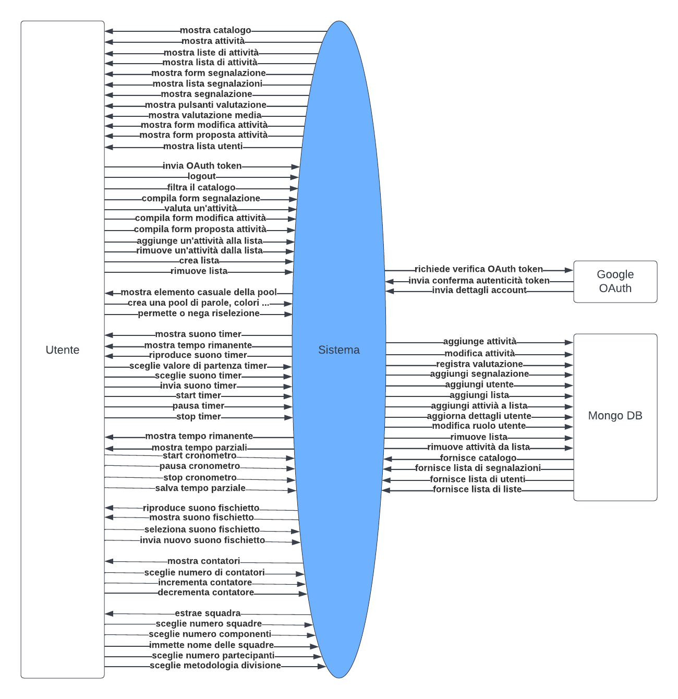
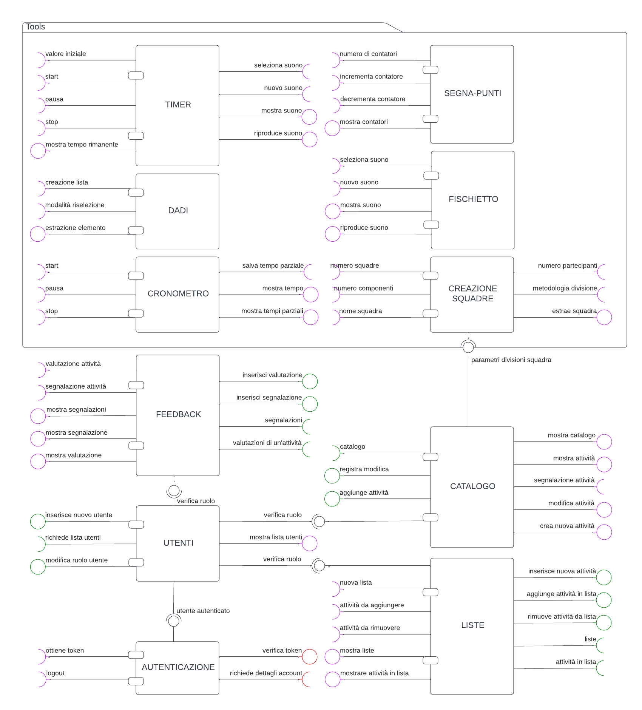

---
pdf_options:
    format: a4
    margin: 30mm 20mm
    printBackground: true
    headerTemplate: |-
        
        <section>
            D2 - Animati - ??? v1.0
        </section>
    footerTemplate: |-
        <section>
            

                Pagina 
                di 
            

        </section>
---
 Dipartimento di Ingegneria e Scienza dell’Informazione

---

### Progetto:
<h1 align="center">Animati</h1>

### Titolo del documento:
<h1 align="center">???</h1>

### Gruppo:
<h1 align="center">T51</h1>

# Scopo del documento

# Use Case

# Tabella requisiti non funzionali

Nel presente capitolo vengono riportati i requisiti non funzionali (RNF) del sistema utilizzando tabelle strutturate e specificando misure facilmente verificabili.

---

## Efficienza e prestazioni
I primi 7 requisiti assumono che l'utente disponga di una connessione a Internet con una velocità di trasmissione di almeno 20Mbps, per velocità inferiori non sono offerte garanzie di prestazione per quanto riguarda le funzionalità online dell'app.

| Indice | Proprietà | Descrizione | Misura |
| --- | --- | --- | --- |
| RNF1. | Tempo consultazione e filtraggio catalogo | Tempo massimo di risposta del sistema a richieste di consultazione e filtraggio del catalogo da parte dell'utente | 1 secondo |
| RNF1.1 | Tempo consultazione liste personali | Tempo massimo di risposta del sistema a richieste di consultazione delle proprie liste da parte dell'utente | 1 secondo |
| RNF2. | Tempo modifica dati | Tempo massimo di risposta del sistema a richieste di modifica dati da parte dell'utente | 1 secondo, garantito dall'impiego di meccanismi di aggiornamento sequenziale |
| RNF3. | Frequenza aggiornamento catalogo locale | Frequenza di aggiornamento della copia locale del catalogo sul dispositivo dell'utente, qualora esso (il dispositivo) lo permetta | Almeno una volta ogni ora e ad ogni avvio dell'app da parte dell'utente, a condizione che il dispositivo sia connesso ad Internet |
| RNF4. | Tempo aggiornamento catalogo locale | Tempo massimo impiegato dal sistema per l'aggiornamento della copia locale del catalogo sul dispositivo dell'utente, qualora esso (il dispositivo) lo permetta | 10 secondi la prima volta che viene creato, 1 secondo dalle volte successive, e nessuna delle due operazioni impedirà o interromperà la navigazione all'interno dell'app da parte dell'utente |
| RNF5. | Tempo utilizzo tools | Tempo massimo di risposta del sistema per operazioni concernente le funzionalità dei tools  | 1 secondo |
| RNF6. | Tempo login | Tempo massimo di risposta da parte del sistema nell'operazione di login | Tempo impiegato dall'utente per inserire i propri dati quando si trova sull'interfaccia di Google, più ulteriori 10 secondi |
| RNF7. | Tempi funzionalità offline | Tempo massimo di risposta del sistema a richieste di consultazione e filtraggio del catalogo, consultazione delle proprie liste e utilizzo dei tools in assenza di connessione ad Internet | 1 secondo qualora il dispositivo dell'utente permetta di svolgere le funzionalità riportate in modalità offline |
| RNF8 | Tempo logout | Tempo massimo di risposta da parte del sistema nell'operazione di logout | 100ms |
| RNF9. | Banda consumata | Consumo medio di dati Internet da parte del dispositivo dell'utente richiesti dal sistema | 3MB settimanalmente, 20MB in occasione della creazione della copia locale del catalogo |

Nota: il tempo di visualizzazione dei risultati delle richieste al sistema da parte dell'utente dipende, oltre che dal tempo di risposta del sistema, anche dal tempo di che caricamento del browser, che non è di competenza dell'applicazione.

## Memorizzazione dati

| Indice | Proprietà | Descrizione | Misura |
| --- | --- | --- | --- |
| RNF10. | Spazio sul dispositivo | Spazio massimo occupato dai dati salvati sul dispositivo dell'utente | 20MB |
| RNF11. | Dati utenti non autenticati | Informazioni sui dati raccolti per gli utenti non autenticati | - |
| RNF11.1 | Dati utenti non autenticati sul server | Dati raccolti sugli utenti non autenticati e memorizzati su un server | Nessuno |
| RNF11.2 | Cookie tecnici| Dati raccolti sugli utenti non autenticati e memorizzati sul browser dell'utente sotto forma di cookie tecnico | Conferma di non voler più visualizzare un tutorial dopo che l'utente avrà visualizzato il contenuto di un tutorial ed espresso tale preferenza, sotto forma di cookie tecnico, ovvero non disattivabile |
| RNF11.3 | Ulteriori dati generici | Dati non relativi ad uno specifico utente raccolti e memorizzati sul dispositivo dell'utente non necessari alla navigazione online nell'applicativo | Copia del catalogo e delle pagine HTML e JavaScript necessari a garntire le funzionalità offline, memorizzate sul browser dell'utente o, previa autorizzazione, sul filesystem del dispositivo dell'utente |
| RNF12. | Dati utenti autenticati | Informazioni sui dati raccolti per gli utenti autenticati | - |
| [RNF11.2.](#rnf112) | Come sopra | - | - |
| [RNF11.3.](#rnf113) | Come sopra | - | - |
| RNF12.1 | Dati individuali sul server | Dati raccolti sugli utenti autenticati e memorizzati su un server | Mail, valutazioni lasciate alle attività, proposte di nuovi giochi, liste di attività, segnalazioni inviate, presenza o meno di privilegi di amministratore |
| RNF12.2 | Dati individuali sul dispositivo | Dati raccolti sugli utenti autenticati e memorizzati sul dispositivo dell'utente | Come RNF12.1 |

## Privacy e security

| Indice | Proprietà | Descrizione | Misura |
| --- | --- | --- | --- |
| RNF13. | Sicurezza connessione | Sicurezza e protezione dei dati trasmessi dal/al sistema | Ogni connessione da e verso il sistema utilizzerà il protocollo HTTPS |
| RNF14. | Visibilità dei dati | Elenco di entità che avranno accesso ai dati raccolti dal sistema descritti nella sezione precedente | - |
| RNF14.1 | Visibilità cookie tecnici | Entità che hanno accesso ai cookie tecnici di un utente in [RNF11.2](#rnf112) | Esclusivamente l'utente direttamente interessato e solo su esplicita richiesta di accesso. |
| RNF14.2 | Visibilità liste | Entità che hanno accesso alle liste personali di un utente | Esclusivamente l'utente direttamente interessato dall'interno dell'applicazione |
| RNF14.3 | Visibilità valutazioni e proposte | Entità che hanno accesso alle valutazioni lasciate da un utente alle attività e alle sue proposte di attività | L'utente stesso dall'interno dell'applicazione; tutti gli altri utenti potranno visualizzare tali dati in forma anonimizzata e aggregata all'interno dell'applicazione |
| RNF14.4 | Visibilità dati personali | Entità che hanno accesso a mail, id identificativo e segnalazioni di un utente | L'utente stesso e tutti gli utenti con privilegi di amministratore |
| RNF13. | Codice della privacy | Norma della Repubblica Italiana, emanata con il Decreto legislativo 30 giugno 2003, n. 196, in vigore dal 1º gennaio 2004. | Conforme |
| RNF15.0 | Regolamento per la protezione dei dati (GDPR) | Regolamento dell'Unione europea n. 2016/679 in materia di trattamento dei dati personali e di privacy, adottato il 27 aprile 2016, entrato in vigore il 24 maggio dello stesso anno ed operativo dal 25 maggio 2018. | Conforme |
| RNF15.1 | Richiesta di consenso | Richiesta da parte del sistema a un utente di trattare i dati raccolti su di esso | Ogni richiesta di consenso sarà preventiva ed esplicita. Per garantire un corretto funzionamento del sistema l'utente potrà negare il consenso al trattamento di ogni dato raccolto su di lui ad eccezione dei cookie tecnici di cui al [RNF11.2](#rnf112) |
| RNF15.2 | Diritto all'oblio | Diritto dell'utente di richiedere e ottenere la cancellazione dei dati raccolti su di lui dal sistema | Su esplicita richiesta di un utente a un amministratore saranno cancellati tutti i dati che lo riguardano dal sistema, eccetto per le valutazioni lasciate ad attività, le proposte di attività e le segnalazioni di attività, che saranno conservate in forma anonima. |
| RNF15.3 | Diritto di accesso | Diritto di un utente di visualizzare i dati raccolti su di lui dal sistema | Un utente avrà visibilità sui propri dati come descritto in [RNF14.](#rnf14) |
| RNF15.4 | Revoca del consenso | Diritto dell'utente di richiedere l'interruzione della raccolta di dati su di lui da parte del sistema e del trattamento dei dati raccolti fino a quel momento su di lui | Garantito nelle stesse modalità del diritto all'oblio, e in particolare comporta la cancellazione dell'account dell'utente dal sistema, ovvero il passaggio da utente autenticato a utente anonimo fino a nuova registrazione sull'applicazione e prestazione del consenso. |

## Portabilità

| Indice | Proprietà | Descrizione | Misura |
| --- | --- | --- | --- |
| RNF16. | Compatibilità funzionalità online | Condizioni sul dispositivo dell'utente per il funzionamento delle funzionalità offerte dal sistema che richiedono connessioni a Internet | Supporto di HTML5 da parte del browser |
| RNF17. | Compatibilità funzionalità offline | Condizioni sul dispositivo dell'utente per il funzionamento delle funzionalità offerte dal sistema che non richiedono connessioni a Internet | Supporto di service workers da parte del browser. Di seguito sono riportate le versioni da cui ciò è disponibile per i seguenti browser. |
| RNF17.1 | - | Chrome | 40 |
| RNF17.2 | - | Edge | 17 |
| RNF17.3 | - | Firefox | 44 |
| RNF17.4 | - | Opera | 27 |
| RNF17.5 | - | Safari | 11.1 |
| RNF17.6 | - | Chrome Android | 40 |
| RNF17.7 | - | Firefox for Android | 44 |
| RNF17.8 | - | Opera Android | 27 |
| RNF17.9 | - | Safari on iOS | 11.3 |
| RNF17.10 | - | Samsung Internet | 4.0 |
| RNF17.11 | - | WebView Android | 40 |

## Usabilità

| Indice | Proprietà | Descrizione | Misura |
| --- | --- | --- | --- |
| RNF18. | Tutorial | Schermate di spiegazione per facilitare la comprensione delle principali funzionalità dell'applicazione all'utente | 14, divise per tipologia di utente |
| RNF18.1 | Tutorial per ogni utente | - | 6 |
| - | - | - | 1. Mostrare come navigare catalogo, applicare filtri, selezionare attività per visualizzarne le informazioni |
| - | - | - | 2. Introduzione all'interfaccia dei tools |
| - | - | - | 3. Mostrare come usare lo strumento di creazione squadre, nelle due modalità |
| - | - | - | 4. Mostare come caricare un suono sul tool del timer o del fischietto e riprodurlo |
| - | - | - | 5. Mostare come creare liste parole, colori o immagini sullo strumento del dado |
| - | - | - | 6. Introdurre il funzionamento offline dell'applicazione |
| RNF18.2 | Tutorial solo per utenti anonimi | - | - |
| - | - | - | 1. Anticipare funzionalità utenti registrati e indicare come registrarsi |
| RNF18.3 | Tutorial solo per utenti autenticati | - | 4 |
| - | - | - | 1. Mostare come lasciare valutazioni o segnalazioni ad attività, o aggiungerle ai preferiti |
| - | - | - | 2. Mostare come creare o modificare proposte di attività |
| - | - | - | 3. Mostare come creare o modificare liste di attività |
| - | - | - | 4. Accennare alla visualizzazione offline delle liste personali |
| RNF18.4 | Tutorial solo per amministratori | - | 3 |
| - | - | - | 1. Mostare come aggiungere o modificare attività |
| - | - | - | 2. Mostare come visualizzare le segnalazioni |
| - | - | - | 3. Mostare come visualizzare la lista utenti, selezionare un utente e modificarne il ruolo |
| RNF19. | Tempi di addestramento | Tempo medio necessario a un utente per comprendere come utilizzare le funzionalità offerte dal sistema senza l'utilizzo di un manuale | Diviso per tipologie di utente |
| RNF19.1 | - | Tempo di addestramento per comprendere le funzionalità offerte agli utenti anonimi | 10 minuti |
| RNF19.2 | - | Tempo di addestramento per comprendere le funzionalità offerte agli utenti autenticati | 20 minuti |
| RNF19.3 | - | Tempo di addestramento per comprendere le funzionalità offerte agli amministratori | 15 minuti |
| RNF20. | Tasso errori utenti | Numero massimo di errori commessi da un utente dopo l'addestramento | 2 su media giornaliera |
| RNF21. | Standard di ux design | Accorgimenti di design di User Interface e User Experience per migliorare l'usabilità dell'applicazione | Conforme alle regole euristiche riportate [nell'articolo](https://www.interaction-design.org/literature/article/user-interface-design-guidelines-10-rules-of-thumb), in particolare: |
| RNF21.1 | Visibilità dello stato del sistema | Possibilità dell'utente di discernere visivamente e chiaramente lo stato corrente del sistema | Garantito tramite banner in un menù che indichi tipologia di utente con cui sta accedendo sul momento al sistema: anonimo/autenticato/admin, account con cui è loggato in caso sia autenticato, stato offline/online/di errore del sistema |
| RNF21.2 | Chiarezza errori | Mostrare agli utenti errori che siano per essi comprensibili e che consentano loro di intraprendere le azioni corrette per uscirne | Garantito mostrando messaggi di errore specifici e indicativi del malfunzionamento in corso o eccezione avvenuta invece di generici errori del browser, su browser che supportano l'installazione di service workers |
| RNF21.3 | Testing con veri utenti | Effettuare il testing del sistema chiedendo il feedback di persone rientranti nelle categorie di utenti finali dell'applicazione | Il sistema sarà testato chiedendo il feedback di almeno 50 animatori/educatori per giovani |

## Affidabilità e robustezza

| Indice | Proprietà | Descrizione | Misura |
| --- | --- | --- | --- |
| RNF22. | Uptime minimo | Tempo minimo di disponibilità del sistema | 20 giorni su media mensile nel primo anno dal deployment del sistema |
| RNF23. | Tempo massimo malfunzionamento | Tempo massimo di indisponiblità del sistema al verificarsi di un malfunzionamento | 3 giorni lavorativi in presenza di segnalazioni su Github |
| RNF24. | Perdita dati | Perdita dei dati di un utente in caso di malfunzionamento | Nel caso in cui si dovesse verificare un malfunzionamento del sistema mentre un utente è connesso ad esso via Internet, è garantito che i dati che l'utente ha memorizzato sul suo account almeno 10 secondi prima del malfunzionamento saranno preservati. |
| RNF25. | Disponibilità sistema offline | Possibilità di accedere alle funzionalità del sistema nel caso in cui il server non sia raggiungibile | Sarà garantito il funzionamento delle funzionalità offline, qualora il dispositivo dell'utente sia compatibile |

## Sicurezza

| Indice | Proprietà | Descrizione | Misura |
| --- | --- | --- | --- |
| RNF26. | Seganalazioni | Possibilità per un utente di segnalare agli amministratori la presenza di contenuto inappropriato in una delle attività nel catalogo | Garantita |
| RNF27. | Controllo segnalazioni | Tempo massimo entro il quale viene controllata una segnalazione sulle attività e fasce orarie in cui viene effettuato il controllo | Al massimo 4 ore nella fascia oraria tra le 8:00 del mattino e le 00:00 (mezzanotte) |
| RNF28.1 | Possessione dispositivo | Numero di dispositivi necessari all'organizzazione e svolgimento di un'attività di animazione con l'impiego del sistema | 1 per l'organizzatore/arbitro, nessun dispositivo richiesto per gli altri partecipanti |
| RNF28.2 | Tempo allo schermo | Tempo di impiego dell'applicazione necessario all'organizzazione e svolgimento di un'attività di animazione con l'impiego del sistema per i partecipanti diversi dall'organizzatore/arbitro | 10 secondi, sotto supervisione di un utente addestrato nell'utilizzo dell'applicazione |

## Interoperabilità

| Indice | Proprietà | Descrizione | Misura |
| --- | --- | --- | --- |
| RNF29. | MongoDB | Interazione del sistema con un database non relazionale offerto da MongoDB | Usato per memorizzare dati e rispondere alle richieste degli utenti |
| RNF30. | Google OAuth 2.0 | Interazione del sistema con l'API di Google OAuth 2.0 | Usato per identificare gli utenti |
| RNF31. | API catalogo | Esposizione da parte del sistema di API che consentano la consultazione e il filtraggio del catalogo online | Esposta dal sistema |
| RNF32. | API liste | Esposizione da parte del sistema di API che consentano la creazione ed esportazione di liste di attività | Esposta dal sistema |
| RNF33. | Filesystem | Interazione del sistema con il filesystem del dispositivo dell'utente | Usato per la memorizzazione di dati in locale sotto previo consenso da parte dell'utente e qualora il dispositivo dell'utente lo permetta |

## Scalabilità

| Indice | Proprietà | Descrizione | Misura |
| --- | --- | --- | --- |
| RNF34. | Utenti supportati | Numero di utenti autenticati registrati contemporaneamente che il sistema potrà supportare senza perdita di prestazioni | 10.000, garantito dalla possibilità di gestire le richieste degli utenti, qualora i loro dispositivi lo permettano, anche offline, rimuovendo quindi lavoro dal server |
| RNF35. | Attività supportate | Numero di attività presenti contemporaneamente nel catalogo che il sistema potrà supportare senza perdita di prestazioni negli aggiornamenti alle copie locali dei cataloghi | 10.000, garantito dalla tecnica di aggiornamento sequenziale |
| RNF36. | Richieste gestite | Numero di richieste per unità di tempo al server online che il sistema potrà gestire contemporaneamente senza perdita di prestazioni | 10.000/s, garantito dalla possibilità di gestire le richieste degli utenti, qualora i loro dispositivi lo permettano, anche offline, rimuovendo quindi lavoro dal server |

## Accessibilità

| Indice | Proprietà | Descrizione | Misura |
| --- | --- | --- | --- |
| RNF37. | Accessibilità utenti con disabilità | Misure adottate per facilitare la navigazione nel sistema da parte di utenti con disabilità | Conformi a [Web Content Accessibility Guidelines (WCAG) 2.2](https://www.w3.org/TR/WCAG22/), ad esempio: |
| RNF37.1. | Navigazione ipovedenti | Misure adottate per facilitare la navigazione nel sistema da parte di utenti ipovedenti | Stile con colori ad alto contrasto ove necessario distinguere forme |
| RNF37.2. | Navigazione mobilità limitata e non vedenti | Misure adottate per facilitare la navigazione nel sistema da parte di utenti non vedenti o con mobilità limitata | L'applicazione sarà completamente navigabile via tastiera, in particolare: |
| - | - | - | 1. ogni elemento interagibile tramite posizionamento del click del mouse sarà raggiungibile per chi naviga tramite tastiera (usando frecce e tab) spostando il "focus" su di esso; |
| - | - | - | 2. l'ordine con cui viene messo il "focus" sugli elementi all'interno di una pagina rispetterà il flow logico della stessa; |
| - | - | - | 3. ogni elemento quando il focus viene messo su di esso farà comparire un riquadro con breve suggerimento o spiegazione riguardo l'elemento stesso in modo che questo possa essere letto da eventuali sistemi di screen-reader o VoiceOver; |

## Lingua

| Indice | Proprietà | Descrizione | Misura |
| --- | --- | --- | --- |
| RNF38. | Lingue | Lingue previste su tutte le schermate di cui è composto il software. | Italiano |

## Distribuzione

| Indice | Proprietà | Descrizione | Misura |
| --- | --- | --- | --- |
| RNF39. | FOSS | Il sistema deve essere distribuito come Free and Open Source Software | Il codice sorgente dell'applicativo sarà distribuito sotto licenza GPL3.0 |

## Progressive Web App

| Indice | Proprietà | Descrizione | Misura |
| --- | --- | --- | --- |
| RNF40. | Criteri PWA | Criteri affinché il sistema sia considerato una Progressive Web App | Conforme |
| [RNF13.](#rnf13) | - | - | - |
| RNF40.1 | Funzionamento offline | Qualora il dispositivo dell'utente lo permetta, parte dell'app può essere caricata ed eseguita anche mentre il dispositivo dell'utente è offline | Conforme |
| RNF40.2 | Manifest | L'app deve avere un Web App Manifest di riferimento con almeno quattro proprietà chiave: name, short_name, start_url, e display | Conforme |
| RNF40.3 | Icona | L'app deve avere una icona grande almeno 144×144 pixel in formato png. | Conforme |

# Diagramma di Contesto

# Diagramma delle Componenti

