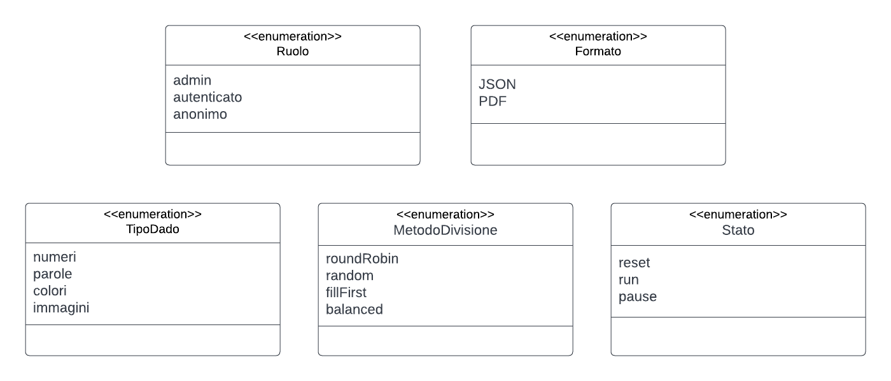
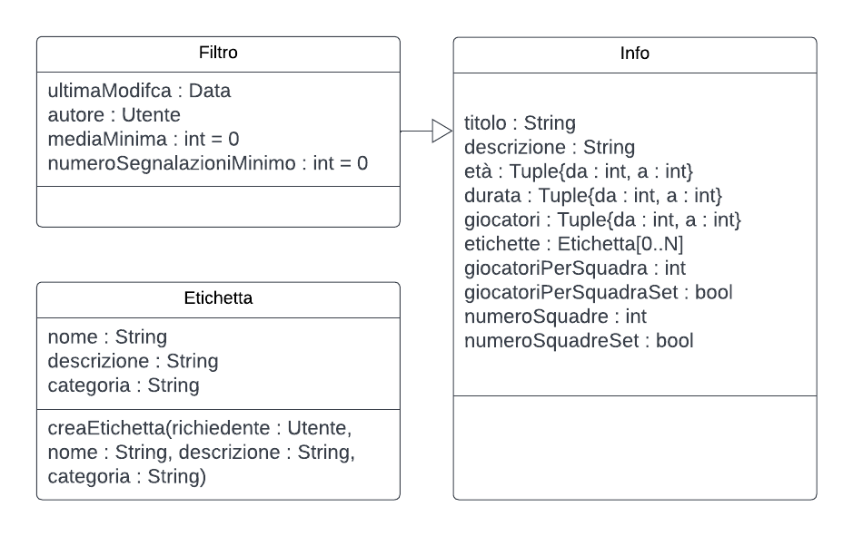

---
pdf_options:
    format: a4
    margin: 30mm 20mm
    printBackground: true
    headerTemplate: |-
        <style>
            section {
                margin: 0 auto;
                font-family: system-ui;
                font-size: 11px;
            }
        </style>
        <section>
            D3 - Animati - Architettura v0.1 [pre-release]
        </section>
    footerTemplate: |-
        <section>
            <div>
                Pagina <span class="pageNumber"></span>
                di <span class="totalPages"></span>
            </div>
        </section>
---
 Dipartimento di Ingegneria e Scienza dell’Informazione

---

### Progetto:
<h1 align="center">Animati</h1>

<center></center>

### Titolo del documento:
<h1 align="center">Architettura</h1>

### Gruppo:
<h1 align="center">T51</h1>

<div class="page-break"></div>

# Indice
<span class=horizontal_dotted_line>Diagramma delle Classi<span class=dot></span>3</span>
<span class=horizontal_dotted_line>OCL<span class=dot></span>?</span>

<style>
.horizontal_dotted_line{
    width: 100%;
    display : flex;
}
.dot{
    flex: 1;
    border-bottom: 2px dotted black;
    margin-left: 5px;
    margin-right: 5px;
    height: 1em;
}
</style>
<div class="page-break"></div>

# Scopo del documento
[...]

<div class="page-break"></div>

# Diagramma delle classi
Nel presente capitolo vengono presentate le classi previste nell'ambito del progetto Animati. Vengono riportate di seguito le classi individuate a partire dai diagrammi di contesto e dei componenti.

## Classi enumerative di supporto
### Unità
> La classe **Unità** è una classe di supporto utilizzata nella classe Info, che sta ad indicare con i suoi attributi la durata di un'attività.
### Ruolo
> La classe **Ruolo** è una classe di supporto utilizzata nella classe Utente, che sta ad indicare con i suoi attributi il ruolo assunto da uno specifico utente.
### Formato
> La classe **Formato** è una classe di supporto utilizzata ogniqualvolta si deve indicare il formato di un file da esportare. In questo caso nella classe ListaAttività, quando viene esportata una lista col metodo esporta(formato : Formato).
### TipoDado
> La classe **TipoDado** è una classe di supporto utilizzata nella classe Dado, che sta ad indicare con i suoi attributi il tipo di faccia utilizzata dallo strumento dado.
### MetodoDivisione
> La classe **MetodoDivisione** è una classe di supporto utilizzata nella classe CreazioneSquadre, che sta ad indicare con i suoi attributi la metodologia di divisione scelta dall'utente per l'estrazione delle squadre.
### Stato
> La classe **Stato** è una classe di supporto utilizzata nelle classi Cronometro e Timer, che serve per descrivere lo stato in cui si trovano gli stessi.

<p align="center"></p>

## Classi di supporto
### Data
> La classe **Data** è una classe di supporto che con i suoi attributi giorno, mese, anno, orario sta ad indicare un preciso momento, col suo metodo now() restituisce i valori di questi attributi e con il metodo lessThan(d2 : Data) : bool può confrontare due date.
### URL
> La classe **URL** è una classe di supporto che con i suoi attributi protocollo e percorso va ad indicare un immagine o un suono, a seconda dell'uso che si fa della classe.<br>
> Per esempio, nella classe Suono, l'url utilizzato per l'attributo sorgente rappresenta un suono. Al contrario, nelle classi Faccia, Attività e Utente, gli attributi immagine e banner rappresentano un'immagine.
### Time
> La classe **Time** è una classe di supporto, che con i suoi attributi, va a rappresentare un tempo con precisione massima nell'ordine dei centesimi di secondo.
### Colore
> La classe **Colore** è una classe di supporto che con i suoi attributi, va a rappresentare un colore espresso tramite codice RGB, uno spazio di colore che riproduce i colori visibili all’uomo tramite la mescolanza additiva dei tre colori di base: rosso, verde e blu.

<p align="center"></p>

### Info, Filtro ed Etichetta
> La classe **Etichetta** è una classe di supporto che con i suoi attributi, va a rappresentare nome, descrizione e categoria di un'etichettà che può essere assegnata ad un'attività. Viene usata nella classe Info.<br>
> La classe **Info** è una classe di supporto che con i suoi attributi va a definire tutte le informazioni riguardanti un'attività.<br>
> La classe **Filtro** è una classe di supporto ed è collegata tramite una generalizzazione alla classe Info. Viene utilizzata per contenere le informazioni secondo le quali le attività devono essere filtrate.

<p align="center"></p>

## Dado e Faccia
> La classe **Faccia** è una classe di supporto alla classe Dado, e presenta tutti gli attributi necessari a definire qual è il tipo di una faccia del dado e cosa vi è rappresentato.
> La classe **Dado** è una classe il quale compito è quello di fornire gli attributi e i metodi necessari all'utilizzo dello strumento dado. <br>
> Una volta determinati i parametri definiti dagli attributi, grazie ai metodi presenti, il metodo estrai() è quello che fa funzionare lo strumento.

<p align="center"></p>

## Cronometro
> La classe **Cronometro** è una classe il quale compito è quello di fornire gli attributi e i metodi necessari all'utilizzo dello strumento cronometro.<br>
> Il tempo viene rappresentato grazie alla classe di supporto Time.

<p align="center"></p>

## Timer e Suono
> La classe **Suono** è una classe il quale compito è quello di fornire gli attributi e i metodi necessari all'utilizzo dello strumento fischietto, nonché di essere una classe di supporto alla classe Timer.<br>
> La classe **Suono**, grazie ai suoi attributi e metodi riesce a riprodurre un suono in base a come viene gestito l'attributo booleano inRiproduzione.<br>
> La classe **Timer** è una classe il quale compito è quello di fornire gli attributi e i metodi necessari all'utilizzo dello strumento timer.<br>
> I metodi stop() e start() di Timer hanno una funzione diversa rispetto a quelli di Suono, in quanto si occupano di fermare e avviare il timer e non di riprodurre o meno il suono.

<p align="center"></p>

## CreazioneSquadre
> La classe **CreazioneSquadre** è una classe il quale compito è quello di fornire gli attributi e i metodi necessari all'utilizzo dello strumento creazione squadre.<br>
> Gli attributi presenti indicano i valori dei parametri come anche se quei parametri sono stati impostati, nel caso degli attributi booleani Set.<br>
> Grazie ai metodi presenti viene poi fatta l'estrazione delle squadre, secondo la metodologia scelta dall'utente.

<p align="center"></p>

## SegnaPunti
> La classe **SegnaPunti** è una classe il quale compito è quello di fornire gli attributi e i metodi necessari all'utilizzo dello strumento segna punti.<br>
> L'attributo contatori rappresenta i contatori delle varie squadre, che vengono incrementati e/o decrementati grazie ai metodi presenti.

<p align="center"></p>

## Utente
> La classe **Utente** è una classe che rappresenta colui che utilizza l'applicazione. Ci sono quindi attributi che rappresentano i dati identificativi di quell'utente, come anche il ruolo e lo stato, che può essere offline o online.<br>
> Il metodo login() crea un'istanza di Autenticazione e chiama diversi suoi metodi. Esso è associato al metodo logout().<br>
> Il metodo verificaRuolo(ruoloNecessario : Ruolo, richiedente : Utente) serve a confrontare due ruoli.<br>
> Un utente può promuovere gli altri utenti, ma l'attributo promossoDa, serve nel caso un utente voglia declassare un altro utente che ha il ruolo di amministratore. In tal caso, l'utente deve essere quello che lo ha promosso a tale.<br>
> Il metodo listaUtenti(richiedente : Utente) : Utente[0..N] fornisce una lista di utenti.<br>
> Un utente può creare una o più attività e/o liste di attività, rappresentate rispettivamente dalle classi Attività e ListaAttività.<br>
> Un utente può effettuare una o più segnalazioni e/o valutazioni, rappresentate rispettivamente dalle classi Segnalazione e Valutazione.

<p align="center"></p>

## Autenticazione
> La classe **Autenticazione** è una classe che rappresenta il processo di login di un utente. <br>
> Quando viene chiamato il metodo login() della classe Utente, viene creata un'istanza di Autenticazione e viene chiamata richiestaAutorizzativa().<br>
> Se il codice è valido viene chiamato il metodo richiestaToken() e successivamente dettagliAccount() che mette i risultati negli attributi id e mail dell'utente. <br>
> Viene chiesto a MongoDB il ruolo dell'utente e la sua foto profilo che vengono a loro volta assegnati agli attributi ruolo e immagine dell'utente.<br>
> Infine avviene un aggiornamento dei dati locali.

<p align="center"></p>

## Segnalazione
> La classe **Segnalazione** è una classe che rappresenta la segnalazione fatta da un utente ad un'attività. Più segnalazioni possono riferirsi ad una stessa attività. Ogni segnalazione è stata effettuata da un solo utente. <br>
> Gli attributi rappresentano le informazioni relative alla segnalazione, ovvero descrizione, utente da cui è stata fatta e attività alla quale si riferisce. <br>
> Un utente può effettuare una segnalazione grazie al metodo presente.<br>
> Se un utente non esiste più le segnalazioni effettuate dallo stesso rimangono.
## Valutazione
> La classe **Valutazione** è una classe che rappresenta la valutazione fatta da un utente ad un'attività. Più valutazioni possono riferirsi ad una stessa attività. Un utente può dare una sola valutazione ad un'attività. <br>
> Gli attributi rappresentano le informazioni relative alla valutazione, ovvero il voto espresso con un numero intero, l'attività a cui si riferisce e l'utente da cui è stata fatta. <br>
> Un utente può effettuare una valutazione grazie al metodo presente. <br>
> Se un utente non esiste più le valutazioni effettuate dallo stesso rimangono.

<p align="center"></p>

## GestoreDatiOffline
> La classe **GestoreDatiOffline** è una classe che rappresenta tutte le operazioni che vengono fatte sui dati presenti localmente, ovvero che non necessitano che l'utente sia online.<br>
> Oltre a ciò si occupa anche di aggiornare i dati locali grazie al metodo omonimo.

<p align="center"></p>

## Attività
> La classe **Attività** è una classe che rappresenta tutto ciò riguardante un'attività.<br>
> Viene aiutata dalla classe di supporto Info, che contiene gran parte delle informazioni dell'attività stessa.<br>
> Essa può essere soggetta a modifiche grazie all'omonimo metodo.
> A un'attività si possono riferire delle segnalazioni e/o valutazioni. Il metodo mostraSegnalazioni() mostra tutte le segnalazioni associate a quella specifica attività. <br>
> Il metodo divisioneSquadre, reindirizza l'utente alla schermata di creazione squadre con i parametri già riempiti per rispettare i vincoli di quella specifica attività.<br>
> Un'attività è contenuta nel catalogo e può essere contenuta in una lista. Più liste possono contenere la stessa attività, e un'attività può essere contenuta più volte nella stessa lista.<br>
> Un'attività viene creata da un solo utente.

<p align="center"></p>

## Catalogo
> La classe **Catalogo** è una classe che rappresenta il catalogo di attività.<br>
> Tra gli attributi c'è un'istanza di Filtro. Grazie al metodo impostaFiltro(filtro : Filtro) si va a impostare gli attributi di filtroAttuale.<br>
> Grazie al metodo ottieniCatalogo si va a riempire l'attributo lista con il catalogo filtrato.<br>
> Il catalogo può contenere delle attività.<br>
> Il metodo mostraAttivitàSegnalate(richiedente : Utente) mostra la lista di attività segnalate e per ogni attività quante sono le segnalazioni.

<p align="center"></p>

## ListaAttività
> La classe **ListaAttività** è una classe che rappresenta le liste di attività create dagli utenti.<br>
> Un utente può creare più liste di attività. Ne ha almeno una in quanto ogni utente ha la lista "Preferiti". Ogni lista ha un solo utente, non esistono liste condivise.<br>
> Tra gli attributi della lista sono presenti le informazioni che la identificano e con i metodi forniti si può crearla, rimuoverla, mostrarla ed esportarla, oltre ad aggiungervi o rimuovere attività.

<p align="center"></p>

## MongoDB
> La classe **MongoDB** è una classe che rappresenta in che modo il sistema si interfaccia con MongoDB.<br>
> Il metodo controllaConnessione() verifica se si è connessi o meno al DBMS.<br>
> I metodi presenti rappresentano tutti i modi in cui il sistema interagisce con MongoDB.

<p align="center"></p>

<div class="page-break"></div>

# Codice in Object Constraint Language
In questo capitolo è descritta in modo formale la logica prevista nell’ambito di alcune operazioni di alcune classi. Tale logica viene descritta in Object Constraint Language (OCL) (https://www.omg.org/spec/OCL/2.4/PDF) perché tali concetti non sono esprimibili in nessun altro modo formale nel contesto di UML.

## **Cronometro**

| Metodo | Precondizioni | Postcondizioni |
| --- | --- | ---|
|start()|**stato** deve essere in "reset" o in "pause"|**stato** assume valore "run"|
|pause()|**stato** deve essere in "run"|**stato** assume valore "pause"|
|stop()|**stato** deve essere in "pause"|<ul><li>**stato** assume valore "reset"</li><li>**parziali** è una lista vuota</li></ul>|
|parziale()|**stato** deve essere in "run"|<ul><li>**stato** rimane al valore "run"</li><li>aggiunto tempo a lista **parziali**</li></ul>|

```js
context Cronometro::start()
pre: (self.stato = "reset") OR (self.stato = "pause")
post: self.stato = "run"
```
```js
context Cronometro::pause()
pre: self.stato = "run"
post: self.stato = "pause"
```
```js
context Cronometro::stop()
pre: self.stato = "pause"
post: (self.stato = "reset") AND (self.parziali->isEmpty())
```
```js
context Cronometro::parziale()
pre: self.stato = "run"
post: (self.stato = "run") AND (self.parziali = self.parziali@pre->append(self.tempo))
```

---

## **Segna-Punti**

#### **Invarianti**:
#### contatori : Tuple{nome : String, punteggio : int}[0..N]
- contatori contiente al più 99 elementi
- il campo nome di ogni elemento di contatori deve avere tra 0 (escluso) e 99 (incluso) caratteri
- il campo punteggio di ogni elemento di contatori deve essere compreso tra -500 e 500

```js
context Segna-Punti inv :
self.contatori->size() <= 99
```
```js
context Segna-Punti inv :
self.contatori->forAll(c : Tuple{nome : String, punteggio : int} | 0 < c.nome.size() AND c.nome.size <= 99)
```
```js
context Segna-Punti inv :
self.contatori->forAll(c : Tuple{nome : String, punteggio : int} | -500 <= c.punteggio AND c.punteggio <= 99)
```

| Metodo | Precondizioni | Postcondizioni |
| --- | --- | --- |
|aggiungiContatore(indice : int)|<ul><li>Il nome non deve essere vuoto e non può eccedere i 99 caratteri</li><li>il numero di contatori può essere al massimo 98</li><ul>|la sequenza di contatori deve avere come ultimo elemento un contatore con il nome scelto e punteggio pari a 0|
|incrementa(indice : int)|il contatore all'indice scelto deve avere punteggio minore di 500|il punteggio del contatore alla posizione scelta viene incrementato di 1|
|decrementa(indice : int)|il contatore all'indice scelto deve avere punteggio maggiore di -500|il punteggio del contatore alla posizione scelta viene decrementato di 1|

```js
context Segna-Punti::aggiungiContatore(indice : int)
pre: (0 < nome.size() AND nome.size() <= 99) AND (self.contatori->size() < 99)
post: self.contatori = self.contatori@pre->append(Tuple{nome : String = nome, punteggio : int = 0})
```
```js
context Segna-Punti::incrementa(indice : int)
pre: self.contatori->at(indice) < 500
post: (self.contatori->at(indice)).punteggio = (self.contatori@pre->at(indice)).punteggio + 1
```
```js
context Segna-Punti::decrementa(indice : int)
pre: self.contatori->at(indice) > -500
post: (self.contatori->at(indice)).punteggio = (self.contatori@pre->at(indice)).punteggio - 1
```
---

## **Timer**

#### **Invarianti**:
#### suono : Suono
- il suono non può essere in riproduzione se il timer non è scaduto
```js
context Timer inv :
self.suono.inRiproduzione implies self.stato = "run" AND self.tempo.ore = 0 AND self.tempo.minuti = 0 AND self.tempo.secondi = 0 AND self.tempo.centesimi = 0
```

| Metodo | Precondizioni | Postcondizioni |
| --- | --- | --- |
|start()|**stato** deve essere in "reset" o in "pause"|**stato** assume valore "run"|
|pause()|**stato** deve essere in "run"|**stato** assume valore "pause"|
|stop()|**stato** deve essere in "pause"|**stato** assume valore "reset"|
|imposta(ore : int, minuti : int, secondi : int)| il tempo fonito deve essere valido | **tempo** assume il valore del tempo fornito|
|spegni()|**self.suono.inRiproduzione** deve essere true|**self.suono.inRiproduzione** deve essere false e **stato** dev'essere reset|

```js
context Timer::start()
pre: (self.stato = "reset") OR (self.stato = "pause")
post: self.stato = "run"
```
```js
context Timer::pause()
pre: self.stato = "run"
post: self.stato = "pause"
```
```js
context Timer::stop()
pre: self.stato = "pause"
post: self.stato = "reset"
```
```js
context Timer::imposta(ore : int, minuti : int, secondi : int)
pre: 0<=ore AND 0<=minuti AND minuti<60 AND 0<=secondi AND secondi<60
post: self.tempo = tempo
```
```js
context Timer::spegni()
pre: self.suono.inRiproduzione
post: (NOT self.suono.inRiproduzione) AND stato = reset
```

---

## **Dado**

#### **Invarianti**:
#### dimensione : int
- La dimensione deve essere compresa tra 0 e 9.999 inclusi
#### campione : Faccia[0..N]
- La dimensione del campione deve essere al più 9.999 incluso
- ogni elemento del campione deve avere tipo corrispondente al tipo del dado
#### estremoInferiore : int
- L'estremo inferiore deve essere compreso tra 0 e 9.999 inclusi
#### passo : int
- Il passo deve essere compreso tra 1 e 9.999 inclusi
#### estrazioni : int
- Il numero di estrazioni effettuate deve essere non negativo

```js
context Dado inv :
0<=self.dimensione AND self.dimensione<=9.999 AND self.campione->size()<=9.999 AND self.campione.forALL(f : Faccia | f.tipo = self.tipo)
```
```js
0<=self.estremoInferiore AND self.estremoInferiore<=9.999 AND 1<=self.passo AND self.passo<=9.999
AND 0<=self.estrazioni
```

| Metodo | Precondizioni | Postcondizioni |
| --- | --- | --- |
|scegliModalità(reimmissione : bool)| non deve essere stata effettuata ancora alcuna estrazione |l'attributo reimmissione viene impostato al valore selezionato|
|scegliTipo(tipo : tipoDado)|<ul><li>non deve essere stata effettuata ancora alcuna estrazione</li><li>il campione dev'essere vuoto</li></ul>|l'attributo tipo viene impostato al valore selezionato|
| scegliDimensione(dim : int)|<ul><li>non può essere stata effettuata ancora alcuna estrazione</li><li>il valore fornito dev'essere una dimensione valida</li><li>il campione dev'essere vuoto</li></ul>|l'attributo dimensione viene impostato al valore selezionato|
|scegliEstremoPasso(estremo : int, passo : int)|<ul><li>non deve essere stata effettuata ancora alcuna estrazione</li><li>i valori forniti devono essere validi</li><li>il tipo del dado dev'essere "numeri"</li><li>il campione dev'essere vuoto</li></ul>|<ul><li>gli attributi estremoInferiore e passo vengono impostati ai valori selezionati</li><li>il campione viene riempitocon un numero di valori pari a dimensione che partono da estremoInferiore con scarto di passo tra due elementi consecutivi</li></ul>|
|aggiungiElemento(elemento :  Faccia)|<ul><li>non deve essere stata effettuata ancora alcuna estrazione</li><li>l'elemento fornito dev'essere del tipo del dado</li><li>il tipo del dado dev'essere diverso da "numeri"</li><li>la dimensione del campione dev'essere inferiore alla dimensione impostata</li></ul>|Il campione deve avere come ultimo elemento l'elemento fornito|
|estrai() : Faccia|il campione non dev'essere vuoto|<ul><li>il risultato è un elemento presente nel campione prima della chiamata al metodo</li><li>estrazioni viene incrementato di 1</li><li>se reimmissione è false, un'occorrenza del risultato viene rimossa dal campione</li></ul>|

```js
context Dado::scegliModalità(reimmissione : bool)
pre: self.estrazioni = 0
post: self.reimmissione = reimmissione
```
```js
context Dado::scegliTipo(tipo : tipoDado)
pre: self.estrazioni = 0 AND self.campione->isEmpty()
post: self.tipo = tipo
```
```js
context Dado::scegliDimensione(dim : int)
pre: self.estrazioni = 0 AND 0<dim AND dim<=9.999 AND self.campione->isEmpty()
post: self.dimensione = dim
```
```js
context Dado::scegliEstremoPasso(estremo : int, passo : int)
pre: self.estrazioni = 0 AND self.campione->isEmpty() AND 0<estremo AND estremo<=9.999 AND 1<passo AND passo<=9.99
post: self.estremoInferiore = estremo AND self.passo = passo AND self.campione->size() = dimensione AND self.campione->first().numero = estremoInferiore AND self.campione->forAll(f:Faccia | self.campione->count(f)=1 AND let i=self.campione->indexOf(f) in if i>1 then f.numero=passo+self.campione->at(i-1) endif)
```
```js
context Dado::aggiungiElemento(elemento :  Faccia)
pre: self.estrazioni = 0 AND elemento.tipo = self.tipo AND self.tipo <> "numeri" AND self.campione->size() < dimensione
post: self.campione = self.campione@pre->append(elemento)
```
```js
context Dado::estrai() : Faccia
pre: self.campione->notEmpty()
post: self.campione@pre->includes(result) AND self.estrazioni = self.estrazione@pre + 1 if (NOT reimmissione) then (self.campione->size() = self.campione@pre->size() AND self.campione->forAll(f:Faccia | let c=self.campione@pre->count(f) in if f<>result then self.campione->count(f)=c else self.campione->count(f)=c-1 endif)) endif
```

---
## **Suono**

#### **Invarianti**:

#### dimesnione : int
- la dimensione in byte del suono non deve superare i 100MB

```js
context Suono inv:
self.dimensione <= 100.000.000
```

| Metodo | Precondizioni | Postcondizioni |
| --- | --- | --- |
|start()||il suono è in riproduzione|
|stop()||il suono non è in riproduzione|
|scegliSuono(sorgente : URL)||la sorgente del suono è quella scelta|


```js
context Suono::start()
pre:
post: self.inRiproduzione = true
```
```js
context Suono::stop()
pre:
post: self.inRiproduzione = false
```
```js
context Suono::scegliSuono(sorgente : URL)
post: self.sorgente = sorgente
```

## **Creazione Squadre**

#### **Invarianti**:

#### numeroSquadre : int
- tra 0 e 100 esclusi
#### numeroComponenti : int
- tra 0 e 100 esclusi
#### numeroPartecipanti : int
- tra 0 e 9.802 esclusi
#### conferma : bool, numeroSquadre : int, numeroComponenti : int, numeroPartecipanti : int
- dal momento che conferma è true, gli altri tre campi devono essere compatibili (con numeroComponenti arrotondato per difetto)

```js
context CreazioneSquadre inv :
(0 < numeroSquadre AND numeroSquadre < 100) AND (0 < numeroComponenti AND numeroComponeti < 100) AND (0 < numeroPartecipanti AND numeroPartecipanti <= 9.801)
```
```js
context CreazioneSquadre inv :
conferma implies (numeroPartecipanti div numeroSquadre = numeroComponenti)
```


| Metodo | Precondizioni | Postcondizioni |
| --- | --- | --- |
|inserisciNumSquadre(numero : int)|<ul><li>il numero fornito dev'essere valido</li><li>non dev'essere ancora stata data la conferma dei parametri</li></ul>|<ul><li>numeroSquadre viene impostato al valore fornito</li><li>squadreSet viene impostato a true</li></ul>|
|inserisciNumComponenti(numero : int)|<ul><li>il numero fornito dev'essere valido</li><li>non dev'essere ancora stata data la conferma dei parametri</li></ul>|<ul><li>numeroComponenti viene impostato al valore fornito</li><li>componentiSet viene impostato a true</li></ul>|
|inserisciNumPartecipanti(numero : int)|<ul><li>il numero fornito dev'essere valido</li><li>non dev'essere ancora stata data la conferma dei parametri</li></ul>|<ul><li>numeroPartecipanti viene impostato al valore fornito</li><li>partecipantiSet viene impostato a true</li></ul>|
|rendiCampiCompatibili()|<ul><li>non dev'essere ancora stata data la conferma dei parametri</li><li>devono essere stati forniti almeno 2 parametri</li></ul>|i parametri diventano confermati|
|inserisciNome(nome : String)|<ul><li>dev'essere stata data la conferma dei parametri</li><li>nomi deve avere dimensione minore di numeroSquadre</li><li>il nome fornito non deve essere vuoto e la non deve eccedere i 99 caratteri</li></ul>|il nome fornito viene aggiunto a nomi|
|scegliMetodo(metodo : MetodoDivisione)|dev'essere stata data la conferma dei parametri|l'attributo metodoDivisione viene impostato a quello fornito|
|generaOrdine()|devono essere stati forniti tutti i nomi|ordineEstrazione deve contenere in posizione i l'indice della squadra a cui assegnare il partecipante i, in particolare:<ul>
<li>deve avere dimensione pari al numero di partecipanti</li>
<li>ogni squadra deve comparire un numero di volte pari a numeroComponenti o numeroComponenti + 1 (a seconda del resto della divisione di numeroPartecipanti per numeroSquadre)</li>
<li>se metodoDivisione assume il valore "Round robin", l'assegnamento delle squadre sarà sequenziale</li>
<li>se il metodo assume il valore "Fill first" l'assegnamento avverrà per completamento delle squadre, ovvero riempiendo i posti di ogni squadra prima di procedere con l'assegnamento per la prossima</li>
<li>se il metodo assume il valore "Balanced", a blocchi consecutivi di numeroComponenti assegnamenti tutte le squadre dovranno avere lo stesso numero di partecipanti prima di procedere con il prossimo blocco</li>
</ul>|
|estrai() : String|deve essere rimasto almeno un elemento da estrarre|<ul><li>estratti viene incrementato di 1</li><li>il risultato e' il nome della squadra assegnata al primo partecipante non ancora estratto</li></ul>|

```js
context CreazioneSquadre::inserisciNumSquadre(numero : int)
pre: (NOT conferma) AND 0 < numero AND numero < 100
post: numeroSquadre = numero AND squadreSet
```
```js
context CreazioneSquadre::inserisciNumComponenti(numero : int)
pre: (NOT conferma) AND 0 < numero AND numero < 100
post: numeroComponenti = numero AND componentSet
```
```js
context Creazione squadre::inserisciNumPartecipanti(numero : int)
pre: (NOT conferma) AND 0 < numero AND numero < 100
post: numeroPartecipanti = numero AND partecipantiSet
```
```js
context CreazioneSquadre::rendiCampiCompatibili()
pre: (NOT conferma) AND Sequence{squadreSet, partecipantiSet, componentiSet}->select(true)->size() >= 2
post: conferma
```
```js
context CreazioneSquadre::inserisciNome(nome : String)
pre: conferma AND nomi->size() < numeroSquadre AND nome <> "" AND nome.size() < 100
post: nomi = nomi@pre -> append(nome)
```
```js
context CreazioneSquadre::scegliMetodo(metodo : MetodoDivisione)
pre: conferma
post: metodoDivisione = metodo
```
```js
context CreazioneSquadre::generaOrdine()
pre: nomi->size() = numeroSquadre
post: ordineEstrazioni.size() = numeroPartecipanti AND Sequence(1...numeroSquadre)->forAll(n : int | let c = ordineEstrazioni.count(i), r = numeroPartecipanti mod numeroSquadre in (if(i <= r) then (c = numeroComponenti) else c = (numeroComponenti + 1)))
    AND metodoDivisione = roundRobin implies let oE = ordineEstrazioni in (oE->first = 1 AND Sequence{1...numeroPartecipanti-1}->forAll(i : int | (oE->at(i)+1) mod numeroSquadre = (oE->at(i+1)) mod numeroSquadre))
    AND metodoDivisione = fillFrist implies let oE = ordineEstrazioni, r = numeroPartecipanti mod numeroSquadre, c = numeroComponenti  in (Sequence{1...numeroSquadre -> forAll(i : int | if (i <= r) then (Sequence{(i-1)*(c+1)+1 ... i*(c+1)}->forAll(j : int | oE->at(j)=i)) else (Sequence{r*(c+1)+(i-1-r)*c+1 ... r*(c+1)+(i-r)*c}->forAll(j : int | oE->at(j)=i)) endif)})
    AND metodoDivisione = balanced implies let oE = ordineEstrazioni, c = numeroComponenti, n = numeroSquadre in (Sequence{1...n}->forAll(s : int | Sequence{1...c}->forAll(i : int | oE->subSequence((i-1)*n+1, i*n)->count(s) = 1) AND (s <= r implies oE->subSequence(c*n+1 ... numeroPartecipanti)->count(s) = 1)))
```
```js
context CreazioneSquadre::estrai() : String
pre: estratti < numeroPartecipanti
post: estratti = estratti@pre + 1 AND result = nomi->at(ordineEstrazione->at(estratti))
```

---


## **Utente**

#### **Invarianti**:
#### id : String
- l'id identifica univocamente un utente
#### mail : String
- la mail identifica univocamente un utente

#### ruolo : Ruolo, id : String, mail : String
- l'utente anonimo ha id automatico "000000000000000000000" e mail vuota

```js
context Utente inv :
Utente.allInstances()->forAll(u1, u2 |
u1 <> u2 implies (u1.id <> u2.id AND u1.mail <> u2.mail))
```
```js
context Utente inv :
ruolo = "anonimo" implies id = "000000000000000000000" AND mail = ""
```

| Metodo | Precondizioni | Postcondizioni |
| --- | --- | --- |
|login()|<ul><li>l'utente dev'essere online</li><li>l'utente deve avere ruolo anonimo</li></ul>|l'utente deve avere ruolo autenticato o admin|
|logout()|l'utente deve avere ruolo autenticato o admin|l'utente deve avere ruolo anonimo|
|cambiaRuolo(promotore : Utente, nuovoRuolo : Ruolo)|<ul>
<li>non si può cambiare ruolo in anonimo e non si può cambiare ruolo in quello già posseduto</li>
<li>il promotore deve essere un amministratore</li>
<li>un amministratore può essere declassato a utente comune unicamente dall’amministratore che lo ha promosso</li>
</ul>|l'attributo ruolo dell'utente assume il valore di nuovoRuolo|
|verificaRuolo(ruoloNecessario : Ruolo, richiedente : Utente) : bool|||
|listaUtenti(richiedente : Utente) : Utente[0...N]|||

```js
context Utente::login()
pre: online AND ruolo = "anonimo"
post: ruolo = "autenticato" OR ruolo = "admin"
```
```js
context Utente::logout()
pre: ruolo = "autenticato" OR ruolo = "admin"
post: ruolo = "anonimo"
```
```js
context Utente::cambiaRuolo(promotore : Utente, nuovoRuolo : Ruolo)
pre: nuovoRuolo <> anonimo AND nuovoRuolo <> self.ruolo AND self.ruolo <> anonimo AND promotore.Ruolo = "admin" AND (nuovoRuolo = "autenticato" implies promotore = self.promossoDa)
post: self.ruolo = nuovoRuolo AND (nuovoRuolo = "admin" implies self.promossoDa = promotore)
```
```js
context Utente::verificaRuolo(ruoloNecessario : Ruolo, richiedente : Utente) : bool
pre: richiedente = self OR richiedente.ruolo = "admin"
post:
```
```js
context Utente::listaUtenti(richiedente : Utente) : Utente[0...N]
pre: richiedente.Ruolo = "admin"
post:
```

---


## **Autenticazione**

| Metodo | Precondizioni | Postcondizioni |
| --- | --- | --- |
|richiestaToken()|il codice autorizzativo dev'essere valido||
|dettagliAccount() : Tuple{id : String, mail : String, foto : URL}|il token non dev'essere vuoto||

```js
context Autenticazione::richiestaToken()
pre: codiceValido
post:
```
```js
context Autenticazione::dettagliAccount() : Tuple{id : String, mail : String, foto : URL}
pre: token <> ""
post:
```

---


## **Catalogo**

| Metodo | Precondizioni | Postcondizioni |
| --- | --- | --- |
|impostaFiltro(filtro : Filtro, richiedente : Utente)||il filtroAttuale viene impostato al valore fornito|
|creaAttività(richiedente : Utente, info : Info, banner : URL,  collegamenti : Tuple{testo : String, link : URL}[0...N])
|<ul><li>se il richiedente non è un amministratore, le informazioni devono avere l'etichetta "proposta"</li><li>il titolo fornito in informazioni non deve coincidere con quello di un'attività esistente e non deve essere vuoto</li><li>il richiedente dev'essere online</li></ul>||viene aggiunta una nuova attività a quelle esistenti|
|ottieniCatalogo(richiedente : Utente)|il richiedente dev'essere online o avere il gestore dati offline attivo|gli elementi di lista sono tutte e sole le attività che rispettano il filtro|
|mostraAttivitàSegnalate(richiedente : Utente)|<ul><li>il richiedente deve essere amministratore</li><li>il richiedente dev'essere online</li></ul>|lista contiene tutte e sole le attività con almeno una segnalazione|

```js
context Catalogo::impostaFiltro(filtro : Filtro, richiedente : Utente)
pre:
post: filtroAttuale = filtro
```
```js
context Catalogo::creaAttività(richiedente : Utente, info : Info, banner : URL,  collegamenti : Tuple{testo : String, link : URL}[0...N])
pre: (richiedente, ruolo <> "admin" implies info.Etichette->select(e : Etichetta | e.nome = "proposta")->notEmpty()) AND info.titolo <> "" AND Attività.allInstances()->select(a : Attività | a.titolo = info.titolo)->isEmpty()  AND richiedente.online
post: let aI = Attività.allInstances(), prec = Attività.allInstances@pre() in (aI->size() = prec->size() + 1 AND prec->forAll(a : Attività | aI->includes(a)) AND aI->select(a : Attività | a.info = info AND a.autore = richiedente AND a.banner = banner AND a.collegamenti = collegamenti AND a.ultimaModifica = Data::now()).size() = 1)
```
```js
context Catalogo::ottieniCatalogo(richiedente : Utente) : Catalogo
pre: richiedente.online OR richiedente.gestoreOffline.attivo
post: let f = filtroAttuale in lista = Attività.allInstances()->select(a : Attività |
(f.titolo = "" OR (f.titolo.size() < a.titolo.size() AND Sequence{1...a.titolo.size()-f.titolo.size()+1}->select(i : int | a.titolo.substring(i, i+f.titolo.size()-1) = f.titolo)->notEmpty())
)
AND (f.descrizione = "" OR (f.descrizione.size() < a.descrizione.size() AND Sequence{1...a.descrizione.size()-f.descrizione.size()+1}->select(i : int | a.descrizione.substring(i, i+f.descrizione.size()-1) = f.descrizione)->notEmpty())
)
AND a.età.da <= f.età.da AND f.età.a <= a.età.a
AND f.durata.da <= a.durata.da AND a.durata.a <= f.durata.a
AND a.giocatori.da <= f.giocatori.da AND f.giocatori.a <= a.giocatori.a
AND f.Etichette->forAll(e : Etichetta | a.Etichette.includes(e))
AND f.ultimaModifica(lessThan(a.ultimaModifica))
AND f.autore.id = "000000000000000000000" OR f.autore = a.autore
AND f.numeroSegnalazioniMinimo <= a.numeroSegnalazioni
)
```
```js
context Catalogo::mostraAttivitàSegnalate(richiedente : Utente)
pre: richiedente.ruolo = "admin" AND richiedente.online
post: lista = Attività.allInstances()->select(a : Attività | 0 < a.numeroSegnalazioni)
```

---


## **ListaAttività**

#### **Invarianti**:
#### id : String
- l'id dev'essere univoco fra tutte le liste esistenti
#### nome : String, autore : Utente
- il nome dev'essere univoco tra le liste di un dato utente
#### nome : String
- il nome deve avere un numero di caratteri compreso tra 0 (escluso) e 20 (incluso)
#### autore : Utente
- un utente può avere al più 99 liste di attività e nessuna lista può avere autore anonimo
#### lista : Attività[0...N]
- ogni lista può avere al più 9.999 attività

```js
context ListaAttività inv:
ListaAttività.allInstances()->forAll(l1 : ListaAttività, l2 : ListaAttività | l1 <> l2 implies (l1.id <> l2.id AND (l1.nome <> l2.nome OR l1.autore <> l2.autore)))
```
```js
context ListaAttività inv:
self.nome <> "" AND self.nome.size() <= 20
```
```js
context ListaAttività inv:
Utente.allInstances()->forAll(u : Utente | ListaAttività.allInstances()->select(l : ListaAttività | l.autore = u)->size() < 100)
```
```js
context ListaAttività inv:
self.autore.ruolo <> "anonimo" AND self.lista->size() < 10.000
```


| Metodo | Precondizioni | Postcondizioni |
| --- | --- | --- |
|creaLista(nome : String, autore : Utente)|<ul><li>l'utente dev'essere autenticato e online</li><li>il nome non può essere vuoto e non può superare i 20 caratteri di lunghezza</li><li>un utente non può creare più di 99 liste di attività</li><li>il nome della lista di attività non può essere uguale al nome di un'altra lista dell'autore</li></ul>|viene creata una nuova lista di attività|
|aggiungiAttività(attività : Attività, richiedente : Utente)|<ul><li>il richiedente dev'essere l'autore</li><li>il numero di attività in una lista non può superare 9.999</li></ul>|l'attività scelta viene aggiunta alla lista|
|eliminaAttività(indice : int, richiedente : Utente)|<ul><li>il richiedente dev'essere l'autore e dev'essere online</li><li>l'indice dev'essere valido</li></ul>|l'attività con l'indice scelto viene rimossa dalla lista|
|rimuoviLista(richiedente : Utente)|<ul><li>il richiedente dev'essere l'autore e dev'essere online</li><li>non si può rimuovere la lista dei preferiti</li></ul>||
|mostraLista(richiedente : Utente) : ListaAttività|il richiedente dev'essere l'autore e dev'essere online o avere il gestore dati offline attivo||
|mostraElencoListe(richiedente : Utente) : ListaAttività[0...N]|il richiedente dev'essere online o avere il gestore dati offline attivo|vengono mostrate solo le liste di cui il richiedente è l'autore|

```js
context ListaAttività::creaLista(nome : String, autore : Utente)
pre: autore.ruolo <> "anonimo" AND autore.online AND nome <> "" AND nome.size() <= 20 AND let lA = ListaAttività.allInstances()->select(l : ListaAttività | l.autore = autore) in (lA->size() < 99 AND lA->forAll(l : ListaAttività | l.nome <> nome))
post: let lA = ListaAttività.allInstances(), prec = ListaAttività.allInstances@prec() in (lA.size() = prec->size()+1 AND let ultimo = lA->last() in (ultimo.nome = nome AND ultimo.autore = autore AND ultimo.lista->isEmpty() AND ultimo.ultimaModifica = Data::now() AND lA = prec->append(lA->last())))
```
```js
context ListaAttività::aggiungiAttività(attività : Attività)
pre: self.autore = richiedente AND richiedente.online AND self.lista->size() < 9.999
post: self.lista = self.lista@pre->append(attività)
```
```js
context ListaAttività::eliminaAttività(indice : int)
pre: self.autore = richiedente AND richiedente.online AND 0 < indice AND indice <= self.lista->size()
post: let prec = lista@pre, s = lista@pre->size() in (if(s = 1) then lista->isEmpty() else (if (indice = 1) then (lista = prec->subSequence(2...s)) else (if (indice = s) then (lista = pre->subSequence(1, s-1)) else (lista = pre->subSequence(1, indice-1)->union(pre->subSequence(indice+1, s))) endif) endif) endif)
```
```js
context ListaAttività::rimuoviLista(richiedente : Utente)
pre: self.autore = richiedente AND (richiedente.online OR richiedente.gestoreOffline.attivo) AND self.nome <> "Preferiti"
post: ListaAttività->allInstances() = ListaAttività->allInstances@pre()->excluding(self)
```
```js
context ListaAttività::mostraElencoListe(richiedente : Utente) : ListaAttività[0...N]
pre: richiedente.online OR richiedente.gestoreOffline.attivo
post: result = ListaAttività->allInstances()->select(l : ListaAttività | l.autore = richiedente)
```

---


## **Attività**

#### **Invarianti**:
#### id : String
- l'id dev'essere univoco fra tutte le attività esistenti
#### titolo : String
- il titolo dev'essere non vuoto e dev'essere univoco tra le attività esistenti
#### mediaValutazioni : real
- la media dev'essere compresa tra 0 e 5 inclusi

```js
context Attività inv:
Attività.allInstances()->forAll(a1 : Attività, a2 : Attività | a1 <> a2 implies (a1.id <> a2.id AND a1.info.titolo <> a2.info.titolo))
```
```js
context Attività inv:
self.info.titolo <> ""
```

| Metodo | Precondizioni | Postcondizioni |
| --- | --- | --- |
|modifica(richiedente : Utente, info : Info, banner : URL,  collegamenti : Tuple{testo : String, link : URL}[0...N])|<ul><li>il richiedente dev'essere un admin o l'autore dell'attività se l'attività è ancora una proposta e a condizione che resti una proposta</li><li>il richiedente dev'essere online</li></ul>|<ul><li>tutti gli attributi assumono il valore dell'attività modificata</li><li>l'attributo ultimaModifica assume il valore della data corrente</li></ul>|
|mostraSegnalazioni(richiedente : Utente)|Il richiedente dev'essere un amministratore e dev'essere online|il valore di ritorno sono le segnalazione relative all'attività in questione|

```js
context Attività::modifica(richiedente : Utente, info : Info, banner : URL,  collegamenti : Tuple{testo : String, link : URL}[0...N])
pre: richiedente.online AND richiedente.ruolo = "admin" OR (richiedente = self.autore AND self.info.Etichette->select(e : Etichetta | e.nome = "proposta")->notEmpty() AND info.Etichette->select(e : Etichetta | e.nome = "proposta")->notEmpty())
post: self.info = info AND self.ultimaModifica = Data::now()
```
```js
context Attività::mostraSegnalazioni(richiedente : Utente)
pre: richiedente.online AND richiedente.ruolo = "admin"
post: result = Segnalazione.allInstances()->select(s : Segnalazione | s.attività = self)
```

---


## **Segnalazione**

#### **Invarianti**:
#### titolo : String
- deve avere tra 0 (escluso) e 50 (incluso) caratteri
#### messaggio : String
- deve avere tra 0 (escluso) e 500 (incluso) caratteri

```js
context Segnalazione inv:
titolo <> "" AND titolo.size() <= 50 AND messaggio <> "" AND messaggio.size() <= 500
```

| Metodo | Precondizioni | Postcondizioni |
| --- | --- | --- |
|inviaSegnalazione(autore : Utente, attività : Attività, titolo : String, messaggio : String)|<ul><li>l'attributo messaggio non può essere vuoto e non può superare i 500 caratteri di lunghezza</li><li>l'attributo titolo non può essere vuoto e non può superare i 50 caratteri di lunghezza</li><li>l'autore dev'essere online e non anonimo</li></ul>|<ul><li>viene aggiunta una segnalazione per l'attività scelta</li><li>viene aggiornato il numero di segnalazioni dell'attività scelta ma NON la data dell'ultima modifica</li></ul>|

```js
context Segnalazione::inviaSegnalazione(autore : Utente, attività : Attività, titolo : String, messaggio : String)
pre: titolo <> "" AND titolo.size() <= 50 AND messaggio <> "" AND messaggio.size() <= 500 AND autore.online AND autore.ruolo <> "anonimo"
post: let aI = Segnalazione.allInstances(), prec = Segnalazione.allInstances@pre() in (aI->size() = prec->size()+1 AND let ultimo = aI->last() in (ultimo.titolo = titolo AND ultimo.messaggio = messaggio AND ultimo.autore = autore AND ultimo.attività = attività) AND aI = prec->append(aI->last()))
post: attività.numeroSegnalazioni = attività.numeroSegnalazioni@pre + 1 AND attività.utlimaModifica = attività.ultimaModifica@pre
```

---


## **Valutazione**

#### **Invarianti**:
#### voto : int
- dev'essere compreso tra 0 (escluso) e 10 (incluso)

```js
context Valutazione inv:
0 < voto AND voto <= 10
```

| Metodo | Precondizioni | Postcondizioni |
| --- | --- | --- |
|inviaValutazione(autore : Utente, attività : Attività, voto : int)|<ul><li>il voto inserito dev'essere compreso tra 0 (escluso) e 10 (incluso)</li><li>l'autore dev'essere online e non anonimo</li></ul>|<ul><li>viene aggiunta la valutazione all'attività scelta</li><li>vengono aggiornate la valutazione media e la data dell'ultima modifica dell'attività scelta</li></ul>|

```js
context Valutazione::inviaValutazione(autore : Utente, attività : Attività, voto : int)
pre: 0 < voto AND voto <= 10 AND autore.online AND autore.ruolo <> anonimo
post: let aI = Valutazione.allInstances(), prec = Valutazione.allInstances@pre() in (aI->size() = prec->size()+1 AND let ultimo = aI->last() in (ultimo.voto = voto AND ultimo.autore = autore AND ultimo.attività = attività) AND aI = prec->append(aI->last()))
post: attività.utlimaModifica = Data::now() AND  let vA = Valutazioni.allInstances()->select(v : Valutazioni | v.attività = attività)->collect(voto : int) in (attività.mediaValutazioni = vA->sum()/vA->size())
```

---


## **GestoreDatiOffline**

| Metodo | Precondizioni | Postcondizioni |
| --- | --- | --- |
|aggiornaDatiLocali()|<ul><li>il gestore dev'essere attivo</li><li>l'utente dev'essere online</li></ul>|l'attributo ultimoAggiornamento assume il valore della data corrente|
|richiediCatalogo(filtro : Filtro) : Catalogo|il gestore dev'essere attivo||
|richiediListe() : ListaAttività[0...N]|<ul><li>il gestore dev'essere attivo</li><li>l'utente non può essere anonimo</li></ul>||
|richiediAttività(idAttività : String) : Attività|il gestore dev'essere attivo||

```js
context Catalogo::aggiornaDatiLocali()
pre: self.attivo AND self.utente.online
post: self.ultimoAggiornamento = Data.now()
```
```js
context Catalogo::richiediCatalogo(filtro : Filtro) : Catalogo
pre: self.attivo
post:
```
```js
context Catalogo::richiediListe() : ListaAttività[0...N]
pre: self.attivo AND self.utente.ruolo <> "anonimo"
post:
```
```js
context Catalogo::richiediAttività(idAttività : String) : Attività
pre: self.attivo
post:
```

---


## **MongoDB**

| Metodo | Precondizioni | Postcondizioni |
| --- | --- | --- |
|qualsiasi metodo|controllaConnessione() deve restituire il valore true|il risultato è descritto nel nome del metodo|
---


## **Info**

#### **Invarianti**:

#### titolo : String
- il titolo deve avere al massimo 20 caratteri
#### descrizione : String
- la descrizione deve avere al massimo 2.000 caratteri
#### età : Tuple{da : int, a : int}
- il range di età deve avere estremi compresi tra 0 e 100 esclusi
#### durata : Tuple{da : int, a : int}
- il range di durata deve avere estremi compresi tra 0 e 10.00 esclusi
#### giocatori : Tuple{da : int, a : int}
- il range di giocatori deve avere estremi compresi tra 0 e 100 esclusi
#### giocatoriPerSquadra : int
- il numero di giocatori per squadra dev'essere compreso tra 0 e 100 esclusi
#### numeroSquadre : int
- il numero di squadre squadre dev'essere compreso tra 0 e 100 esclusi


```js
context Info inv:
self.titolo.size() <= 20 AND self.descrizione.size() <= 2.000
```
```js
context Info inv:
0 < self.età.da AND self.età.da <= self.età.a AND self.età.a < 100
```
```js
context Info inv:
0 < self.durata.da AND self.durata.da <= self.durata.a AND self.durata.a < 10.000
```
```js
context Info inv:
0 < self.giocatori.da AND self.giocatori.da <= self.giocatori.a AND self.giocatori.a < 100
```
```js
context Info inv:
0 < self.giocatoriPerSquadra AND self.giocatoriPerSquadra < 100
```
```js
context Info inv:
0 < self.numeroSquadre AND self.numeroSquadre < 100
```

---


## **Filtro**

#### **Invarianti**:

#### giocatori : Tuple{da : int, a : int}
- il range del numero di giocatori deve essere costituito da un solo valore (l'attuale numero di giocatori presenti)
#### mediaMinima : int
- la media minima dev'essere compresa tra 0 e 10 inclusi
#### numeroSegnalazioniMinimo : int
- il numero minimo di segnalazioni dev'essere compreso tra 0 e 9.999 inclusi

```js
context Filtro inv:
self.giocatori.da = self.giocatori.a
```
```js
context Filtro inv:
0 <= self.mediaMinima AND self.mediaMinima <= 10
```
```js
context Filtro inv:
0 <= self.numeroSegnalazioniMinimo AND self.numeroSegnalazioniMinimo < 10.000
```

---


## **Faccia**

#### **Invarianti**:
#### parola : String
- la parola può avere al massimo 20 caratteri e, se il tipo è parole, non deve essere vuota

```js
context Faccia inv:
self.parola.size() < 20 AND (self.tipo = "parole" implies self.parola <> "")
```

---


## **Colore**

#### **Invarianti**:
#### R : int
- il valore del colore rosso dev'essere compreso fra 1 e 255 inclusi
#### G : int
- il valore del colore verde dev'essere compreso fra 1 e 255 inclusi
#### B : int
- il valore del colore blu dev'essere compreso fra 1 e 255 inclusi

```js
context Colore inv:
(0 <= R AND R < 256) AND (0 <= G AND G < 256) AND (0 <= B AND B < 256)
```

---


## **URL**

#### **Invarianti**:
#### protocollo : String
- il protocollo dev'essere http o https o file
```js
context URL inv:
self.protocollo = "http" OR self.protocollo = "https" OR self.protocollo = "file"
```
---

## **Data**

#### **Invarianti**:
#### giorno : int
- il giorno dev'essere compreso tra 1 e 31 (inclusi), escluso 31 se il mese è aprile, giugno, settembre o novembre, esclusi 30 e 31 se il mese è febbraio, escluso anche 29 se il mese è febbraio e l'anno non è bisestile
#### mese : int
- il mese dev'essere compreso tra 1 e 12 (inclusi)
#### anno : int
- l'anno dev'essere compreso tra 0 e 9.999 (inclusi)
#### orario : Time
- le ore devono essere minori di 24

```js
context Data inv:
0 < self.giorno AND self.giorno <= 31 AND (Set{2, 4, 6, 9, 11}->count(self.mese) > 0 implies self.giorno <> 31) AND (self.mese = 2 implies (self.giorno <> 30 AND if ((self.anno % 4 <> 0) OR (self.anno % 100 = 0 AND self.anno % 1000 <> 0)) then self.giorno <> 29 endif))
```
```js
context Data inv:
0 < self.mese AND self.anno <= 12
```
```js
context Data inv:
0 <= self.anno AND self.anno < 10.000
```
```js
context Data inv:
self.orario.ore < 24
```
---

## **Time**

#### **Invarianti**:
#### ore : int
- le ore devono essere un intero non negativo

#### minuti : int
- i minuti devono essere compresi fra 0 (incluso) e 60 (escluso)

#### secondi : int
- i secondi devono essere compresi fra 0 (incluso) e 60 (escluso)

#### centesimi : int
- i centesimi devono essere compresi fra 0 (incluso) e 100 (escluso)

```js
context Time inv:
0 <= self.ore
```
```js
context Time inv:
0 <= self.minuti AND self.minuti < 60
```
```js
context Time inv:
0 <= self.secondi AND self.secondi < 60
```
```js
context Time inv:
0 <= self.centesimi AND self.centesimi < 100
```

---

## **Etichetta**

#### **Invarianti**:
#### nome : String
- i nomi delle etichette devono essere univoci, non vuoti e avere massimo 20 caratteri

#### descrizione : String
- le descrizioni delle etichette devono avere al massimo 2000 caratteri

#### categoria : String
- i nomi delle categorie devono essere non vuoti e avere massimo 20 caratteri

```js
context Etichetta inv:
Etichetta.allInstances()->forAll(e1, e2 |
e1 <> e2 implies e1.nome.toLowerCase() <> e2.nome.toLowerCase()) AND self.nome <> "" AND self.nome.size() <= 20
```
```js
context Etichetta inv:
self.descrizione.size() <= 2000
```
```js
context Etichetta inv:
self.categoria <> "" AND  self.categoria.size() <= 20
```

| Metodo | Precondizioni | Postcondizioni |
| --- | --- | --- |
|creaEtichetta(richiedente : Utente, nome : String, descrizione : String, categoria : String)|il richiedente dev'essere un amministratore||

```js
context Etichetta::creaEtichetta(richiedente : Utente, nome : String, descrizione : String, categoria : String)
pre: richiedente.ruolo = "admin"
post:
```

---

<div class="page-break"></div>
