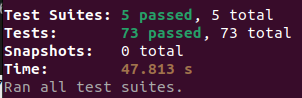
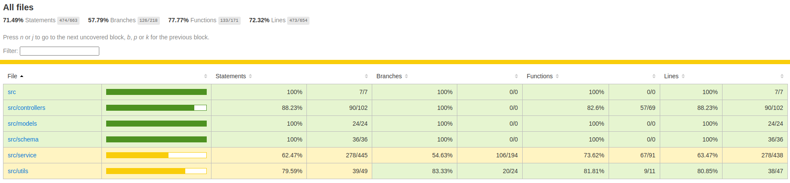
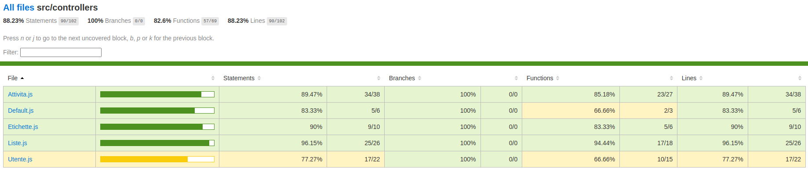

# 6. Testing

Per effettuare il testing abbiamo utilizzato la libreria Jest e il modulo superjest per il testing e l’invocazione delle API.

Il testing è contenuto nella cartella test, all'interno di animati-server.

In questa cartella ci sono 5 file .test.js che costituiscono i file nei quali sono contenuti rispettivamente i test di ciascun modello per cui sono definite delle API.

Un file .test.js è strutturato nel seguente modo:
- all'inizio vi è l'importazione del modulo 'supertest' di jest per il testing delle API, del server di mongoose per effettuare una connessione al database per testare le nostre API e del modulo 'jsonwebtoken" per creare un token per le API che lo necessitano
- nel metodo beforeAll() abbiamo la definizione di tutto ciò che deve essere fatto all’inizio dell’esecuzione del codice del file, ovvero la connessione al database di test, creato apposta per il testing, e l’attivazione del server alla porta 8080
- nel metodo afterAll() abbiamo la definizione di tutto ciò che deve essere fatto al termine dell'esecuzione del codice del file, ovvero chiudere la connessione e disattivare il server, nonché eventualmente svuotare il database di test in alcune occasioni
- in alcuni file è presente pure il beforeEach() dove si svuota, per sicurezza, ancora una volta il database di test

Per ogni test cases viene controllato il corretto status code di ritorno e, se viene tornata una risorsa si verifica che i vari attributi siano quelli desiderati.
Sono presenti API di tipo GET, POST, PUT, PATCH e DELETE.

## Risultati del testing

Per effettuare il testing abbiamo innanzitutto aggiunto il seguente script al file package.json:
- "test": "jest --coverage --detectOpenHandles"

In questo modo facendo il comando npm test dalla root del progetto verranno eseguiti tutti i file .test.js da noi definiti.
Il flag --coverage serve per creare i report finali che testimoniano i risultati del testing, mentre il flag
--detectOpenHandles ha lo scopo di identificare se nel corso del testing viene chiamato qualcosa
che impedisce al testing di terminare.

Questi sono i risultati dei nostri test:

Tutte e cinque le test suites sono state eseguite e tutti i 73 casi di test (definiti dai metodi test()) risultano passati.

Un report per visualizzare i risultati del test si trova nella cartella coverage/ (nella root del progetto)
e successivamente nella cartella lcov-report/.
Il file index.html apre una pagina di ipertesto in cui verificare ed analizzare i risultati ottenuti.

Nella prima schermata che appare abbiamo un riassunto degli statements, dei branches, delle funzioni e delle linee di codice coperte dal nostro testing.
La cartella che più interessa è chiaramente la cartella src/controllers in cui sono definite tutte le API
(ed infatti è la cartella più grande).

Il testing ci ha permesso di raggiungere il 62.47% di copertura di tutti gli statements e il 63.47% di tutte le
linee di codice delle varie API. 57/69 funzioni sono state coperte.
La copertura cala un po’ quando andiamo a verificare i branches esplorati (ovvero i rami degli if-then-else) attestandosi quasi sul 54.63%, dopo vedremo perché.

Premendo sulla cartella src/controllers otteniamo tutti i dati del testing effettuato su ogni file .js che
contiene il codice delle varie API.

I numeri sono simili per i vari gruppi di API: le funzioni testate sono intorno all'80%, le linee di
codice testate sono intorno al 85% di media e gli statements verificati sull’85%.

La percentuale dei branch vista prima (54.63%) è tale perché in ogni API abbiamo un branch per gestire i vari errori indipendenti da
noi che possono accadere (ad esempio errori del server, errori di connessione al database, ecc.).
