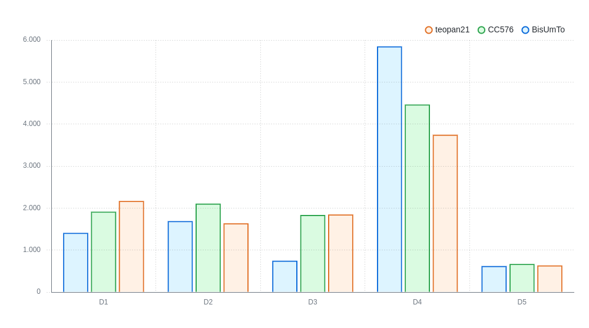
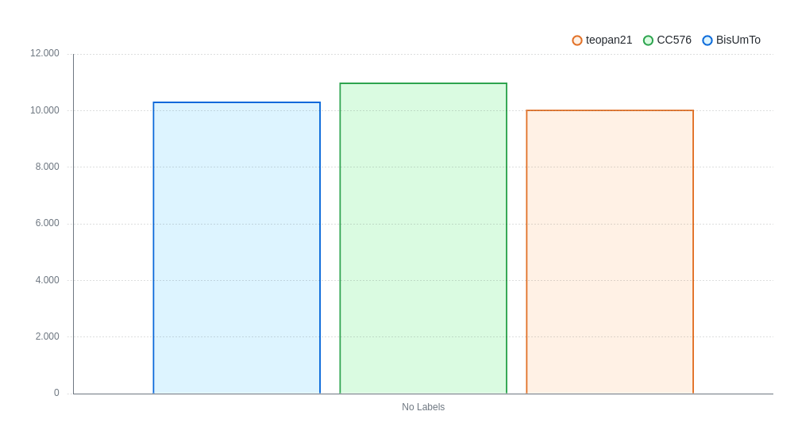

---
pdf_options:
    format: a4
    margin: 30mm 20mm
    printBackground: true
    headerTemplate: |-
        
        <section>
            D5 - Animati - Report Finale v1.0
        </section>
    footerTemplate: |-
        <section>
            

                Pagina 
                di 
            

        </section>
---
 Dipartimento di Ingegneria e Scienza dell’Informazione

---

### Progetto:
<h1 align="center">Animati</h1>

### Titolo del documento:
<h1 align="center">Report Finale</h1>

### Gruppo:
<h1 align="center">T51</h1>

# Indice
1. Scopo del documento3
2. Organizzazione del lavoro?
3. Ruoli e Attività?
4. Criticità?
5. Autovalutazione?

# Scopo del documento
[...]

# Organizzazione del lavoro
Nel nostro progetto hanno partecipato Carmen Casulli, Kevin Delugan e Teodora Panjkovic. 
Carmen Casulli ha esperienze nella programmazione competitiva e una passione per la matematica, mentre Kevin Delugan ha esperienze nel videogames modding e nel mantenimento di siti web per associazioni ONLUS. Teodora Panjkovic, invece, lavora attualmente presso l'Embedded Systems unit di FBK come software developer.

Il lavoro è stato suddiviso in modo equo tra i componenti del gruppo, cercando di assegnare un ruolo specifico a ciascuno degli elementi. Tuttavia, la tendenza era quella di prestare aiuto ai colleghi in caso di necessità e a revisionare il lavoro degli altri. La divisione dei compiti è stata basata sulle competenze pregresse dei singoli membri, sia in ambito lavorativo che per interesse personale.

Le riunioni legate al progetto sono state periodiche e il mezzo di comunicazione principale utilizzato per tenersi in contatto e aggiornarsi con messaggi quotidiani è stato il gruppo Telegram creato apposta. Il gruppo ha lavorato sia in presenza (sia all'università che a casa dei membri del gruppo) che in videoconferenza su Discord.

È stato utilizzato un documento Google condiviso per organizzare le attivià da fare e un progetto su Github per gestire le mansioni individuali di tutti. Carmen Casulli è stata la responsabile del progetto, ma si è sempre confrontata con gli altri membri del gruppo prima di prendere decisioni importanti.

Durante il progetto non ci sono stati conflitti fra i membri del gruppo. Il clima lavorativo è sempre stato sereno e collaborativo.Tuttavia, c'è stata una distribuzione poco uniforme del lavoro nel tempo a causa di numerosi periodi di malattia e problemi familiari che hanno colpito alcuni membri del gruppo in periodi diversi. 
Complessivamente, però, l'organizzazione del lavoro è stata efficiente e l'aiuto e l'impegno da parte di tutti ha reso possibile superare gli ostacoli che si sono presentati.

# Ruoli e Attività

| Componente del Team | Ruolo | Principali attività |
| --- | --- | --- |
| **Carmen Casulli** | Project leader / Sviluppatrice / Analista | Il ruolo principale è stato svolgere un'accurata analisi e stesura dei requisiti non funzionali, scrivere i vincoli in OCL, implementare delle risposte d'errore delle API ed effettuare la revisione dei documenti degli altri membri. |
| **Kevin Delugan** | Sviluppatore / Designer / Progettista  | Il ruolo principale è stato lo del server e del client, della realizzazione dei grafici e dell'analisi e stesura dei requisiti funzionali del progetto. Si è occupato inoltre della generazione dei PDF automatica, del deployment e della stesura del report finale. |
| **Teodora Panjkovic** | UI e UX Designer / Progettista / Sviluppatrice | Il ruolo principale è stato progettare l'interfaccia utente e i casi d'uso dell'utente. Si è occupata inoltre della progettazione del diagramma delle classi, con relativa descrizione, della progettazione delle componenti, della scrittura del testing delle API del server e della stesura dei report. |

# Carico e distribuzione del lavoro

Seguono i grafici rafficuranti il cario e la distribuzione del lavoro.

Diviso per deliverable:

Totale:

Tabella ore:

| Componente del Team | D1 | D2 | D3 | D4 | D5 | Totale |
| --- | --- | --- | --- | --- | --- | --- |
| Carmen Casulli *(in blu)* | 31,92 | 34,417 |30,58 | 28,92 | 8,33 | 134,17 |
| Kevin Delugan *(in viola)* | 23,50 | 28,17 | 12,45 | 89,83 | 9,33 | 163,28 |
| Teodora Panjkovic *(in verde)* | 36,67 | 26,75 | 30,78 | 36,58 | 9,33 |139,61 |
# Criticità

Durante il progetto, si sono presentate numerose problematiche che hanno richiesto la revisione di alcuni obiettivi iniziali per mantenere la coerenza con ciò che per necessità è stato modificato col tempo nel progetto. Una di queste sfide è stata mantenere concentrazione e dedizione per un periodo di tempo lungo e organizzare il lavoro per rispettare le deadline.

Il testing del server javascript è stato particolarmente complesso a causa di numerosi problemi ed errori di esecuzione. Questo problema è stato risolto grazie ad un maggiore approfondimento da parte di Carmen Casulli, che ha preso in mano questa parte del progetto.

Il frontend dell'applicazione è stato difficile da testare nella sua parte di funzionamento offline, poiché i dispositivi tendevano a non aggiornare i file in cache. Purtroppo, le funzionalità offline non sono ancora disponibili nell'attuale versione del client.

Sono state incontrate difficoltà anche nel deployment dell'applicazione, poiché Heroku richiede una carta di credito, per poterne fare utilizzo. Alla fine, la scelta per il deployment è ricaduta su Vercel.

Il problema dell'impaginazione accurata dei grafici ha richiesto una grande quantità di tempo e precisione, ed è stato aggirato, in alcuni casi, suddividendo alcuni degli stessi. Inoltre, le nozioni di Javascript e Mongoose apprese nei tutorial hanno dovute essere colmate con le rispettive documentazioni per trovare una soluzione alle numerose ambiguità verificatesi durante lo sviluppo.

Durante la stesura dei deliverables, ci sono stati numerosi problemi di sovrapposizione tra i vari documenti, poiché i periodi di malattia, lavoro e studio hanno ritardato il lavoro . Ciò ha comportato che solo un elemento del gruppo potesse andare a lezione per volta, il che ha portato a una bozza iniziale di ciascuna fase dello sviluppo da parte di chi andava a lezione, seguita da progressivi ampliamenti, revisioni e correzioni da parte degli altri membri man mano che raggiungevano quella fase. Ciò ha a sua volta comportato nuove modifiche alle fasi successive dello sviluppo che erano state intanto raggiunte dal membro più avanti nel lavoro.

Infine, essendo tutti e tre programmatori, il gruppo ha riscontrato difficoltà nella definizione dei requisiti, del contesto o dell'architettura di un sistema. Sarebbe stato più naturale e semplice, date le esperienze dei membri pregresse, definire questi aspetti dopo aver fatto una bozza di implementazione del sistema. Tuttavia, dato il compito assegnato, alcune informazioni specifiche del progetto sono state definite sin dai primi documenti, anche se non c'erano le competenze o conoscenze sufficienti per scrivere un documento completo. Nonostante queste difficoltà, è stato portato a termine il progetto e le cose imparate durante questo tempo sono state molte.
